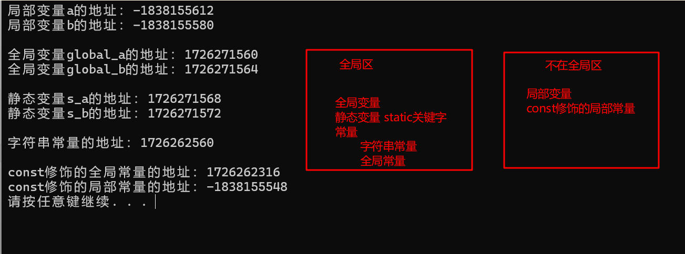

[TOC]

# 20250311

## stack 栈容器

stack 先进后出 只有一个出口

栈中只有顶端的元素才可以被外界使用，因此栈不允许有遍历行为

 

构造函数 

`stack<T> stk;` //利用模板类实现，stack对象默认构造形式

`stack(const stack &stk);` //拷贝构造函数

赋值操作

`stack& operator=(const stack &stk);` //重载等号运算符

数据存取

`push(elem)` //向栈顶添加元素

`pop() `从栈顶移除元素

`top()` 返回栈顶元素

大小操作

`empty()` //判断堆栈是否为空

`size()` //返回栈的大小


## 指针

空指针

1. 用于给指针变量进行初始化

```
int* p = NULL;
```

2.空指针是不可以进行访问的

0~255之间的内存是系统占用的，不可以访问

*p = 1000;

cout << *p << endl; 都是会报错的

 

野指针

指针变量指向非法的内存空间

int* p = (int*)0x1100;

cout << *p << endl;

 

/*

const修饰指针有三种情况：

1. const修饰指针 - 常量指针

>  ```int* const p = &a;```
>
> 特点：指针的指向不可以改，但是指针指向的值可以改

2. const修饰常量 - 指针常量

```const int* p = &a;```

指针p指向的数据类型为```const int```，因此

特点：==指针指向的值不能改==


const既修饰指针，又修饰常量

const int* const p = &a;

特点：指针的指向和指针指向的值都不可以改

*/


在C++中，数组名被视为`常量指针`。


## 作用域内枚举

传统的枚举

```C++
enum egg {small, medium...};
enum t_shirt {small, medium...}; //这样会报错，因为small位于相同的作用域
//C++ 提供了新枚举
enum class {small, medium...}; //class可以被struct替代
```


# 20250312

## set/multiset 容器

所有元素在插入时自动被排序

set/multiset属于关联式容器，底层结构是用二叉树实现

set和multiset区别

- set不允许容器中有重复的元素
- multiset允许容器中有重复的元素

### ex_1 set 构造与赋值

```C++
//set<T> st; //默认构造
//set(const set &st) //拷贝构造
#include <iostream>
#include <set>
using namespace std;
//set 构造和赋值
void printset(set<int>& s)
{
	for (set<int>::iterator it = s.begin(); it != s.end(); ++it)
	{
		cout << *it << " ";
	}
	cout << endl;
}
void test01()
{
	set<int> s1;
	s1.insert(10); //插入数据只有Insert
	s1.insert(30);
	s1.insert(5);
	
	printset(s1); //所有元素插入时自动被排序， set不允许插入重复值
	
	set<int> s2(s1); //拷贝构造
	printset(s2);
	
	set<int> s3;
	s3 = s2; //重载=运算符
	printset(s3);
	
}
int main()
{
	test01();
	system("pause");
	return 0;
}
```

### ex_2 set 大小和交换

```C++
#include <iostream>
#include <set>
using namespace std;
//set 大小和交换
/*
	size()
	empty()
	swap(st)
*/
void printset(set<int>& st)
{
	for (set<int>::const_iterator it = st.begin(); it != st.end(); ++it)
	{
		cout << *it << " ";
	}
	cout << endl;
}
void test01()
{
	set<int> st;
	st.insert(10);
	st.insert(20);
	st.insert(5);
	cout << "交换前----" << endl;
	printset(st);
	
	if (st.empty())
		cout << "st 为空" << endl;
	else
	{
		cout << "st 不为空" << endl;
		cout << "st 的大小为：" << st.size() << endl;
	}
	cout << "交换后----" << endl;
	set<int> st1;
	st1.insert(200);
	st1.insert(10);
	st1.insert(30);
	
	st.swap(st1);
	cout << "交换后----" << endl;
	printset(st);
}
int main()
{
	test01();
	system("pause");
	return 0;
}
```

### ex_3 set 插入和删除

```C++
#include <iostream>
#include <set>
using namespace std;
//set 插入和删除
/*
	insert()
	clear()
	erase(pos) //删除pos迭代器所指向的元素，返回下一个元素的迭代器
	erase(beg, end) //删除区间[beg, end)的所有元素，返回下一个元素的迭代
	erase(elem) //删除所有的elem元素
*/
void printset(set<int>& st)
{
	for (set<int>::const_iterator it = st.begin(); it != st.end(); ++it)
	{
		cout << *it << " ";
	}
	cout << endl;
}
void test01()
{
	set<int> s1;
	s1.insert(10);
	s1.insert(5);
	s1.insert(15);
	printset(s1);
	set<int>::iterator it = s1.begin();
	s1.erase(30);
	
	printset(s1);
}
int main()
{
	test01();
	system("pause");
	return 0;
}
```

### ex_4 set 查找和统计

```C++
#include <iostream>
#include <set>
using namespace std;
//set 查找和统计
/*
	find(key) //查找Key是否存在，返回该键的元素迭代器，若不存在，返回set.end()
	count(key) //统计key的元素个数
*/
void printset(set<int>& st)
{
	for (set<int>::const_iterator it = st.begin(); it != st.end(); ++it)
	{
		cout << *it << " ";
	}
	cout << endl;
}
void test01()
{
	set<int> s1;
	s1.insert(10);
	s1.insert(5);
	s1.insert(15);
	printset(s1);
	//查找
	set<int>::iterator pos = s1.find(5);
	if (pos != s1.end())
		cout << *pos << endl;
	else
		cout << "没有找到" << endl;
	//统计
	int num = s1.count(10); //统计10的个数
	cout << num << endl; //对于set而言，统计的结果要么是0，要么是1
}
int main()
{
	test01();
	system("pause");
	return 0;
}
```

### ex_5 set和multiset区别

```C++
//set不可以插入重复数据，而multiset可以
//set插入数据的同时会返回结果，表示插入是否成功
//multiset不会检测数据，因此可以插入重复数据
#include <iostream>
#include <set>
using namespace std;
//set和multiset区别
void test01()
{
	set<int> st;
	pair<set<int>::iterator, bool> ret = st.insert(10); //set.insert()会返回一个std::pair对象
	if (ret.second)
		cout << "第一次插入成功" << endl;
	else
		cout << "第一次插入失败" << endl;
	st.insert(10);
	ret = st.insert(10);
	if (ret.second)
		cout << "第二次插入成功" << endl;
	else
		cout << "第二次插入失败" << endl;
	st.insert(5);
	
	multiset<int> ms;
	ms.insert(10);
	ms.insert(10);
	
	for (multiset<int>:: iterator it = ms.begin(); it != ms.end(); ++it)
	{
		cout << *it << " ";
	}
	cout << endl;
}

int main()
{
	test01();
	system("pause");
	return 0;
}
```

### ex_6 初识pair

```C++
//成对出现的数据，利用对组可以返回两个数据
//pair<type, type> p (value1, value2) 初始化
//pair<type, type> p = make_pair(value1, value2)

#include <iostream>
using namespace std;
//pair 对组使用
void test01()
{
	pair<string, int> p("Tom", 18);
	cout << "姓名：" << p.first << "\t年龄：" << p.second << endl;
	
	pair<string, int> p2 = make_pair("John", 30);
	cout << "姓名：" << p2.first << "\t年龄：" << p2.second << endl;
}
int main()
{
	test01();
	system("pause");
	return 0;
}
```

### ex_7 set 排序

```C++
//set容器默认排序规则为从小到大，可以利用仿函数，改变排序规则
#include <iostream>
#include <set>
using namespace std;
class MyCompare
{
public:
	bool operator()(int v1, int v2) const//第一个（）表示重载()，第二个（）表示重载函数的参数列表
	{
		return v1 > v2; //当第一个数据大于第二个数据的时候，为真
	}
};
void test01()
{
	set<int> st;
	st.insert(10);
	st.insert(30);
	st.insert(20);
	st.insert(5);
	for (set<int>::iterator it = st.begin(); it != st.end(); ++it)
	{
		cout << *it << " ";
	}
	cout << endl;
	//指定排序规则为从大到小
	set<int, MyCompare> s2;

	s2.insert(10);
	s2.insert(30);
	s2.insert(20);
	s2.insert(5);

	for (set<int, MyCompare>::iterator it = s2.begin(); it != s2.end(); ++it)
	{
		cout << *it << " ";
	}
	cout << endl;
}
int main()
{
	test01();
	system("pause");
	return 0;
}
```

### ex_8 set 自定义数据类型 排序

```C++
#include <iostream>
#include <string>
#include <set>
using namespace std;
//set容器排序，存放自定义数据类型
class Person
{
public:
	Person(string name, int age)
	{
		m_name = name;
		m_age = age;
	}
	string m_name;
	int m_age;
};
class MyCompare
{
public:
	bool operator()(const Person& p1, const Person& p2) const
	{
		return p1.m_age > p2.m_age;
	}
};
void test01()
{
	set<Person, MyCompare> st;
	//创建Person对象
	Person p1("刘备", 24);
	Person p2("张飞", 28);
	Person p3("李白", 20);
	Person p4("杜甫", 19);
	Person p5("关羽", 16);

	st.insert(p1);
	st.insert(p2);
	st.insert(p3);
	st.insert(p4);
	st.insert(p5);

	for (set<Person, MyCompare>::iterator it = st.begin(); it != st.end(); ++it)
	{
		cout << "姓名：" << it->m_name << "\t年龄：" << it->m_age << endl;
	}
}
int main()
{
	test01();
	system("pause");
	return 0;
}
```

## map/multimap 容器

map中所有元素都是pair

pair中第一个元素为key（键值），起到索引作用，第二个元素为value（实值）

所有元素都会根据元素的键值自动排序

 本质：map/multimap属于关联式容器，底层结构是用二叉树实现

 优点：可以根据key值快速找到value值

map不允许容器中有重复key值元素

### ex_1 初识map容器

```C++
#include <iostream>
#include <string>
#include <map>
using namespace std;
//map容器 构造和赋值
//map<T1, T2> mp
//map(const map& mp);
void printmap(map<int, int>& m)
{
	for (map<int, int>::iterator it = m.begin(); it != m.end(); it++)
	{
		cout << "key:" << it->first << " " << "value:" << it->second << endl;
		cout << endl;
	}
}
void test01()
{
	map<int, int> m;
	m.insert(pair<int, int>(1, 10));
	m.insert(pair<int, int>(2, 8));
	m.insert(pair<int, int>(3, 6));
	m.insert(pair<int, int>(4, 4));
	printmap(m);

	map<int, int> m2(m); //拷贝构造
	map<int, int> m3 = m2; //赋值
}
int main()
{
	test01();
	system("pause");
	return 0;
}
```

### ex_2 map 大小和交换

size();

empty();

m1.swap(m2);

### ex_3 map 插入和删除

insert(elem); 

clear();

erase(pos); //删除pos迭代器所指元素，返回下一个元素的迭代器

erase(beg, end);

erase(key); //删除容器中键值为key的pair元素

```C++
//map有多种插入方式
mp.insert(pair<int, int>(10, 100)); //pair是一种模板类
mp.insert(make_pair(10, 100));
mp.insert(map<int, int>::value_type(3, 30)); //value_type是map容器中的嵌套类型定义 std::pair<const key, T>
mp[4] = 40;
```

### ex_4 map 查找和统计

find(key); //查找key是否存在，若存在，返回该键的元素的迭代器，若不在，则返回end()

count(key); //统计key的个数，返回值只能是0或1，因为map中的每个键都是唯一的

### ex_5 map 排序

map内部默认是按照键，从小到大进行排序的。可以写仿函数让map按照键从大到小排序。

```C++
//仿函数
class MyCompare{
public: 
	bool operator()(int v1, int v2){
		return v1 > v2;
	}
}
```


# 20250313

## queue 容器

先进先出

队列容器允许从一端新增数据，从另一端移除数据

队列中只有队头和队尾才可以被外界使用，因此队列不允许有遍历行为

 

构造函数

queue<T> que; //采用模板类实现，queue对象的默认构造形式

queue(const queue &que) //拷贝构造函数

赋值操作

queue& operator=(const queue &que);

数据存取

push(elem)

pop()

back(); //返回最后一个元素

front(); //返回队首元素

大小操作

empty()

size() 返回栈的大小

swap(que2) 交换两个队列的内容

### ex_1 初识queue容器

```C++
#include <iostream>
#include <queue>
#include <string>
using namespace std;
//队列 queue
class Person
{
public:
	Person(string name, int age)
	{
		m_name = name;
		m_age = age;
	}
	string m_name;
	int m_age;
};
int main()
{
	queue<Person> q; //创建队列
	Person p1("唐僧", 30); //准备数据
	Person p2("孙悟空", 120);
	Person p3("猪八戒", 50);
	Person p4("沙和尚", 80);
	q.push(p1); //入栈
	q.push(p2);
	q.push(p3);
	q.push(p4);
	cout << "队列大小：" << q.size() << endl;
	while (!q.empty())
	{
		cout << "队头元素 -- 姓名" << q.front().m_name << "\t年龄: " << q.front().m_age << endl; //查看队头
		cout << "队尾元素 -- 姓名" << q.back().m_name << "\t年龄：" << q.back().m_age << endl;
		q.pop(); //出队
	}
	cout << "队列大小：" << q.size() << endl;
	
	system("pause");
	return 0;
}
```

# 20250314

## deque 容器

功能：双端队列，可以对头端和尾端进行插入删除操作

deque与vector区别:

- vector对于头部的插入删除效率低，数据量越大，效率越低
- deque相对而言，对头部的插入删除速度比vector快
- vector访问元素时的速度会比deque快

 

push_front()

pop_front()

push_back()

pop_back()

insert()

 

deque内部工作原理

deque内部有个中控器，维护每段缓冲区中的内容，缓冲区中存放真实数据

中控器维护的是每个缓冲区的地址，使得使用deque时像一片连续的内存空间

 

deque容器的迭代器也==支持随机访问==

### ex_1 deque 构造函数

```C++
#include <iostream>
#include <string>
#include <deque>
using namespace std;
void printDeque(const deque<int> &d)
{
	for (deque<int>::const_iterator it = d.begin(); it != d.end(); it++)
		cout << *it << " ";
	cout << endl;
}
void test01()
{
	deque<int> d;
	for (int i = 0; i < 10; i++)
		d.push_back(i);
	printDeque(d);
	
	deque<int> d1(d.begin(), d.end());
	printDeque(d1);
	
	deque<int> d2(10, 100);
	printDeque(d2);
	
	deque<int> d3(d2);
	printDeque(d3);
}
int main()
{
	test01();
	system("pause");
	return 0;
}
```

### ex_2 deque 赋值操作

```C++
#include <iostream>
#include <string>
#include <deque>
using namespace std;
/*
	deque& operator=(const deque &deq) //重载等号操作符
	assign(beg, end) //将[beg, end)区间中的数据拷贝赋值给本身
	assign(n, elem) //将n个elem拷贝赋值给本身
*/

void printDeque(const deque<int> &d)
{
	for (deque<int>::const_iterator it = d.begin(); it != d.end(); it++)
		cout << *it << " ";
	cout << endl;
}
void test01()
{
	deque<int> d;
	for (int i = 0; i < 10; i++)
		d.push_back(i);
	printDeque(d);
	
	deque<int> d1 = d;
	printDeque(d1);
	
	deque<int> d2;
	d2.assign(d1.begin(), d1.end());
	printDeque(d2);
	
	deque<int> d3;
	d3.assign(10, 100);
	printDeque(d3);
}
int main()
{
	test01();
	system("pause");
	return 0;
}
```

### ex_3 deque 大小操作

```C++
#include <iostream>
#include <string>
#include <deque>
using namespace std;
/*
	deque.empty()
	deque.size()
	deque.resize(num) //重新指定容器的长度，若容器变长，则默认值填充新位置
	deque.resize(num, elem)
*/

void printDeque(const deque<int> &d)
{
	for (deque<int>::const_iterator it = d.begin(); it != d.end(); it++)
		cout << *it << " ";
	cout << endl;
}
void test01()
{
	deque<int> d;
	for (int i = 0; i < 10; i++)
		d.push_back(i);
	printDeque(d);
	if (d.empty())
		cout << "d 为空" << endl;
	else
	{
		cout << "d 不为空" << endl;
		cout << "d 的大小：" << d.size() << endl; //deque没有容量的概念
	}
	d.resize(15); //重新指定大小
	printDeque(d);
}
int main()
{
	test01();
	system("pause");
	return 0;
}
```

### ex_4 deque 插入和删除

```C++
#include <iostream>
#include <string>
#include <deque>
using namespace std;
/*
	两端插入
	push_back(elem)
	push_front(elem)
	pop_back()
	pop_front()
	指定位置操作
	insert(pos, elem) //在pos位置插入一个elem元素的拷贝，返回新元素的位置
	insert(pos, n, elem) //在pos位置插入n个elem,无返回值
	insert(pos, beg, end) //在pos位置插入[beg, end)区间的数据，无返回值
	clear() //清空
	erase(beg, end) //删除[beg, end)区间的数据，返回下一个数据的位置
	erase(pos) //删除pos位置的数据，返回下一个数据的位置
*/

void printDeque(const deque<int> &d)
{
	for (deque<int>::const_iterator it = d.begin(); it != d.end(); it++)
		cout << *it << " ";
	cout << endl;
}
void test01()
{
	deque<int> d;
	d.push_back(10); //尾插
	d.push_front(100); //头插
	printDeque(d);
	d.insert(d.begin(), 1000);
	d.insert(d.begin(),2, 2);
	printDeque(d);
	
	deque<int>::iterator it = d.begin();
	it++;
	d.erase(it);
	printDeque(d);

}
int main()
{
	test01();
	system("pause");
	return 0;
}
```

### ex_5 deque 数据存取

```C++
#include <iostream>
#include <string>
#include <deque>
using namespace std;
//deque 数据存取
/*
	at(int idx) //返回索引idx所指向的数据
	Operator[]
	front()
	back() //返回容器中最后一个数据元素
*/

void printDeque(const deque<int> &d)
{
	for (deque<int>::const_iterator it = d.begin(); it != d.end(); it++)
		cout << *it << " ";
	cout << endl;
}
void test01()
{
	deque<int> d;
	for (int i = 0; i < 9; i++)
		d.push_back(i);
	for (int i = 0; i < d.size(); i++)
		cout << d.at(i) << " ";
	cout << endl;

}
int main()
{
	test01();
	system("pause");
	return 0;
}
```

### ex_6 deque 排序

```C++
#include <iostream>
#include <string>
#include <deque>
#include <algorithm>
using namespace std;
//deque 排序
/*
	sort(iterator beg, iterator end) //对beg和end区间内元素进行排序
*/

void printDeque(const deque<int> &d)
{
	for (deque<int>::const_iterator it = d.begin(); it != d.end(); it++)
		cout << *it << " ";
	cout << endl;
}
void test01()
{
	deque<int> d;
	d.push_back(10);
	d.push_back(30);
	d.push_back(20);
	cout << "排序前:" << endl;
	printDeque(d);
	cout << "排序后:" << endl;
	sort(d.begin(), d.end());
	printDeque(d); //默认从小到大
}
int main()
{
	test01();
	system("pause");
	return 0;
}
```

### ex_7 deque 案例：评委打分

```C++
//有5名选手：选手ABCDE， 10个评委分别对每一名选手打分，去除最高分，去除最低分，取平均分
#include <iostream>
#include <string>
#include <vector>
#include <deque>
#include <cstdlib>
#include <algorithm>
#include <ctime>
using namespace std;
//案例
class Person
{
public:
	Person(string name, int score)
	{
		m_name = name;
		m_score = score;
	}
	string m_name;
	int m_score;
};
void create_person(vector<Person> &v)
{
	string nameseed = "ABCDE";
	for (int i = 0; i < 5; i++)
	{
		string name = "选手";
		name += nameseed[i];
		int score = 0;
		Person p(name, score);
		v.push_back(p);
	}
}
void set_score(vector<Person> &v)
{
	deque<int> d;
	for (vector<Person>::iterator it = v.begin(); it != v.end(); it++)
	{
		cout << "接下来让我们掌声有请 " << it->m_name << " 为我们带来精彩的表演" << endl;
		cout << "表演结束，等待评委打分--------" << endl;
		for (int i = 0; i < 10; i++)
		{
			int score = rand() % 41 + 60; //0~40 + 60 = [60, 100]
			d.push_back(score);
		}
		sort(d.begin(), d.end());
		for (int i = 0; i < 10; i++)
		{
			cout << d[i] << " ";
		}
		cout << endl;
		cout << "去掉一个最高分：" << d.back() << endl;
		d.pop_back();
		cout << "去掉一个最低分：" << d.front() << endl;
		d.pop_front();
		int sum = 0;
		for (int k = 0; k < d.size(); k++)
		{
			sum += d[k];
		}
		it->m_score = sum / d.size();
		cout << it->m_name << " 的最后得分：" << it->m_score << "分"<< endl;
		d.clear();
	}
}
void Show_Score(vector<Person>& v)
{
	for (vector<Person>::iterator it = v.begin(); it != v.end(); ++it)
	{
		cout << "姓名：" << it->m_name << "\t分数：" << it->m_score << endl;
	}
}
int main()
{
	//随机数种子
	srand((unsigned int)time(NULL));
	//1.创建5名选手
	vector<Person> v; //存放选手的容器
	create_person(v);
	cout << "让我们恭喜进入决赛的5名选手，他们分别是：" << endl;
	for (int i = 0; i < v.size(); i++)
	{
		cout << v[i].m_name << " ";
	}
	cout << endl;
	set_score(v);
	Show_Score(v);
	system("pause");
	return 0;
}
```

## C++11 列表初始化

构造函数初始化列表

```C++
struct DoublyListNode {
	int val;
	DoublyListNode(int val): val(val) {
		//构造函数
	}
}
```

列表初始化

```C++
struct DoublyListNode {
	int val;
	DoublyListNode(int val): val{val} {
		//构造函数
	}
}
```


### 

### STL基本概念

STL(standard Template Library，标准模板库)

从广义上分为：容器(container) 算法(algorithm) 迭代器(iterator)

容器和算法之间通过迭代器进行无缝连接。

 

STL六大组件

容器：各类数据结构，如vector、list、set等，用来存放数据

序列式容器：强调值的排序，序列式容器中的每个元素均有固定的位置

关联式容器：二叉树结构，各元素之间没有严格的物理上的顺序关系

算法：各种常用的算法，如sort、find等

质变算法：运算过程中会更改区间内的元素的内容

非质变算法：运算过程中不会更改

迭代器：

仿函数：行为类似函数，可作为算法的某种策略

适配器：一种用来修饰容器或者仿函数或者迭代器接口的东西。

空间配置器：负责空间的配置和管理。


### 


### 


### 


### ex_7 多态案例：电脑组装

```C++
ex_7 多态案例3-电脑组装

#include <iostream>
#include <string> //用C++风格的字符串，要包含这个头文件
using namespace std;
//多态案例-电脑组装
class CPU //抽象类
{
public: //如果不加public 默认是Private
	virtual void calculator() = 0; //抽象计算函数 
};
class Videocard //抽象类
{
public:
	virtual void display() = 0; //抽象显示函数
};
class Memory
{
public:
	virtual void storage() = 0; //抽象存储函数
};
class Computer
{
public:
	Computer(CPU *c, Videocard *vc, Memory *mem)
	{
		m_cpu = c;
		m_videocard = vc;
		m_memory = mem;
	}
	~Computer()
	{
		if (m_cpu != NULL)
		{
			delete m_cpu;
			m_cpu = NULL;
		}
		if (m_videocard != NULL)
		{
			delete m_videocard;
			m_videocard = NULL;
		}
		if (m_memory != NULL)
		{
			delete m_memory;
			m_memory = NULL;
		}
	}
	void doWork()
	{
		m_cpu->calculator();
		m_videocard->display();
		m_memory->storage();
	}
private:
	CPU* m_cpu; //CPU的零件指针
	Videocard *m_videocard; //显卡的零件指针
	Memory* m_memory; //内存条的零件指针

};
//具体零件厂商
class IntelCpu : public CPU
{
	void calculator()
	{
		cout << "Intel CPU开始计算" << endl;
	}
};
class IntelVideocard : public Videocard
{
	void display()
	{
		cout << "Intel Videocard开始显示" << endl;
	}
};
class IntelMemory : public Memory
{
	void storage()
	{
		cout << "Intel Memory开始存储" << endl;
	}
};
class LenovoCpu : public CPU
{
	void calculator()
	{
		cout << "Lenovo CPU开始计算" << endl;
	}
};
class LenovoVideocard : public Videocard
{
	void display()
	{
		cout << "Lenovo Videocard开始显示" << endl;
	}
};
class LenovoMemory : public Memory
{
	void storage()
	{
		cout << "Lenovo Memory开始存储" << endl;
	}
};
void test01()
{
	//第一台电脑
	cout << "----第一台电脑开始工作----" << endl;
	CPU* intelcpu = new IntelCpu; //父类指针指向子类匿名对象
	Videocard* lenovovc = new LenovoVideocard;
	Memory* lenovomem = new LenovoMemory;
	Computer* computer1 = new Computer(intelcpu, lenovovc, lenovomem);
	computer1->doWork();
	delete computer1;
	//第二台电脑
	cout << "-------------------------" << endl;
	cout << "----第二台电脑开始工作----" << endl;
	Computer* computer2 = new Computer(new LenovoCpu, new IntelVideocard, new IntelMemory);
	computer2->doWork();
	delete computer2;
}
int main()
{
	test01();
	system("pause");
	return 0;
}
```

# 20250315

## 函数对象

重载函数调用操作符，也即重载（）的类，其对象称为函数对象

函数对象使用重载的()时，行为类似函数调用，也叫仿函数。

函数对象(仿函数)是一个类，不是一个函数。

# 20250326

### ex_1 函数基本使用

```C++
#include <iostream>
#include <string>
using namespace std;
//函数对象：仿函数
/*
1.	函数对象在使用时，可以像普通函数那样调用，可以有参数，也可以有返回值
2.	函数对象可以有自己的状态
3.	函数对象可以作为参数传递
*/
class MyAdd
{
public:
	int operator()(int v1, int v2) {
		return v1 + v2;
	}
};
class MyPrint
{
public: 
	MyPrint() {
		this->count = 0;
	}
	void operator()(string test) {
		cout << test << endl;
		count++;
	}
	int count; //2.内部自己状态
};
void doPrint(MyPrint& mp, string test) //函数对象作为参数传递
{
	mp(test);
}
void test01() {
	MyAdd myAdd;
	cout << myAdd(10, 10) << endl; //1
}
void test02() {
	MyPrint myPrint;
	myPrint("Hello,world!");
	cout << "myPrint调用次数为：" << myPrint.count << endl;
}
void test03() {
	MyPrint myPrint;
	doPrint(myPrint, "Hello,world!");
}
int main(void) {
	test03();
	system("pause");
	return 0;
}
```

## 谓词

返回bool类型的仿函数

- 如果operator()接受一个参数，那么叫做一元谓词
- 若是接受两个参数，那么叫做二元谓词

### ex_1 一元谓词

```C++
#include <iostream>
#include <vector>
#include <algorithm>
using namespace std;
class GreaterFive
{
public:
	bool operator()(int val) {
		return val > 5;
	}
};
void test01() {
	vector<int> v;
	for (int i = 0; i < 10; ++i) {
		v.push_back(i);
	}
	//查找容器中，有没有大于5的数字
	vector<int>::iterator it = find_if(v.begin(), v.end(), GreaterFive()); //Pred代表谓词
		//GreaterFive()是一个匿名的函数对象
	if (it == v.end())
		cout << "没找到" << endl;
	else
		cout << "找到了大于5的数：" << *it << endl; //输出6
}

int main(void) {
	test01();
	system("pause");
	return 0;
}
```

## 内建函数对象

STL内建的一些函数对象

- 算术仿函数
- 关系仿函数
- 逻辑仿函数

使用内建函数对象，需要引入头文件#include<functional>

```
//算术仿函数
template<class T> T plus<T> //加法仿函数
minus //减法
multiplies //乘法
divides //除法
modulus //取模
negate //取反，只有它是一元运算，其余都是二元运算
```

### ex_1 内建函数对象-算术仿函数

```C++
//内建函数对象，仿函数
//negate 一元仿函数 取反
//plus 二元仿函数 加法
void test01() {
	negate<int> n;
	cout << n(50) << endl; //输出-50，原来是这样取反
}
void test02() {
	plus<int> m;
	cout << m(10, 20) << endl; //输出30
}
```

关系仿函数

```
template<class T> bool equal_to<T> //等于
not_equal_to //不等于
greater //大于
greater_equal //大于等于
less //小于
less_equal //小于等于
```

### ex_2 内建函数对象-大于仿函数

```C++
//内建函数对象，仿函数
//大于 greater
void test01() {
	vector<int> v;
	v.push_back(3);
	v.push_back(1);
	v.push_back(2);
	for (vector<int>::iterator it = v.begin(); it != v.end(); ++it) {
		cout << *it << " ";
	}
	cout << endl;
	//降序排列
	sort(v.begin(), v.end(), greater<int>());
	for (vector<int>::iterator it = v.begin(); it != v.end(); ++it) {
		cout << *it << " ";
	}
	cout << endl;
}
```

逻辑仿函数

```
template<class T> bool logical_and<T> //逻辑与
logical_or //逻辑或
logical_not //逻辑非
```

### ex_3 内建函数对象-逻辑仿函数

```C++
void test01() {
	vector<bool> v;
	v.push_back(true);
	v.push_back(false);
	v.push_back(true);
	for (vector<bool>::iterator it = v.begin(); it != v.end(); ++it) {
		cout << *it << " ";
	}
	cout << endl;
	//利用逻辑非 将容器v 搬运到 容器v2中 并执行取反操作
	vector<bool> v2;
	v2.resize(v.size());
	transform(v.begin(), v.end(), v2.begin(), logical_not<bool>());
	for (vector<bool>::iterator it = v2.begin(); it != v2.end(); ++it) {
		cout << *it << " ";
	}
	cout << endl;
}
```

# 20250327

## STL常用算法

- 算法主要由头文件<algorithm><functional><numerical>组成
- <algorithm>是所有STL头文件中最大的一个
- <functional>定义了一些模板类，以声明函数对象
- <numerical>体积很小，只包括几个进行简单运算的模板函数

### 常用遍历算法

```
for_each() //遍历容器
for_each(iterator beg, iterator end, _func); //_func 函数或函数对象
transform() //搬运容器到另一个容器
```

#### ex_1 常用遍历算法-for_each()

```C++
class MyPrint
{
public:
	void operator()(int val) {
		cout << val << " ";
	}
};
void test01() {
	vector<int> v;
	for (int i = 0; i < 10; ++i)
		v.push_back(i);
	for_each(v.begin(), v.end(), MyPrint()); //也可以提供普通函数
}
```

### 常用查找算法

```C++
find() //查找指定元素，返回指定元素的迭代器，找不到则返回end()
find_if() //按条件查找
adjacent_find() //查找相邻重复元素
binary_search() //二分查找
count //统计元素个数
count_if //按条件统计元素个数
```

函数原型

```C++
find(iterator beg, iterator end, value) //如果value是自定义数据类型，则必须重载==运算符
find_if(iterator beg, iterator end, _Pred) //_Pred函数或谓词(返回值为bool类型的仿函数)
    
adjacent_find(iterator beg, iterator end) //返回相邻元素的第一个位置的迭代器，如果没有返回end

bool binary_search(iterator beg, iterator end, value) //查找指定元素是否存在
//这是二分查找，因此只适用于有序序列
    
count(iterator beg, iterator end, value) //统计元素个数
count_if(iterator beg, iterator end, _Pred) //
```

### 常用排序算法

```C++
sort //对容器内元素进行排序
random_shuffle //洗牌，指定范围内的元素随机调整次序
merge //合并容器元素，并存储到另一容器中
reverse //反转指定范围内的元素
```

函数原型

```
sort(iterator beg, iterator end, _Pred)
merge(iterator beg1, iterator end1, iterator beg2, iterator end2, iterator dest)
//dest目标容器开始迭代器，，两个容器必须是一样排序的有序序列，
```

### 常用拷贝和替换算法

```
copy //拷贝容器指定范围内的元素到另一容器中
replace //将容器指定范围内的元素修改为新元素
replace_if //容器内指定范围满足条件的元素更改为新元素
swap //互换两个容器中的元素
```

函数原型

```
replace(iterator beg, iterator end, oldvalue, newvalue)
```

### 常用算术生成算法

```
accumulate() //计算元素累计总和
fill() //向容器中添加元素
```

函数原型

```
accumulate(iterator beg, iterator end, value) //用这个算法时要包含头文件<numeric>
//value是起始的累加值
fill(iterator beg, iterator end, value) //value是填充的值，也要包含<numerical>
```

### 常用集合算法

```
set_intersection() //求两个容器的交集
set_union() //求两个容器的并集
set_difference() //求两个容器的差集
```

函数原型

```
set_intersection(iterator beg1, iterator end1, iterator beg2, iterator end2, iterator dest) //两个容器必须是有序序列，dest是目标容器开始迭代器，返回值是交集的结束位置，是个迭代器

set_union(iterator beg1, iterator end1, iterator beg2, iterator end2, iterator dest )//同样要是有序序列，返回值是并集的结束位置
```


# 预备知识 01


## C语言 面向过程编程


通过一系列==有序的步骤（过程）==来解决问题。

在面向过程编程中，程序被分解为多个==函数或模块==，每个函数负责完成一个特定的任务，然后通过函数调用将这些任务组合起来，实现程序的整体功能。

/* 


​	例如，一个简单的图书管理系统，我们可以定义一个函数来添加书籍信息，另一个函数来删除书籍信息，再定义一个函数来查询书籍。主程序会按照用户的需求调用这些函数来完成操作。


*/

优：代码复用性高（同一个函数可以被反复调用）、代码结构比较清晰、理解起来也相对容易

缺：

- 代码维护困难（如果修改某个函数，可能影响到调用它的其它函数）
- 数据和功能是分离的（如果要修改某个数据结构，可能与之相关的函数也要修改）


## C++ 


#### 面向对象编程：对象、类、封装、数据隐藏、多态和继承等


面向对象编程是一种==以对象为中心==的编程范式。

它的核心思想是将现实世界中的事物抽象为对象，每个对象都有自己的属性（数据）和行为（方法）。通过对象之间的交互来实现程序的功能。

/* 


​	例如，假设我们正在开发一个汽车管理系统。

​	在面向对象编程中，我们可以定义一个`Car`类，这个类有属性（如`color`、`model`、`speed`），也有方法（如`accelerate()`加速、`brake()`刹车）。

​	每个具体的汽车实例就是`Car`类的一个对象，它们共享类的属性和方法，但可以有不同的具体值。


*/


- 类：将数据和操作数据的方法封装在一起
- 对象：根据类构造的特定数据结构
- 封装：隐藏内部实现细节，只通过接口（方法）对外提供服务。这提高了代码的安全性和复用性。
- 数据隐藏：保护数据
- 多态：为运算符和函数创造多个定义，如父类和子类的同一个方法可以采取不同的实现。
- 继承：从旧类中派生新类


#### 泛型编程：模板


- 创建独立于类型的代码，即可以编写一个泛型函数，并将其应用于各种数据类型
- 优：提高了代码的重用性


### 可移植性和标准

C++98(1998)：添加了异常、RTTI（运行阶段类型识别）、**模板、STL**

C++03(2003)：修改了C++98的错误，没有改变语言特性

C++11(2011)

14

17

20

思考：每一个版本都新增了哪些内容？


# 开始学习C++ 02


```c++
#include <iostream>
```

这是一条预编译指令。

在编译之前，预处理器会将 iostream 文件中的内容添加到程序中。


## 名称空间


```c++
using namespace std;
```

using 编译指令。


? 使用 `endl` 和 "\n" 的区别

- `endl`可以确保程序在继续往下运行前刷新输出（将其立即显示在屏幕上）


# 处理数据 03


头文件 `climits` 包含了许多 变量限制的信息，如INT_MAX

浮点常量默认数据类型是double


- 对于**局部变量**（在函数内部定义的变量），如果没有显式初始化，其值是不确定的
- 对于**全局变量或静态变量**（包括函数内的静态局部变量），如果未显式初始化，编译器会自动将其初始化为**0**（数值类型）、**false**（布尔类型）或**空指针**（指针类型）

# 复合类型 04


`sizeof`运算符返回类型或数据对象的长度，用于数组名时，得到的是整个数组所占的字节数


"Bubbles" 这叫做==字符串常量==，以 '\0' 结尾，数据类型为==const char[]==，直接使用"Bubbles"时，它将被隐式转换成==const char*==，即第一个字符的地址。

标准头文件<cstring>提供了许多处理字符串的函数

`strlen()`只计算看得见的字符，不包括\0


## 字符串


`cin`使用==空白（空格、制表符和换行符）==来确定字符串的结束位置，换行符会留在缓冲区中。

`cin.ignore()`可以清除缓冲区中的换行符。

它只能读取一个单词，像*Alistair Dreeb*回车，只能读取Alistair


？那我们如何才能读取New York这样的短语呢

- 面向行的输入：istream类成员函数getline()，cin是类对象

  ```cin.getline(数组名，字符数)```

​	它将通过回车键键入的换行符确定输入结尾，即遇到换行符停止读取，数组中不会包含换行符，==换行符也不会留在输入队列==

```C++
cin.getline(name, 20); //最多读取19个字符到Name数组
```

- 面向行的输入：istream类另一个成员函数get()

​	```cin.get(name, 20); ```//与getline()类似，但是==换行符将会留在输入队列中==

​	可以使用get()变体（函数重载），即cin.get()读取一个字符（换行符）

- 空行和其它问题

​	当get()读取空行后将设置失效位(failbit)，输入会被阻断，恢复命令`cin.clear()`

​	另，输入字符串比指定的长度还要多，`getline()`和`get()`将多余的留在输入队列，`getline()`还会设置失效位关闭后续输入


## string类


string类 位于命名空间std中

读取string对象，可以用```getline(cin, str)```。

它不是类方法，是定义在`string`头文件中的模版函数。

str是string对象，可以根据字符串长度自动调整长度。

string 和 char***区别**：

- char*是一个指针

- string是一个类，类内封装了char*


| string 常见操作 | 解释 |
| --------------- | ---- |
| length()        |      |


### ex_1 初识string

```c++
#include <iostream>
#include <string>
using namespace std;
//string的构造函数
/*
	string() //创建一个空的字符串，如string str; 默认构造
	string(const char* s) //使用字符串s初始化
	string(const string& str) //使用string对象初始化另一个string对象
	string(int n, char c) //使用n个字符c初始化
*/
void test01()
{
	string s1; //默认构造
	const char* str = "Hello world!";
	string s2(str);
	cout << "s2 = " << s2 << endl;
	string s3(s2); //拷贝构造
	cout << "s3 = " << s3 << endl;
	string s4(10, 'a');
	cout << "s4 = " << s4 << endl;
}
```


### ex_2 赋值操作

```C++
#include <iostream>
#include <string>
using namespace std;
/*
	string& operator=(const char* s); //char*类型字符串 赋值给当前的字符串
	string& operator=(const string &s); //把字符串s赋给当前的字符串
	string& operator=(char c); //把字符赋值给当前的字符串  
	string& assign(const char *s); //把字符串s赋给当前的字符串
	string& assign(const char *s, int n) //把字符串的前n个字符赋给当前的字符串
	string& assign(const string &s) //把字符串s赋给当前字符串
	string& assign(int n, char c) //用n个字符串c赋给当前字符串
*/
void test01()
{
	string str1;
	str1 = "Hello world!";
	cout << "str1 = " << str1 << endl;
	string str2;
	str2 = str1;
	cout << "str2 = " << str2 << endl;
	string str3;
	str3 = 'a';
	cout << "str3 = " << str3 << endl;
	string str4;
	str4.assign("Hello world!");
	cout << "str4 = " << str4 << endl;
}
int main()
{
	test01();
	system("pause");
	return 0;
}
```


### ex_3 追加字符串

```C++
#include <iostream>
#include <string>
using namespace std;
/*
	string& operator+=(const char* str); 
	string& operator+=(const char c);
	string& operator+=(const string& str); 
	string& append(const char *s); 
	string& append(const char *s, int n) 
	string& append(const string &s) 
	string& append(const string &s, int pos, int n) //字符串s中从pos开始的n个字符连接到字符串结尾
*/
void test01()
{
	string str1;
	str1 = "我";
	str1 += "爱玩游戏";
	cout << "str1 = " << str1 << endl;
	str1 += ':';
	cout << "str1 = " << str1 << endl;
	
	string str2;
	str2 = 'i';
	str2.append(" love playing game.");
	cout << "str2 = " << str2 << endl;
	
}
int main()
{
	test01();
	system("pause");
	return 0;
}
```


### ex_4 替换和查找


```C++
#include <iostream>
#include <string>
using namespace std;
//string 查找和替换 查找指定字符串是否存在/在指定的位置替换字符串
/*
	int find(const string& str, int pos = 0) const; //查找str第一次出现位置，从pos开始查找
	int find(const char* s, int pos = 0) const; 
	int find(const char *s, int pos, int n) const; //从Pos位置查找s的前n个字符第一次位置
	int find(const char c, int pos = 0) const; //查找字符c第一次出现位置
	int rfind(const string& str, int pos = npos) const //查找str最后一次出现位置，从pos开始查找
	int rfind(const char* s, int pos = npos) const 
	int rfind(const char *s, int pos, int n) const //从pos开始查找前n个字符最后一次出现位置
	int rfind(const char c, int pos = 0) const 
	string& replace(int pos, int n, const string& str); //替换从pos开始的n个字符
	string& replace(int pos, int n, const char* s) 
*/
void test01()
{
	//查找
	string str1 = "abcdefg";
//	int pos = str1.find("de");
//	cout << "pos = " << pos << endl; //因为索引为0，所以返回值为3
//	pos = str1.find("df");
//	cout << "pos = " << pos << endl;  //找不到将会返回-1
//	pos = str1.rfind("de");
//	cout << "pos = " << pos << endl;  //rfind从右往左查，返回的是字符最后一次出现的位置
	//替换
	str1.replace(1, 3, "1111"); //从1号位置起， 删除3个字符， 然后再将1111依次从1添加到字符串中
	cout << str1 << endl;	
}
int main()
{
	test01();
	system("pause");
	return 0;
}
```


### ex_5 比较字符串

```C++
#include <iostream>
#include <string>
using namespace std;
//string 比较 按字符的ASCII码进行对比
// = 返回 0
// > 返回 1
// < 返回 -1
/*
	int compare(const string &s) const; 
	int compare(const char* s) const; //这里的const修饰的是整个成员函数，表示这个函数不会修改它所属类的任何成员变量（即不会改变对象的状态）。这种函数被称为常量成员函数。
*/
void test01()
{
	string str1 = "Hello";
	string str2 = "Hello";
	if (str1.compare(str2) == 0)
		cout << "str1 = str2 " << endl;
}
int main()
{
	test01();
	system("pause");
	return 0;
}
```


### ex_6 字符串存取


```C++
#include <iostream>
#include <string>
using namespace std;
//string 单个字符串存取
/*
 	char& operator[](int n)
	char& at(int n)
*/
void test01()
{
	// 读
	string str1 = "Hello";
	//通过[]访问单个字符
	for (int i = 0; i < str1.size(); i++)
		cout << str1[i] << " ";
	cout << endl;
	//通过at访问单个字符
	for (int i = 0; i < str1.size(); i++)
		cout << str1.at(i) << " ";
	cout << endl;
	// 写
	str1[0] = 'h';
	str1.at(1) = 'o';
	for (int i = 0; i < str1.size(); i++)
		cout << str1.at(i) << " ";
	cout << endl;
	
}
int main()
{
	test01();
	system("pause");
	return 0;
}
```


### ex_7 字符串插入和删除


```C++
#include <iostream>
#include <string>
using namespace std;
//string 字符串 插入 和 删除
/*
	string& insert(int pos, const char* s); //插入字符串
	string& insert(int pos, const string& str)
	string& insert(int pos, int n, char c) //在指定位置插入n个字符
	string& erase(int pos, int n = npos); //删除从pos开始的n个字符
*/
void test01()
{
	string str = "hello";
	str.insert(1, "111");
	cout << str << endl; //h111ello
	str.erase(1, 3);
	cout << str << endl; //hello
}
int main()
{
	test01();
	system("pause");
	return 0;
}
```


### ex_8 获取子串

```C++
#include <iostream>
#include <string>
using namespace std;
//string 子串获取
/*
	string substr(int pos = 0, int n = npos) const; //返回由pos开始的n个字符组成的字符串
*/
void test01()
{
	string str = "hello";
	string str1 = str.substr(1, 3);
	cout << str1 << endl;
}
void test02()
{
	string email = "Hello@sina.com";
	// 从邮件的地址中 获取 用户名信息
	int pos = email.find('@'); // 5
	string username = email.substr(0, pos); // 从0开始截取5个字符
	cout << username << endl;
}
int main()
{
	test02();
	system("pause");
	return 0;
}
```


## 结构体


### ex_1 定义结构体


```C++
#include <iostream>
#include <string> //用C++风格的字符串，要包含这个头文件
using namespace std;
/*
结构体：自定义数据类型，一些类型的集合
*/
int main()
{
	//三种方法创建一个实例
	struct student //第一种方法，在创建结构体时顺便创建结构体变量
	{
		string name;
		int age;
		int score;
	} s1; //student是这种结构体的名称，s1是这种结构体的变量
	s1.name = "张三";
	s1.age = 18;
	s1.score = 98;
	cout << "姓名：" << s1.name << endl;
	cout << "年龄：" << s1.age << endl;
	cout << "分数：" << s1.score << endl;
	
	//第二种方法
	struct student s2; //这是一个学生
	s2.name = "李四";
	s2.age = 21;
	s2.score = 45;
	cout << "姓名：" << s2.name << endl;
	cout << "年龄：" << s2.age << endl;
	cout << "分数：" << s2.score << endl;
	
	//第三种方法（在定义结构体时struct不能省略）
	student s3 = { "王五", 25, 67 }; //C++允许在声明结构变量时省略关键字struct
    //C++11 结构体初始化 “=”也可以省略
	cout << "姓名：" << s3.name << endl;
	cout << "年龄：" << s3.age << endl;
	cout << "分数：" << s3.score << endl;
	system("pause");
	return 0;
}
```


### ex_2 结构体数组


```C++
#include <iostream>
#include <string> //用C++风格的字符串，要包含这个头文件
using namespace std;
int main()
{
    //定义结构体
    struct Student
    {
        string name;
        int age;
        int score;
    };
    //创建结构体数组
    Student stuArray[3] =
    {
        {"张三", 18, 100},
        {"李四", 21, 56},
        {"王五", 16, 38}
    };
    stuArray[2].name = "孙六";
    stuArray[1].age = 35;
    for (int i = 0; i < 3; i++)
    {
        cout << "姓名：" << stuArray[i].name << endl;
        cout << "年龄：" << stuArray[i].age << endl;
        cout << "分数：" << stuArray[i].score << endl;
    }
    system("pause");
    return 0;
}
```


### ex_3 通过指针访问结构体


```C++
#include <iostream>
#include <string> //用C++风格的字符串，要包含这个头文件
using namespace std;
int main()
{
	//定义结构体
	struct Student
	{
		string name;
		int age;
		int score;
	};
	//创建学生结构体变量
	Student s = { "张三", 18, 78 };
	//通过指针指向结构体变量
	struct Student* p = &s;
	//通过指针访问结构体变量中的数据
	cout << "姓名：" << p->name << endl;
	cout << "年龄：" << p->age << endl;
	cout << "分数：" << p->score << endl;
	system("pause");
	return 0;
}
```


### ex_4 结构体嵌套


```C++
#include <iostream>
#include <string> //用C++风格的字符串，要包含这个头文件
using namespace std;
//结构体嵌套
int main()
{
	struct student
	{
		string name;
		int age;
		int score;
	};
	struct teacher
	{
		int id;
		string name;
		int age;
		struct student stu;
	};
	//创建老师实例
	teacher t = { 10000, "张三", 45, {"李四", 22, 89} };
	cout << "老师的id:" << t.id << endl;
	cout << "老师的姓名:" << t.name << endl;
	cout << "老师的年龄:" << t.age << endl;
	cout << "老师学生的姓名:" << t.stu.name << endl;
	cout << "老师学生的年龄:" << t.stu.age << endl;
	system("pause");
	return 0;
}

```


### ex_5 结构体作函数参数


```C++
#include <iostream>
#include <string> //用C++风格的字符串，要包含这个头文件
using namespace std;
/*
结构体做函数参数
1.值传递
2.地址传递
*/
struct Student
{
	string name;
	int age;
	int score;
};
//值传递
void printStudent1(struct Student s)
{
	s.age = 100; //不会改变实参的值
	cout << "姓名：" << s.name << endl;
	cout << "年龄：" << s.age << endl;
	cout << "分数：" << s.score << endl;
}
void printStudent2(struct Student* p) //地址传递，使用指针的好处是可以节省内存空间
{
	p->age = 60; //它会改变实参的值
	cout << "姓名：" << p->name << endl;
	cout << "年龄：" << p->age << endl;
	cout << "分数：" << p->score << endl;
}
int main()
{
	Student s1 = { "张三", 20, 87 };
	printStudent1(s1);
	cout << endl;
	printStudent2(&s1);
	cout << endl;
	cout << "姓名：" << s1.name << endl;
	cout << "年龄：" << s1.age << endl;
	cout << "分数：" << s1.score << endl;
	system("pause");
	return 0;
}

```


### ex_6 结构体中的const


```C++
void printStudent1(const Student *p)
{
	//p->age = 100; //加入const之后，就不能再通过指针更改所传入的结构体
	cout << "姓名：" << p->name << endl;
	cout << "年龄：" << p->age << endl;
	cout << "分数：" << p->score << endl;
}

```


### ex_7 结构体案例1

```C++
#include <iostream>
#include <string> //用C++风格的字符串，要包含这个头文件
#include <ctime>
using namespace std;
//学生的结构体
struct Student
{
	string sname;
	int score;
};
//老师的结构体
struct Teacher
{
	string tname;
	struct Student sArray[5];
};
//给老师和学生赋值的函数
void allocateSpace(Teacher *p, int len)
{
	string nameSeed = "ABCDE";
	//给老师开始赋值
	for (int i = 0; i < len; i++)
	{
		p->tname = "Teacher_";
		p->tname += nameSeed[i];
		for (int j = 0; j < 5; j++)
		{
			p->sArray[j].sname = "Student_";
			p->sArray[j].sname += nameSeed[j];
			int num = rand() % 61 + 40;  //0~60->40~100 //rand() % 61 余数最大为60，最小为0
			p->sArray[j].score = num;
		}
		p++;
	}
}
void printInfo(Teacher* p, int len)
{
	for (int i = 0; i < len; i++)
	{
		cout << "老师姓名：" << p->tname << endl;
		for (int j = 0; j < 5; j++)
		{
			cout << "\t学生姓名：" << p->sArray[j].sname;
			cout <<"\t分数：" << p->sArray[j].score << endl;
		}
		p++;
	}
}
int main()
{
	//创建3名老师的数组
	struct Teacher tArray[3];
	int len = sizeof(tArray) / sizeof(tArray[0]);
	//通过函数给3名老师的欣喜赋值，并给老师带的学生赋值
	//添加随机数种子,作用利用当前系统时间生成随机数,防止每次随机数都一样
	srand((unsigned int)time(NULL));
	allocateSpace(tArray, len);
	printInfo(tArray, len);
	system("pause");
	return 0;
}
```


### ex_8 结构体案例2


```C++
#include <iostream>
#include <string> //用C++风格的字符串，要包含这个头文件
#include <ctime>
using namespace std;
/*
设计一个英雄的结构体，对年龄进行冒泡排序，按照升序排序，打印排序后的结果
{"刘备", 23, "男"}
{"关羽", 22, "男"};
{"张飞", 20, "男"};
{"赵云", 21, "男"};
{"貂蝉", 19, "女"};
*/
struct Heroes
{
	string name;
	int age;
	string gender;
};
void bubbleSort(Heroes hArray[], int len)
{
	for (int i = 0; i < len - 1; i++)
	{
		for (int j = 0; j < len - 1 - i; j++)
		{
			if (hArray[j].age > hArray[j + 1].age)
			{
				Heroes temp;
				temp = hArray[j + 1];
				hArray[j + 1] = hArray[j];
				hArray[j] = temp;
			}
		}
	}

}
void printArray(Heroes hArray[], int len)
{
	for (int i = 0; i < len; i++)
	{
		cout << hArray[i].name << "\t" << hArray[i].age << "\t" << hArray[i].gender << endl;
	}
}
int main()
{
	//1.建立结构体
	struct Heroes hArray[5] =
	{
		{"刘备", 23, "男"},
		{ "关羽", 22, "男" },
		{ "张飞", 20, "男" },
		{ "赵云", 21, "男" },
		{ "貂蝉", 19, "女" }
	};
	int len = sizeof(hArray) / sizeof(hArray[0]);
	//2.冒泡算法排序
	bubbleSort(hArray, len);
	//3.打印结构体
	printArray(hArray, len);
	system("pause");
	return 0;
}
```


## 共用体


可以存储不同的数据类型，但只能同时存储其中的一种类型。

```C++
union one4all // 标签
{
	int int_val;
	long long_val;
	double double_val;
} on4all_tmp; //实例
//可以使用one4all变量存储int、long、double，条件是在不同的时间
```


共用体长度为其==最大成员的长度==

这样做的好处是：==可以节省内存==


## 枚举


可以用来创建符号常量


```C++
enum spectrum 
{
    red, orange, yellow
}; //spectrum被称为枚举，red...等作为符号常量，也叫枚举量，对应整数0，1，2（默认情况）。
spectrum band; //可以用枚举名声明这种类型的变量
//枚举量的值只能是整数
```


## 使用new分配内存


常规变量被存储在 栈区，new则在堆区开辟


？计算机内存被耗尽时

- new会引发异常
- 在较老的实现中，new将返回0。在C++中，值为0的指针被称为空指针。


？使用new创建动态数组

- 在编译时给数组分配内存，叫做==静态联编==
  - 数组在编译时就确定了长度。
- 使用new，在程序运行阶段创建数组，叫做==动态联编==


### 自动存储、静态存储和动态存储


常规变量、自动变量 存储在栈中


静态存储：整个程序执行期间都存在。

？如何使变量成为静态存储

- 1. 在函数外面定义它
  2. 在声明时使用关键字==static==


## 模板类 vector


vector 和 数组非常相似， 但不同之处在于

数组是静态空间， 而vector可以动态扩展。

vector数据建立在**==堆区==**

动态扩展：

- 并不是在原空间之后续接新空间，而是找更大的内存空间，把原有的数据拷贝到新空间，释放原空间

方法

- push_back() 尾插
- pop_back() 尾删
- clear() 清空

 

成员

- v.begin() 指向第一个元素的指针

- v.end() 指向最后一个元素**下一个**位置的指针

- v.rend() 指向第一个元素前一个位置

- v.rbegin() 指向最后一个元素的指针

- `v.back()` 返回最后一个元素的引用

- `v.erase(iterator)` 擦除要删除的元素(其实是覆盖，后面的元素往前移，`v.size()`会减1

- v.insert(iterator, Elemtype) 插入元素

  

vector容器的迭代器是**支持随机访问**的迭代器


### ex_1 初识vector


```C++
#include <iostream>
#include <vector>
#include <algorithm> //标准算法头文件
using namespace std;

void myPrint(int val)
{
	cout << val << endl;
}
void test01()
{
	vector<int> v; //创建了一个vector容器，数组
	v.push_back(10); //尾插数据
	v.push_back(20);
	//vector<int>::iterator itBegin = v.begin(); //起始迭代器，指向容器中第一个元素
	//vector<int>::iterator itEnd = v.end(); //结束迭代器，指向容器中最后一个元素的下一个位置
	//while (itBegin != itEnd) //第一种遍历方式
	//{
	//	cout << *itBegin << endl;
	//	itBegin++;
	//}
	//第二种遍历方式
	/*for (vector<int>::iterator it = v.begin(); it != v.end(); it++)
	{
		cout << *it << endl;
	}*/
	//第三种遍历方式 利用STL提供遍历算法
	for_each(v.begin(), v.end(), myPrint);
}
int main()
{
	test01();
	cin.get();
	return 0;
}
```


### ex_2 构造函数


```C++
#include <iostream>
#include <string>
#include <vector>
using namespace std;
//vector 构造函数
/*
	vector<T> v; //利用模板实现类实现， 默认构造函数
	vector(v.beign(), v.end()); 将v[begin(), end())区间的元素拷贝给本身
	vector(n, elem)  构造函数 将n个elem拷贝给本身
	vector(const vector &vec) 拷贝构造函数
*/
void Print_Vector(vector<int>& v)
{
	for (vector<int>::iterator it = v.begin(); it != v.end(); it++)
		cout << *it << " ";
	cout << endl;
}
void test01()
{
	vector<int> v1; //默认构造 无参构造
	for (int i = 0; i < 10; i++)
		v1.push_back(i);
	Print_Vector(v1);
	
	vector<int> v2(v1.begin(), v1.end()); 
	Print_Vector(v2);
	vector<int> v3(10, 100);
	Print_Vector(v3);
	vector<int> v4(v3); //拷贝构造
}

int main()
{
	test01();
	system("pause");
	return 0;
}
```


### ex_3 赋值操作


```C++
#include <iostream>
#include <string>
#include <vector>
using namespace std;
//vector 赋值操作
/*
	vector& operator=(const vector &vec) //重载
	assign(beg, end) //将[beg, end)区间中的数据拷贝赋值给本身
	assign(n, elem) 将n个elem拷贝赋值给本身
*/
void Print_Vector(vector<int> &v)
{
	for (vector<int>::iterator it = v.begin(); it != v.end(); it++)
		cout << *it << " ";
	cout << endl;
}
void test01()
{
	vector<int> v1;
	for (int i = 0; i < 10; i++)
		v1.push_back(i);
	Print_Vector(v1);
	vector<int> v2;
	v2 = v1;
	Print_Vector(v2);
	
	vector<int> v3;
	v3.assign(v1.begin(), v1.end());
	Print_Vector(v3);
	
	vector<int> v4;
	v4.assign(10, 100);
	Print_Vector(v4);
	
}

int main()
{
	test01();
	system("pause");
	return 0;
}
```


### ex_4 容量和大小


```C++
#include <iostream>
#include <string>
#include <vector>
using namespace std;
//vector 容量和大小
/*
	empty() //判断是否为空 true or false
	capacity() //容器容量
	size() //返回容器中元素个数
	resize(int num) //重新指定容器长度， 若容器变长， 则默认值填充新位置； 否则超出容器长度的元素会被删除
	resize(int num, elem) 
*/
void Print_Vector(vector<int> &v)
{
	for (vector<int>::iterator it = v.begin(); it != v.end(); it++)
		cout << *it << " ";
	cout << endl;
}
void test01()
{
	vector<int> v1;
	for (int i = 0; i < 10; i++)
		v1.push_back(i);
	Print_Vector(v1);
	if (v1.empty()) //为真
		cout << "v1为空" << endl;
	else
	{
		cout << "v1的容量:" << v1.capacity() << endl;
		cout << "v1的大小:" << v1.size() << endl;
	}
	v1.resize(20); //重新指定v1容量
	cout << "v1的容量:" << v1.capacity() << endl;
	cout << "v1的大小:" << v1.size() << endl;
	Print_Vector(v1);
	v1.resize(25, 100); //指定默认的填充值
	Print_Vector(v1);
}

int main()
{
	test01();
	system("pause");
	return 0;
}
```


### ex_5 插入和删除


```C++
#include <iostream>
#include <string>
#include <vector>
using namespace std;
//vector 插入和删除
/*
	push_back(elem) //尾部插入elem
	pop_back() //尾部删除
	insert(const_iterator pos, elem) //迭代器指向位置pos，插入元素elem
	insert(const_iterator pos, int count, elem) //迭代器指向位置Pos插入count个元素elem
	erase(const_iterator pos) //删除迭代器指定的元素
	erase(const_iterator start, const_iterator end) //删除迭代器从start到end之间的元素
	clear() //删除容器中所有元素
*/
void Print_Vector(vector<int> &v)
{
	for (vector<int>::iterator it = v.begin(); it != v.end(); it++)
		cout << *it << " ";
	cout << endl;
}
void test01()
{
	vector<int> v1;
	for (int i = 0; i < 10; i++)
		v1.push_back(i);
	Print_Vector(v1);
	v1.pop_back();
	Print_Vector(v1);
	v1.insert(v1.begin(), 100);
	Print_Vector(v1);	
	v1.insert(v1.begin(), 2, 100);
	Print_Vector(v1);	
	v1.erase(v1.begin());
	Print_Vector(v1);
	v1.erase(v1.begin(), v1.end()); //清空
	Print_Vector(v1);
}

int main()
{
	test01();
	system("pause");
	return 0;
}
```


### ex_6 数据存取


```C++
#include <iostream>
#include <string>
#include <vector>
using namespace std;
//vector 数据存取
/*
	at(int index) //返回索引指向的数据
	operator[] //返回索引index指向的数据
	front() //返回容器中第一个元素的引用
	back() //返回容器中最后一个元素的引用
*/
void Print_Vector(vector<int> &v)
{
	for (vector<int>::iterator it = v.begin(); it != v.end(); it++)
		cout << *it << " ";
	cout << endl;
}
void test01()
{
	vector<int> v1;
	for (int i = 0; i < 10; i++)
		v1.push_back(i);
	for (int i = 0; i < v1.size(); i++)
		cout << v1.at(i) << " ";
	cout << endl;
	cout << v1.front() << endl;
	cout << v1.back() << endl;
}

int main()
{
	test01();
	system("pause");
	return 0;
}
```


### ex_7 互换容器


```C++
#include <iostream>
#include <string>
#include <vector>
using namespace std;
//vector 互换容器
/*
	swap(vec) //将vec与本身的元素互换
*/
void Print_Vector(vector<int> &v)
{
	for (vector<int>::iterator it = v.begin(); it != v.end(); it++)
		cout << *it << " ";
	cout << endl;
}
void test01()
{
	cout << "交换前的打印" << endl;
	vector<int> v1;
	for (int i = 0; i < 10; i++)
		v1.push_back(i);
	Print_Vector(v1);
	
	vector<int> v2;
	for (int i = 10; i > 0; i--)
		v2.push_back(i);
	Print_Vector(v2);
	cout << "交换后的打印" << endl;
	v1.swap(v2);
	Print_Vector(v1);
	Print_Vector(v2);
	
}
void test02() //巧用swap收缩内存空间
{
	vector<int> v;
	for (int i = 0; i < 100000; i++)
		v.push_back(i);
	cout << "v的容量" << v.capacity() << endl;
	cout << "v的大小" << v.size() << endl;
	v.resize(3); //重新指定大小为3，容量却依旧非常大
	cout << "v的容量" << v.capacity() << endl;
	cout << "v的大小" << v.size() << endl;
	
	vector<int>(v).swap(v); //此时容量和大小皆是3 vector<int>(v)调用拷贝构造函数拷贝v中的元素生成了匿名对象
	// 然后swap交换了两个容器中的元素，虚拟对象被销毁
	cout << "v的容量" << v.capacity() << endl;
	cout << "v的大小" << v.size() << endl;
}
int main()
{
	test02();
	system("pause");
	return 0;
}
```


### ex_7 预留空间


```C++
//目的：减少vector在动态扩展容量时的扩展次数
#include <iostream>
#include <string>
#include <vector>
using namespace std;
//vector 预留空间
/*
	reserve(int len) //容量预留len个元素长度，预留位置不初始化， 元素不可访问
*/
void Print_Vector(vector<int> &v)
{
	for (vector<int>::iterator it = v.begin(); it != v.end(); it++)
		cout << *it << " ";
	cout << endl;
}
void test01()
{
	
	int num = 0; //统计开辟次数
	int* p = NULL;
	vector<int> v;
	v.reserve(100000); // 利用reserve来预留空间
	for (int i = 0; i < 100000; i++)
	{
		v.push_back(i);
		if (p != &v[0])
		{
			p = &v[0]; //每次空间扩展时v[0]的首地址会变
			num++;
		}
	}
	cout << num << endl;
}

int main()
{
	test01();
	system("pause");
	return 0;
}
```


### 模板类 array


vector类的功能比数组强大，但付出的代价是效率较低。

如果长度固定的话，数组的安全性又不高，因此array应运而生。

array对象的长度是**固定**的，使用**栈**

 

#include<array> 

`array<int, 5> arr;`

`array<typename, n_elem> arr; //(n_elem不能是变量)`

 

# 循环关系和表达式 05


age = 100 这是表达式

age = 100; 这是语句


？++i，i++前缀和后缀的区别

- 前缀的效率更高，因为后缀是先复制一个副本，将副本返回后，再将原来的值+1。

  

数组名表示的是地址。


strcmp() //<cstring>中的字符串处理函数，字符串相同，则返回0


## 类型别名


1. 使用预处理器

​	`#define BYTE char`

编译程序时进行文本替换


2. 使用typedef创建别名

   `typedef char byte;`

`typedef`不会创建新类型，而是为已有类型建立一个新的名称。


## 基于范围的for循环

```C++
for (declaration: expression) //declaration表示遍历声明，在遍历过程中，当前被遍历到的元素会被拷贝到声明的变量中，expression是要遍历的对象，可以是表达式，容器，数组，初始化列表等等。
{
	//循环体
}
//eg.
vector<int> nums;
for (const int& num: nums)
{
	//循环体
}
```


## 循环和文本输入


### 使用cin


`cin`读取字符串时，会跳过前面的空白字符（包括空格、制表符和换行符），直到遇到第一个非空白字符，然后读取数据。

读取完成后，`cin`将换行符留在输入队列里。

选择某个特殊字符作为停止标记

```C++
cin >> ch;
while (ch != '#')
{
	cout << ch;
	cin >> ch;
}  //这样做cin会自动忽略空格和换行符
```


使用`cin.get(char)`进行补救

```C++
cin.get(ch); //成员函数读取输入的下一个字符，即使是空格，也会将其赋给ch
//这里是引用传递，所以ch的值会发生改变
while (ch != '#')
{
	cout << ch;
	cin.get(ch);
} 
```


### 检查文件尾


检测到EOF(end of file)，`cin`将`eofbit`和`failbit`置1

`cin.eof()`

`cin.fail() `都是在事后检验。

`cin`检测到`eof`后，将设置一个指示`eof`的标记，`cin`将不再读取输入。若要再进行读取要用`cin.clear()`


```C++
//常见的字符输入做法
cin.get(ch);
while (cin.fail() == false) {
	cin.get(ch);
}
//也可以是下面这种
while (cin.get(ch)) //cin.get(ch)返回cin对象，istream中有将istream对象转换为bool值的函数
{

}
```


# 分支语句和逻辑运算符 06


## 字符函数库 CCTYPE


C 标准库的 **ctype.h** 头文件提供了一些函数，可用于测试和转换字符，这些函数主要用于检查字符的类型（如字母、数字、空白字符等）以及进行字符大小写转换。


`isalpha(ch)`//如果`ch`是字母，则返回一个非零值

`isdigit(ch)` //如果是数字，则...

`ispunct(ch) `//如果`ch`是标点符号，则返回true


函数`stoi()`支持将`C++string`转换成`int`，它定义在string头文件中。

类似地，有`to_string()`函数，将数值类型，转化为字符串。


## 文件操作


程序运行时产生的数据都属于临时数据，程序一旦运行结束就会被释放

通过文件可以将数据持久化

C++中对文件操作需要包含头文件<fstream>

 

文件类型分为两种

1. 文本文件 -文件以文本的ASCII码形式存储在计算机中

2. 二进制文件 -文件以文本的二进制形式存储在计算机中，用户一般不能直接读懂它们

 

操作文件的三大类

1. `ofstream`:写操作

2. `ifstream`:读操作

3. `fstream`:读写操作

 

写文件步骤

1. 包含头文件#include<fstream>
2. 创建流对象ofstream ofs;
3. 打开文件ofs.open("文件路径",打开方式);
4. 写数据 ofs <<"写入的数据";
5. 关闭文件ofs.close();


文件打开方式

| 文件打开方式 |                                 |
| :----------: | :-----------------------------: |
|   ios::in    | 为读文件而打开文件 文件用于输入 |
|   ios::out   | 为写文件而打开文件 文件用于输出 |
|   ios::ate   |     文件打开后定位到文件尾      |
|   ios::app   |         追加方式写文件          |
|  ios::trunc  |   如果文件存在先删除，再创建    |
| ios::binary  |           二进制方式            |


文件打开方式可以配合使用，利用|操作符

 例如，用二进制方式写文件 ios::binary | ios::out


默认

| 类       | 默认方式               |
| -------- | ---------------------- |
| ofstream | ios::out \| ios::trunc |
| ifstream | ios::in                |
| fstream  | ios::in \| ios::out    |


### ex_1 写文件

```C++
#include <iostream>
#include <string> //用C++风格的字符串，要包含这个头文件
#include <fstream> //读写文件，要包含这个头文件
using namespace std;
//文本文件 写文件
void test01()
{
	ofstream ofs; //输出流对象 output file stream
	ofs.open("text.txt", ios::out); //写文件
	ofs << "Hello, world!" << endl;
	ofs << "Hello, C++" << endl; //写内容
	ofs.close();
}
int main()
{
	test01();
	system("pause");
	return 0;
}
```


读文件步骤
	1.包含头文件#include<fstream>
	2.创建流对象ifstream ifs;
	3.打开文件ifs.open("文件路径",打开方式);
	4.读数据，四种方式读取
	5.关闭文件ifs.close();


### ex_2 读文件


```C++
#include <iostream>
#include <string> //用C++风格的字符串，要包含这个头文件
#include <fstream> //读写文件，要包含这个头文件
using namespace std;
//文本文件 读文件
void test01()
{
	ifstream ifs; //创建对象
	ifs.open("text.txt", ios::in);
	if (!ifs.is_open()) // is_open() 打开成功则返回真
	{
		cout << "文件打开失败" << endl;
		return;
        //exit(EXIT_FAILURE); exit(int)原型是在头文件cstdlib文件中定义的，EXIT_FAILURE也是同操作系统通信的一个值，函数exit()终止程序。
	}
	// 第一种
	//char buf[1024] = { 0 }; //创建一个字符数组，初始化全为0
	//while (ifs >> buf) 
	//{
	//	cout << buf << endl;
	//}
	/*第二种
	while (ifs.getline(buf, sizeof(buf)))
	{
		cout << buf << endl;
	}*/
	
	/*第三种 每一行都是字符串
	string buf;
	while (getline(ifs, buf)) //这里的getline是包含在<string>下的全局函数
	{
		cout << buf << endl;
	}*/
	//第四种 一个一个字符读
	char c;
	while ((c = ifs.get()) != EOF) //EOF end of file
	{
		cout << c << endl;
	}
	ifs.close();
}
int main()
{
	test01();
	system("pause");
	return 0;
}
```


### ex_3 二进制文件


```C++
/*
以二进制的方式对文件进行读写操作
打开方式需要指定为 ios::binary

写文件

二进制方式写文件主要利用流对象调用成员函数write

函数原型 ostream& write(const char* buffer, int len);
参数解释：字符指针buffer指向内存中一段存储空间，len是读写的字节数

读文件

二进制方式读文件主要利用流对象调用成员函数read

函数原型 ifstream& read(char* buffer, int len);
参数解释： 字符指针buffer指向内存中一段存储地址， len是读写的字节数
*/
#include <iostream>
#include <string> //用C++风格的字符串，要包含这个头文件
#include <fstream> //读写文件，要包含这个头文件
using namespace std;
//二进制文件 写文件
class Person
{
public:
	char m_Name[64]; //姓名 写的时候最好用char而不是string
	int m_Age; //年龄
};
//写文件
void test01()
{
	ofstream ofs("Person.txt", ios::out | ios::binary); //创建流对象, 也可以直接调用其构造函数
	//ofs.open("Person.txt", ios::out | ios::binary); //打开文件, 可以这样写
	Person p = { "张三", 18 };
	ofs.write((const char*) & p, sizeof(p));
	ofs.close();
}
//读文件
void test02()
{
	ifstream ifs("Person.txt", ios::in | ios::binary);
	if (!ifs.is_open()) //判断文件是否打开成功
	{
		cout << "文件打开失败" << endl;
		return;
	}
	Person p;
	ifs.read((char*) & p, sizeof(p));
	cout << "姓名： " << p.m_Name << "\t年龄： " << p.m_Age << endl;
	ifs.close();
}
int main()
{
	test02();
	system("pause");
	return 0;
}
```


# 函数 07


## 函数


### ex_1 函数默认参数

```c++
int func(int a, int b = 20, int c = 30)
{
	return a + b + c;
}
//如果某个位置有了默认参数，那么从这个位置往后，从左到右都要有位置参数
```


### ex_2  声明和默认只能有一个默认参数

```C++
#include <iostream>
#include <string> //用C++风格的字符串，要包含这个头文件
#include <ctime>
using namespace std;
//函数声明
//如果声明有默认参数，函数实现就不能有默认参数，否则报错
//声明和实现只能有一个默认参数
int func(int a = 5, int b = 5);
int main()
{
	cout << func(10, 20) << endl;
	
	system("pause");
	return 0;
}
//函数实现
int func(int a, int b)
{
	return a + b;
}
```


### ex_3 函数重载


```C++
#include <iostream>
#include <string> //用C++风格的字符串，要包含这个头文件
#include <ctime>
using namespace std;
//1.必须在同一个作用域下
//2.函数名称相同
//3.函数参数类型不同 或者个数不同 或者顺序不同
void func()
{
	cout << "func的调用" << endl;
}
void func(int a)
{
	cout << "func的调用!" << endl;
}
//注意：函数的返回值不可以作为函数重载的条件
//int func(int a)
//{
//	cout << "func的调用!" << endl;
//}
int main()
{
	func(1);
	system("pause");
	return 0;
}
```


### ex_4 引用作为重载


```c++
#include <iostream>
#include <string> //用C++风格的字符串，要包含这个头文件
#include <ctime>
using namespace std;
//函数重载的注意事项
//1.引用作为重载的条件
//如果是int x, int& x这样是不能重载的，因为编译器会将其看作同一个特征标
void func(int &a)
{
	cout << "func的调用" << endl;
}
void func(const int &a)
{
	cout << "func的调用!" << endl;
}
//上述函数属于类型不同的形参，符合函数重载条件

int main()
{
	int a = 10; //变量可读可写，而const只能读不能写，因此会调用第一个函数版本
	func(a);
	func(10); //这里会调用第二个函数版本，原因是如果第一个，就是int &a = 10;这里是不合法的
	//但如果是第二个，则会int temp = 10; const int &a = temp;
	system("pause");
	return 0;
}
```


### ex_5 函数重载遇到默认参数


```c++
#include <iostream>
#include <string> //用C++风格的字符串，要包含这个头文件
#include <ctime>
using namespace std;
//函数重载的注意事项
//2.函数重载遇到默认参数
void func(int a, int b = 10)
{
	cout << "func的调用" << endl;
}
void func(int a)
{
	cout << "func的调用？" << endl;
}
int main()
{
	//func(10); //当函数重载碰到默认参数，出现二义性，报错
	func(10, 20); //这里就没有问题
	system("pause");
	return 0;
}
```


在C++中，不指定参数列表时可以用省略号

```C++
void say_bye(...) // 可变参数列表
```


在 C/C++ 中，数组名在多数情况下会隐式转换为指向第一个元素的指针（即第一个元素的地址）。


C++将数组名解释为其第一个元素的地址。

首先，数组声明使用数组名标记存储位置；

其次，对数组名使用`sizeof`将得到整个数组的长度（以字节为单位）；

第三，当`&`运算符作用于数组名时，得到的是**整个数组的地址**，其类型为 “指向整个数组的指针”（例如`int (*)[n]`，其中`n`是数组长度），而非 “指向第一个元素的指针”（`int*`）。

两者的地址值在数值上相等，但类型不同，代表的含义也不同（前者指向整个数组，后者指向单个元素）

## 函数指针


与数组类似，如果think()是一个函数，那么think在表达式中会隐式转换成函数地址

```C++
double pam(int); //prototype
double (*pf)(int); // pam是函数，*pf也是函数，pf是函数指针
```


# 函数探幽 08


## 常规函数的调用


程序跳转到函数的地址，执行结束后再返回

调用函数就表明要先把一部分东西压入堆栈，保存好现场再去跳转，等待函数执行完之后再出栈，这是需要时间开销的


## 内联函数

函数调用需要==开销==（将参数压入栈【保留运行时的状态信息】，将控制权传递给被调用的函数）

内联函数不再通过调用，而是由编译器复制内联函数代码将内联函数调用展开。

- 优：运行速度比常规函数快

- 缺：需要占用更多内存

内联函数不能递归

```C++
//an inline function definition
inline double square(double x) { return x*x; } // 编译器有权决定是否内联

#define SQUZRE(x) x*x //这是通过预编译 文本替换实现的
```

> 内联函数只适用于短函数。如果函数太长，C++允许编译器忽略该关键字。

## 引用


引用：给变量取别名

语法：数据类型 &别名 = 原名

如 ```int &b = a```; 无论a还是b，都是同一块内存

 

引用的注意事项

- 引用必须在初始化后

- 引用在初始化后，不可以改变，即int &b = a; int &b = c; //报错

 

引用做函数参数

函数传参时，可以利用引用让形参修饰实参

优：可以简化指针


### ex_1 引用作函数参数

```C++
#include <iostream>
#include <string> //用C++风格的字符串，要包含这个头文件
#include <ctime>
using namespace std;
//1.值传递
void swap01(int a, int b)
{
	int temp = a;
	a = b;
	b = temp;
	cout << "swap a的值为：" << a << endl;
	cout << "swap b的值为：" << b << endl;
}
//2.地址传递
void swap02(int* p1, int* p2)
{
	int temp = *p1;
	*p1 = *p2;
	*p2 = temp;

}
//3.引用传递
void swap03(int& a, int& b)
{
	int temp = a;
	a = b;
	b = temp;
}
int main()
{
	int a = 10;
	int b = 20;
	//swap01(a, b); //值传递，不会改变实参的值
	//swap02(&a, &b); //地址传递，修改了实参的值
	swap(a, b); //引用传递，形参也会修饰实参
	cout << "a的值为：" << a << endl;
	cout << "b的值为：" << b << endl;
	system("pause");
	return 0;
}
```


### ex_2 引用作函数返回值


```C++
/*
引用做函数返回值
	引用可以作为函数的返回值存在
	1.不要返回局部变量的引用
	2.函数的调用可以作为左值
*/
#include <iostream>
#include <string> //用C++风格的字符串，要包含这个头文件
#include <ctime>
using namespace std;
//不要返回局部变量的引用
int& test01()
{
	int a = 10; //局部变量放在内存中的 栈区
	return a;
}
//函数的调用可以作为左值
int& test02()
{
	static int a = 10; //静态变量放在内存中的全局区,在程序结束后才会被释放掉
	return a;
}
int main()
{
	//int& ref = test01();
	//cout << "ref的值为：" << ref << endl; //第一次结果正确，是因为编译器做了保留
	//cout << "ref的值为：" << ref << endl; //第二次结果错误，因为局部变量a的内存已经被释放
	int& ref02 = test02();
	//cout << "ref02的值为：" << ref02 << endl; 
	//cout << "ref02的值为：" << ref02 << endl; //两次结果均能正常输出
	//如果函数的返回值是引用，那么这个调用可以作为左值
	test02() = 1000; //test02的返回值是静态变量a,而ref02也指向这块地址
	cout << "ref02的值为：" << ref02 << endl;
	cout << "ref02的值为：" << ref02 << endl; 
	system("pause");
	return 0;
}
```


### ex_3 引用本质

```C++
//引用的本质
	//在C++中内部的实现是一个指针常量
	//const修饰常量 -指针常量
	//int* const p = &a;
	//特点：指针的指向不可以改，但是指针指向的值可以改
#include <iostream>
#include <string> //用C++风格的字符串，要包含这个头文件
#include <ctime>
using namespace std;
//发现是引用，转换为int* const ref = &a;
void func(int& ref)
{
	ref = 100; //ref 是引用，转换为*ref = 100
}
int main()
{
	int a = 10;
	int& ref = a; //编译器自动转换为 int* const ref = &a; 指针常量是指针指向不可改
	ref = 20; //ref是引用， 自动转换为*ref = 20;
	cout << "a = " << a << endl;
	cout << "ref = " << ref << endl;
	
	system("pause");
	return 0;
}

常量引用
作用：修饰形参，防止形参改变实参
```


？什么是左值


左值参数是可被引用的数据对象，如变量、数组元素、结构成员、引用或解除引用的指针等。

这种数据对象往往出现在赋值运算符的左边，如`int a;`


### 右值引用

而右值在表达式中使用后会消失。

```C++
double && jref = 5;
```

右值引用本身是一个左值（可以取地址的变量），只是它绑定的对象是右值。通过右值引用，我们可以延长临时对象的生命周期，并在某些场景（如移动语义、完美转发）中提高效率。


### Q：右值引用有什么用

A：右值引用是为了实现移动语义。

移动语义：避免移动原始数据，而只修改记录。类似于在计算机中移动文件，文件一直在原来的地方，修改的只是记录。


## `Lambda`表达式


这项功能可以让我们直接使用匿名函数，而无需给函数命名。


```cpp
[capture list] (parameters) -> decltype(T) { function body }; //带括号的左值才能推导出引用
```

- **`[capture list]`**：捕获外部变量的方式（值捕获、引用捕获等）

- **`(parameter list)`**：函数参数列表，与普通函数参数类似
- **`-> return type`**：返回类型（可省略，因为编译器会自动推导）
- **`{ function body }`**：函数体


E：

```c++
auto add = [](int a, int b) {
    return a + b;
};
int result = add(3, 4); // result = 7
```


## 函数模版


C++除了具有面向对象的编程思想，还有一种叫泛型编程，主要利用的技术就是模板

模板 

（1）不可以直接使用，它只是一个框架

（2）模板的通用性很强，但不是万能的

 

C++提供两种模板机制 函数模板 和 类模板

函数模板作用：

- 建立一个通用函数，其函数返回值类型和形参类型可以不具体指定，用一个虚拟的类型代表

语法：

- template<typename T>

函数声明或定义

 

template -声明创建模板

typename -表明其后面的符号是一种数据类型，可以用class替换

T -通用的数据类型，名称可以替换，通常为大写字母


### ex_1 初始模版


```C++
#include <iostream>
#include <string> //用C++风格的字符串，要包含这个头文件
using namespace std;
//函数模板
template<typename T> //声明一个模板，告诉编译器后面代码中紧跟着的T不要报错，
//T是一个通用数据类型
void mySwap(T& a, T& b)
{
	T temp = a;
	a = b;
	b = temp;
}

//两个整型交换函数
void swapInt(int& a, int& b)
{
	int temp = a;
	a = b;
	b = temp;
}
//两个浮点型交换函数
void swapDouble(double& a, double& b)
{
	double temp = a;
	a = b;
	b = temp;
}
void test01()
{
	int a = 10;
	int b = 20;
	//swapInt(a, b); 利用函数模板进行交换
	//两种方式使用函数模板
	//1.自动类型推导
	mySwap(a, b);
	cout << "a = " << a << endl;
	cout << "b = " << b << endl;

	//2.显示指定类型
	mySwap<int>(a, b); //告诉编译器<>中的T是int类型

	double c = 1.1;
	double d = 2.2;
	swapDouble(c, d);
	cout << "c = " << c << endl;
	cout << "d = " << d << endl;
}
int main()
{
	test01();
	system("pause");
	return 0;
}
```


### ex_2 模版注意事项


```C++
//（1）自动推导类型时，必须推导出一致的数据类型T才能使用
//（2）模板必须确定出T的数据类型，才可以使用
#include <iostream>
#include <string> //用C++风格的字符串，要包含这个头文件
using namespace std;
//函数模板使用注意事项
template<typename T> //函数模板用typename,类模板用class
void mySwap(T& a, T& b)
{
	T temp = a;
	a = b;
	b = temp;
}
template<class T>
void func()
{
	cout << "func - 函数调用" << endl;
}

void test01()
{
	double c = 1.1;
	double d = 2.2;
	mySwap<double>(c, d);
	cout << "c = " << c << endl;
	cout << "d = " << d << endl;
}
void test02()
{
	func<int>(); //模板必须要确定出T的类型，才可以使用
}
int main()
{
	test01();
	system("pause");
	return 0;
}
```


### ex_3 模版案例


```C++
#include <iostream>
#include <string> //用C++风格的字符串，要包含这个头文件
using namespace std;
//案例描述
//利用函数模板封装函数，可以对不同数据类型的数组进行排序
//排序规则从大到小，排序算法为选择排序
//分别利用char数组和Int数组进行测试
template<typename T>
void mySwap(T &a, T &b)
{
	T temp = a;
	a = b;
	b = temp;
}
template<typename T>
void mySort(T Arr[], int len) //选择排序，从大到小
{
	for (int i = 0; i < len; i++)
	{
		int max = i; //认定最大值的下标
		for (int j = i + 1; j < len; j++)
		{
			if (Arr[max] < Arr[j])
			{
				max = j; //更新最大值下标
			}
		}
		if (max != i)
		{
			mySwap(Arr[max], Arr[i]);
		}
	}
}
//提供打印数组模板
template<class T>
void printArray(T arr[], int len)
{
	for (int i = 0; i < len; i++)
	{
		cout << arr[i] << " ";
	}
	cout << endl;
}
void test01()
{
	//测试char数组
	char chArr[] = "badcfe"; //尽管字符串末尾会追加\0,但是因为\0的码值是最小的
	//所以即便参与排序，也会在最后面，不打印输出
	int num = sizeof(chArr) / sizeof(char);
	mySort(chArr, num);
	printArray(chArr, num);
}
int main()
{
	test01();
	system("pause");
	return 0;
}
```


### ex_4 普通函数 与 函数模版的区别


```C++
//普通函数调用时 可以发生自动类型转换（隐式转换）
//函数模板调用时，如果利用自动类型推导，不会发生隐式类型转换
//如果利用显示指定类型的方式，可以发生隐式转换
#include <iostream>
#include <string> //用C++风格的字符串，要包含这个头文件
using namespace std;
//普通函数与函数模板区别
//普通函数
int add(int a, int b)
{
	return a + b;
}
//函数模板
template<typename T>
T add01(T a, T b)
{
	return a + b;
}
void test01()
{
	int a = 10;
	int b = 20;
	char c = 'c'; //a 的 ASCII码值 是97
	cout << "a + b = " << add(a, c) << endl;
	cout << "a + b = " << add01(a, b) << endl; //自动类型推导,不能发生隐式类型转换
	cout << "a + c = " << add01<int>(a, c) << endl; //显式指定类型，会发生隐式类型转换
}
int main()
{
	test01();
	system("pause");
	return 0;
}
```


### ex_5 普通函数 和 函数模板的调用规则

调用规则如下：

1. 如果函数模板 和 普通函数 都可以实现， 优先调用普通函数

2. 可以通过空模板参数列表来强制调用函数模板

3. 函数模板也可以发生重载

4. 如果函数模板可以产生更好的匹配，优先调用函数模板


```C++
#include <iostream>
#include <string> //用C++风格的字符串，要包含这个头文件
using namespace std;
//普通函数与函数模板的调用规则
void myPrint(int a, int b)
{
	cout << "普通函数 myPrint 函数调用" << endl;
}
template<typename T>
void myPrint(T a, T b)
{
	cout << "函数模板 myPrint 函数调用" << endl;
}

template<typename T>
void myPrint(T a, T b, T c)
{
	cout << "重载的函数模板 myPrint 函数调用" << endl;
}
void test01()
{
	int a = 10; 
	int b = 20;
	//myPrint(a, b);
	//myPrint<>(a, b); //通过空模板参数列表，强制调用函数模板
	//myPrint(a, b, 100);
	char c1 = 'a';
	char c2 = 'b';
	myPrint(c1, c2);
}
int main()
{
	test01();
	system("pause");
	return 0;
}
```


### ex_6 模版的极限性

```C++
//模板虽然非常通用，但终究不是万能的
#include <iostream>
#include <string> //用C++风格的字符串，要包含这个头文件
using namespace std;
//模板的局限性
//对比两个数据是否相等
class Person
{
public:
	Person(string name, int age)
	{
		m_name = name;
		m_age = age;
	}
	string m_name;
	int m_age = 0;
};
template<typename T>
bool Compare(T& a, T& b)
{
	if (a == b)
		return true;
	else
		return false;
}
//利用具体化Person的版本实现代码，具体化优先调用
template<>bool Compare(Person& p1, Person& p2)
{
	if (p1.m_name == p2.m_name && p1.m_age == p2.m_age)
		return true;
	else
		return false;
}
void test01()
{
	int a = 10;
	int b = 20;
	bool ret = Compare(a, b);
	if (ret)
		cout << "a == b" << endl;
	else
		cout << "a != b" << endl;
}
void test02()
{
	Person p1("Tom", 10);
	Person p2("Tom", 10);
	bool ret = Compare(p1, p2);
	if (ret)
		cout << "p1 == p2" << endl;
	else
		cout << "p1 != p2" << endl;
}
int main()
{
	test02();
	system("pause");
	return 0;
}

//总结：利用具体化的模板，可以解决自定义类型的通用化
//学习模板并不是为了写模板，而是在STL中能够运用系统提供的模板
```


### ex_7 类模板


```C++
//类模板：建立一个通用类，类中的成员 数据类型可以不具体制定，用一个虚拟的类型来代表
//语法与函数模板类似。
#include <iostream>
#include <string> //用C++风格的字符串，要包含这个头文件
using namespace std;
//类模板
template<class NameType, class AgeType>
class Person
{
public:
	Person(NameType name, AgeType age)
	{
		m_name = name;
		m_age = age;
	}
	void ShowPerson()
	{
		cout << "姓名：" << m_name << endl;
		cout << "年龄：" << m_age << endl;
	}
	NameType m_name;
	AgeType m_age;
};
void test01()
{
	Person<string, int> p1("孙悟空", 999);
	p1.ShowPerson();
}
int main()
{
	test01();
	system("pause");
	return 0;
}
```


### ex_8 类模板与函数模版的区别


```C++
//1.类模板没有自动类型推导的方式
//2.类模板在模板参数列表中可以有默认参数
#include <iostream>
#include <string> //用C++风格的字符串，要包含这个头文件
using namespace std;
//类模板 与 函数模板 区别
template<class NameType, class AgeType = int> //默认为整型
class Person
{
public:
    Person(NameType name, AgeType age)
    {
        m_name = name;
        m_age = age;
    }
    void ShowPerson()
    {
        cout << "姓名：" << m_name << endl;
        cout << "年龄：" << m_age << endl;
    }
    NameType m_name;
    AgeType m_age;
};
void test01()
{
    //Person p("孙悟空", 1000); 无法自动类型推导
    Person<string, int> p("孙悟空", 1000); 
    p.ShowPerson();
}
void test02()
{
    Person<string> p("猪八戒", 999);
    p.ShowPerson();
}
int main()
{
    test02();
    system("pause");
    return 0;
}
```


### ex_9 类模板中成员函数创建的时机

```C++
//类模板中的成员函数 和普通类中的成员函数创建时机是有区别的：
//（1）普通类中的成员函数在一开始就可以创建
//（2）类模板中的成员函数在调用时才创建
#include <iostream>
#include <string> //用C++风格的字符串，要包含这个头文件
using namespace std;
//类模板中成员函数创建时机
class Person1
{
public:
	void ShowPerson1()
	{
		cout << "Person1 show" << endl;
	}
};
class Person2
{
public:
	void ShowPerson2()
	{
		cout << "Person2 show" << endl;
	}
};
template<class T>
class MyClass
{
public:
	T obj;
	void func1() //类模板中的成员函数在调用时才会创建
	{
		obj.ShowPerson1();
	}
	void func2()
	{
		obj.ShowPerson2();
	}
};
void test01()
{
	MyClass<Person2> m;
	//m.func1();
	m.func2();
}
int main()
{
	test01();
	system("pause");
	return 0;
}
```


### ex_10 类模板对象做函数参数

三种传入方式

（1）指定传入的类型--直接显示对象的数据类型

（2）参数模板化--将对象中的参数变为模板进行传递

（3）整个类模板化--将这个对象类型 模板化进行传递


```C++
#include <iostream>
#include <string> //用C++风格的字符串，要包含这个头文件
using namespace std;
//类模板对象做函数参数
template<class T1, class T2>
class Person
{
public:
	Person(T1 name, T2 age)
	{
		m_name = name;
		m_age = age;
	}
	void showPerson()
	{
		cout << "姓名:" << m_name << endl;
		cout << "年龄:" << m_age << endl;
	}
	T1 m_name;
	T2 m_age;
};
//1.指定传入类型
void PrintPerson1(Person<string, int> &p)
{
	p.showPerson();
}
void test01()
{
	Person<string, int> p("孙悟空", 100);
	PrintPerson1(p);
}
//2.参数模板化
template<class T1, class T2>
void PrintPerson2(Person<T1, T2> &p)
{
	p.showPerson();
	cout << "T1 类型为：" << typeid(T1).name() << endl; //
	cout << "T2 类型为：" << typeid(T2).name() << endl;
}
void test02()
{
	Person<string, int> p("猪八戒", 90);
	PrintPerson2(p);
}
//3.整个类模板化
template<class T>
void PrintPerson3(T &p)
{
	p.showPerson();
	cout << "T 数据类型：" << typeid(T).name() << endl;
}
void test03()
{
	Person<string, int> p("唐僧", 30);
	PrintPerson3(p);
}
int main()
{
	test03();
	system("pause");
	return 0;
}
```


### ex_11 类模板与继承


当类模板碰到继承，需要注意以下几点：

（1）当子类继承的父类是一个类模板时，子类在声明的时候，要指定父类中T的类型

（2）如果不指定，编译器无法给子类分配内存

（3）如果想灵活指定父类中T的类型，子类也需变为类模板

```C++
#include <iostream>
#include <string> //用C++风格的字符串，要包含这个头文件
using namespace std;
//类模板与继承
template<class T>
class Base
{
public:
	T m;
};
//class Son : public Base 当子类继承的父类是一个类模板时，子类在声明的时候，要指定父类中T的类型
//如果不指定，编译器无法给子类分配内存
class Son : public Base<int>
{

};
//如果想灵活指定父类中T的类型，子类也需变为类模板
template<class T1, class T2>
class Son2 : public Base<T2>
{
public:
	Son2()
	{
		cout << "T1 数据类型：" << typeid(T1).name() << endl;
		cout << "T2 数据类型：" << typeid(T2).name() << endl;
	}
	T1 obj;
};
void test01()
{
	Son s1;
}
void test02()
{
	Son2<int, char> s2;
	s2.obj = 0;
	s2.m = 'a';
}
int main()
{
	test02();
	system("pause");
	return 0;
}
```


### ex_12 类模板中成员函数的类外实现

```C++
#include <iostream>
#include <string> //用C++风格的字符串，要包含这个头文件
using namespace std;
//类模板中成员函数的类外实现
template<class T1, class T2>
class Person
{
public:
	Person(T1 name, T2 age); //类内只写声明
	void ShowPerson();
	T1 m_name;
	T2 m_age;
};
template<class T1, class T2>
Person<T1, T2>::Person(T1 name, T2 age) //构造函数的类外实现
{
	m_name = name;
	m_age = age;
}
template<class T1, class T2>
void Person<T1, T2>::ShowPerson() //成员函数的类外实现
{
	cout << "姓名：" << m_name << endl;
	cout << "年龄：" << m_age << endl;
}
void test01()
{
	Person<string, int> p("Tom", 20);
	p.ShowPerson();
}
int main()
{
	test01();
	system("pause");
	return 0;
}
```


### ex_13 类模板分文件编写

类模板中成员函数创建时机在调用阶段，导致分文件编写时链接不到

解决方式1：直接包含.cpp源文件

解决方式2：将声明和实现写到同一个文件中，并更改后缀名.hpp，hpp是约定的名称，并不是强制


### ex_14 类模板 和友元

```C++
//全局函数类内实现-直接在类内声明友元即可
//全局函数类外实现-需要提前让编译器知道全局函数的存在
#include <iostream>
#include <string>
using namespace std;
template<class T1, class T2>
class Person; //模板类声明
template<class T1, class T2>
void printPerson1(Person<T1, T2> p) //这是类模板的实现
{
	cout << "姓名：" << p.m_name << endl;
	cout << "年龄：" << p.m_age << endl;
}

template<class T1, class T2>
//通过全局函数打印Person的信息
class Person
{
	//全局函数在类内实现
	friend void printPerson(Person<T1, T2> p) //不加friend 就成了成员函数
	{
		cout << "姓名：" << p.m_name << endl;
		cout << "年龄：" << p.m_age << endl;
	}
	//全局函数类外实现
	friend void printPerson1<>(Person<T1, T2> p); //如果不加空模板的参数列表，就是函数声明
	//如果全局函数是类外实现，需要让编译器提前知道这个函数的存在
public:
	Person(T1 name, T2 age)
	{
		m_name = name;
		m_age = age;
	}
private:
	T1 m_name;
	T2 m_age;
};
void test01() 
{
	Person<string, int> p("Tom", 20);
	printPerson(p);
}
void test02()
{
	Person<string, int> p("Tom", 20);
	printPerson1(p);
}
int main()
{
	test02();
	system("pause");
	return 0;
}
```


### ex_15 类模板案例


```C++
#pragma once
#include <iostream> //类模板
using namespace std;
template<class T1>
class MyArray
{
public:
	MyArray(int capacity) //构造函数
	{
		m_Capacity = capacity; 
		m_Size = 0; //初始化后数组中的元素
		m_p = new T1[m_Capacity];
		//cout << "MyArray - 有参构造调用" << endl;

	}
	MyArray(const MyArray& p) //拷贝构造
	{
		//cout << "MyArray - 拷贝构造调用" << endl;
		m_Capacity = p.m_Capacity;
		m_Size = p.m_Size;
		//m_p = p.m_p; 浅拷贝会导致堆区内容重复释放
		m_p = new T1[p.m_Capacity]; //深拷贝
		for (int i = 0; i < p.m_Size; i++)
		{
			m_p[i] = p.m_p[i];
		}
	}
	MyArray& operator=(const MyArray &arr) //重载
	{
		//cout << "MyArray 重载=调用" << endl;
		if (m_p != NULL)
		{
			delete[] m_p;
			m_p = NULL;
		}
		m_Capacity = arr.m_Capacity;
		m_Size = arr.m_Size;
		m_p = new T1[arr.m_Capacity];
		for (int i = 0; i < m_Size; i++)
		{
			m_p[i] = arr.m_p[i];
		}
		return *this;
	}
	void PushBack(const T1 &val) //尾插法
	{
		if (m_Size == m_Capacity)
			return;
		else
		{
			m_p[m_Size] = val;
			m_Size++;
		}
	}
	void PopBack() //尾删法
	{
		if (m_Size == 0)
			return;
		else
		{
			m_Size--;
		}
	}
	T1& operator[](int index) //访问数组元素
	{
		return m_p[index];
	}
	int getCapacity() //返回数组容量
	{
		return m_Capacity;
	}
	int getSize() //返回数组大小
	{
		return m_Size;
	}
	~MyArray() //析构
	{
		cout << "MyArray - 析构函数调用" << endl;
		if (m_p != NULL)
		{
			delete[] m_p;
			m_p = NULL;
		}
	}
private:
	T1* m_p; //指针指向堆区开辟的数组
	int m_Capacity; //容量
	int m_Size; //大小
};


#include <iostream>
#include <string>
#include "myarray.hpp"
using namespace std;
//实现一个通用的数组类
//可以对内置数据类型以及自定义数据类型的数据进行存储
//将数组中的数据存储到堆区
//构造函数可以传入数组的容量
//提供对应的拷贝函数以及Operator=防止浅拷贝问题
//提供尾插法和尾删法对数组中的数据进行增加和删除
//可以通过下标的方式访问数组中的元素
//可以获取数组中当前元素个数和数组的容量
class Person
{
public:
	Person() {};
	Person(string name, int age)
	{
		m_name = name;
		m_age = age;
	}
	string m_name;
	int m_age;
};
void printPersonArr(MyArray<Person>& arr)
{
	for (int i = 0; i < arr.getSize(); i++)
	{
		cout << "第" << i << "号人物" << endl;
		cout << "\t姓名：" << arr[i].m_name << endl;
		cout << "\t年龄：" << arr[i].m_age << endl;
	}
}
void printArr(MyArray<int> &arr)
{
	for (int i = 0; i < arr.getSize(); i++)
	{
		cout << arr[i] << endl;
	}
}
void test01()
{
	MyArray<int> arr1(5);
	for (int i = 0; i < 5; i++)
	{
		arr1.PushBack(i); //利用尾插法向数组中插入了5个数据
	}
	cout << "arr1 打印输出" << endl;
	printArr(arr1);
	cout << "arr1 容量：" << arr1.getCapacity() << endl;
	cout << "arr1 大小：" << arr1.getSize() << endl;

	MyArray<int> arr2(arr1);
	cout << "arr2 打印输出" << endl;
	printArr(arr2);
	arr2.PopBack();
	cout << "arr 尾删后" << endl;
	cout << "arr2 容量：" << arr2.getCapacity() << endl;
	cout << "arr2 大小：" << arr2.getSize() << endl;
}

void test02()
{
	MyArray<Person> arr(10);
	Person p1("孙悟空", 99);
	Person p2("韩信", 23);
	Person p3("李白", 108);
	Person p4("高渐离", 20);
	Person p5("亚瑟", 12);
	arr.PushBack(p1);
	arr.PushBack(p2);
	arr.PushBack(p3);
	arr.PushBack(p4);
	arr.PushBack(p5);
	cout << "arr 打印输出" << endl;
	printPersonArr(arr);

	cout << "arr 容量：" << arr.getCapacity() << endl;
	cout << "arr 大小：" << arr.getSize() << endl;
}
int main()
{
	test02();
	system("pause");
	return 0;
}
```


## 笔记


```C++
void swap(job&, job&); //这是一个函数声明

template <typename T>
void swap(T&, T&); //这是一个函数模板的声明

template<> void swap<job>(job&, job&); //这是一个显式具体化的函数模板的声明
//显示具体化的意思就是专门为某种数据类型显示定义了函数
//一般来说 优先调用现有函数，再就是显式具体化的函数模板，函数模板次之
```


在代码中包含函数模板并不会生成函数定义。编译器使用模板为特定类型生成的是模板实例。

区分**显式实例化**和**显式具体化**

```C++
template void swap<int>(int, int) //这是显式实例化，强制编译器用模版创建处理某种数据的函数

template<> void swap(int, int); // 这是显式具体化，是针对某种类型的专属实现
template<> void swap<int>(int, int); // 这也是显式具体化，二者等价
```

`template`后面带`<>`是显式具体化。

### C++ 关键字 `decltype`


```C++
int x;
decltype(x) y; //使得y的数据类型为int

//decltype不能解决下面这种问题
template<class T1, class T2>
?type? gt(T1 x, T2 y) //这样解决 auto gt(T1 x, T2 y) ->double(auto是一个占位符，double被称为后置返回类型)
{
    return x + y;
}
于是，就变成了 auto gt(T1 x, T2 y) ->decltype(x + y)
```


# 内存模型和名称空间 09


## 内存分区

C++程序在执行时，将内存大方向划分为4个区域

（1）代码区：存放函数体的二进制代码，由==操作系统==进行管理

（2）全局区：存放全局变量、静态变量以及常量

（3）栈区：由==编译器==自动分配释放、存放函数的参数值，局部变量等

（4）堆区：由程序员分配和释放，若程序员不释放，程序结束时由==操作系统==回收

 

程序运行前

程序编译后，生成了.exe可执行程序，未执行该程序前，分为两个区域

（1）**代码区**

存放CPU执行的二进制的机器指令。

代码区是==共享==的。共享的目的是对于频繁被执行的程序，只需要在内存中有一份代码即可。

代码区是只读的，使其只读的原因是防止程序意外修改了它的指令。

（2）**全局区**

全局变量和静态变量存放于此。

全局区还包含了常量区、字符串常量和其他常量也存放于此。

#### ex_1 内存分区

```C++
#include <iostream>
#include <string> //用C++风格的字符串，要包含这个头文件
#include <ctime>
using namespace std;
//全局变量
int global_a = 10;
int global_b = 10;
//const修饰的全局变量
const int c_a = 10;
int main()
{
	//局部变量
	int a = 10;
	int b = 10;

	cout << "局部变量a的地址：" << (int)&a << endl;
	cout << "局部变量b的地址：" << (int)&b << endl;
	cout << endl;
	cout << "全局变量global_a的地址：" << (int)&global_a << endl;
	cout << "全局变量global_b的地址：" << (int)&global_b << endl;
	//静态变量
	static int s_a = 10;
	static int s_b = 10;
	cout << endl;
	cout << "静态变量s_a的地址：" << (int)&s_a << endl;
	cout << "静态变量s_b的地址：" << (int)&s_b << endl;

	//常量
	//字符串常量
	cout << endl;
	cout << "字符串常量的地址：" << (int)&"Hello,world!" << endl;
	//const修饰的变量
	//const修饰的局部变量
	const int c_b = 10;
	cout << endl;
	cout << "const修饰的全局常量的地址：" << (int)&c_a << endl;
	cout << "const修饰的局部常量的地址：" << (int)&c_b << endl;

	system("pause");
	return 0;
}
```





程序运行后

**栈区**

由编译器自动分配释放，存放函数的参数值，局部变量等

注意事项：不要返回局部变量的地址，栈区开辟的数据由==编译器==自动释放

**堆区**

由程序员分配释放，若程序员不释放，程序结束时由==操作系统==回收

在C++中主要利用new在堆区开辟内存

#### ex_2 示例2

```
#include <iostream>
#include <string> //用C++风格的字符串，要包含这个头文件
#include <ctime>
using namespace std;

int* func(int b) //形参数据也会放在栈区
{
	b = 100;
	int a = 10; //局部变量，存放在栈区，栈区的数据在函数执行完自动释放
	return &a;
}
int main()
{
	int* p = func(1);
	cout << *p << endl; //第一次可以打印正确的数字，是因为编译器做了保留
	cout << *p << endl;
	system("pause");
	return 0;
}
```


#### ex_3 示例3

```C++
//C++中利用new操作符在堆区开辟数据
//释放利用操作符delete
//利用new创建的数据，会返回该数据对应类型的指针
#include <iostream>
#include <string> //用C++风格的字符串，要包含这个头文件
#include <ctime>
using namespace std;
//new的基本语法
int* func()
{
	//在堆区创建整型数据
	int* p = new int(10);
	return p;
}
void test01()
{
	int* p = func(); //堆区的数据由程序员管理，开辟，释放
	cout << *p << endl;
	delete p;
	cout << *p << endl; //内存已被释放，再次访问就是非法操作
}
void test02()
{
	//在堆区开辟数组
	int *arr = new int[10]; //数组有10个函数，返回的是数组首地址
	for (int i = 0; i < 10; i++)
	{
		arr[i] = i + 100; //给10个元素赋值100~109
	}
	for (int i = 0; i < 10; i++)
	{
		cout << arr[i] << endl;
	}
	//释放堆区数组
	//释放数组的时候，要加[]才可以
	delete[] arr;
}
int main()
{
	//test01();
	test02();
	system("pause");
	return 0;
}
```


## 存储持续性、作用域和链接性


自动存储持续性：函数中声明的局部变量，在程序开始时被创建，执行完函数后就被释放。

静态存储持续性：全局变量和`static`关键字定义的变量，程序运行期间一直都在。

线程存储持续性：`thread_local`声明的变量，生命周期和所属线程一样长。

动态存储持续性：new分配的内存，程序员开辟，程序员释放。


```volatile```

程序代码可能没有对内存单元进行修改，但是其值可能发生变化。使用volatile的意思就是告诉编译器不用理会，让它自由变吧。


```mutable```

即使结构或类变量为```const```，其某个成员也可以被修改


# 对象 和 类 10


OOP特性

- 抽象
- 封装和数据隐藏
- 多态
- 继承
- 代码的重用性


## 类


### ex_1 一个简单的圆类

```C++
#include <iostream>
#include <string> //用C++风格的字符串，要包含这个头文件
#include <ctime>
using namespace std;
//设计一个圆类，求圆的周长
//求圆的周长： 2 * PI * 半径
const double PI = 3.14;
//class 代表设计一个类，类后面紧跟着的就是类名称
class Circle
{
	//访问权限
	//公共权限
public:
	//属性
	//半径
	int m_r;
	//行为
	//获取圆的周长
	double calculateZC()
	{
		return 2 * PI * m_r;
	}
};
int main()
{
	//通过圆类创建一个具体的圆
	Circle c1; //对象
	//给圆 （对象） 的属性进行赋值
	c1.m_r = 10;
	cout << "圆的周长为：" << c1.calculateZC() << endl;
	system("pause");
	return 0;
}
```


C++面向对象的三大特性：**==封装、继承和多态==**

在设计类时，可以把属性和行为放在不同的权限下，加以控制

三种访问权限：

- **public** **公共权限**

- **protected** **保护权限**

- **private** **私有权限**


### ex_2 访问权限

公共，public		   成员 类内可以访问 类外也可以访问
保护 protected		成员 类内可以访问 ==类外不可以访问  儿子也可以访问父亲中的保护内容==
私有 private		成员 类内可以访问 类外不可以访问  ==儿子不可以访问父亲的私有内容==

```C++
#include <iostream>
#include <string> //用C++风格的字符串，要包含这个头文件
#include <ctime>
using namespace std;
class Person
{
	//公共权限
public:
	string m_name; //姓名
protected:
	string m_Car; //汽车
private:
	int m_password; //银行卡密码
public:
	void func()
	{
		m_name = "张三";
		m_Car = "拖拉机";
		m_password = 123456;
	}
};

int main()
{
	Person p1; //实例化一个具体对象
	p1.m_name = "李四";
	//p1.m_Car = "奔驰"; 保护权限的内容，在类外访问不到
	//p1.m_password = 1234; 私有权限的内容，在类外也访问不到
	p1.func();
	system("pause");
	return 0;
}
```


### ex_3 struct 和 class 区别

```C++
#include <iostream>
#include <string> //用C++风格的字符串，要包含这个头文件
#include <ctime>
using namespace std;
//struct 和 class 的区别
class C1
{
	int m_A; //成员 默认权限为私有
};
struct C2
{
	int m_A; //默认权限是公共
};
int main()
{
	C1 c1;
	//c1.m_A = 10; 类外不可访问
	C2 c2;
	c2.m_A = 10;
	system("pause");
	return 0;
}
```


在C++中，struct和class唯一区别在于默认的访问权限不同
struct 默认权限为公共
==class 默认权限为私有==


### ex_4 将成员设为私有


```C++
//优点1：将所有成员属性设置为私有，可以自己控制读写权限
//优点2：对于写权限，我们可以检测数据的有效性
#include <iostream>
#include <string> //用C++风格的字符串，要包含这个头文件
#include <ctime>
using namespace std;
class Person
{
public:
	void setName(string name) //设置姓名
	{
		m_name = name;
	}
	string getName()
	{
		return m_name;
	}
	void setAge(int age)
	{
		if (age < 0 || age > 150)
		{
			cout << "年龄输入有误，赋值失败" << endl;
			return;
		}
		m_age = age;
	}
	int getAge()
	{
		return m_age;
	}
	void setIdol(string idol)
	{
		m_idol = idol;
	}
private:
	string m_name; //姓名 可读可写
	int m_age = 18; //年龄 只读 可写（年龄必须在0到150之间）
	string m_idol; //偶像 只写
};
int main()
{
	Person p;
	p.setName("张三"); //设置姓名
	cout << p.getName() << endl; //获取姓名
	p.setAge(160);
	cout << p.getAge() << endl;
	p.setIdol("刘亦菲"); //只能写偶像，不能读
	system("pause");
	return 0;
}
```


### ex_5 一个案例

```C++
#include <iostream>
#include <string> //用C++风格的字符串，要包含这个头文件
#include <ctime>
using namespace std;
//设计立方体类
//求立方体的面积和体积
//分别用全局函数和成员函数判断两个立方体是否相等
class Cube //类
{
public:
	void setl(int length) //行为
	{
		m_l = length;
	}
	void setw(int width)
	{
		m_w = width;
	}
	void seth(int height)
	{
		m_h = height;
	}
	int getl()
	{
		return m_l;
	}
	int getw()
	{
		return m_w;
	}
	int geth()
	{
		return m_h;
	}
	int calculates() 
	{
		return 2 * (m_l * m_w + m_l * m_h + m_w * m_h);
	}
	int calculatev()
	{
		return m_l * m_w * m_h;
	}
	//成员函数
	bool isequalbyclass(Cube &c)
	{
		bool flag = 0; //1相等，0不相等
		if (m_l == c.getl() && m_w == c.getw() && m_h == c.geth())
			flag = 1;
		else
			flag = 0;
		return flag;
	}
private:
	int m_l; //属性
	int m_w;
	int m_h;
};
//全局函数
bool isEqual(Cube& c1, Cube& c2)
{
	bool flag = 0; //1相等，0不相等
	if (c1.getl() == c2.getl() && c1.getw() == c2.getw() && c1.geth() == c2.geth())
		flag = 1;
	else
		flag = 0;
	return flag;
}
int main()
{
	Cube c1;
	c1.setl(10);
	c1.setw(10);
	c1.seth(10);
	cout << "长：" << c1.getl() << endl;
	cout << "宽：" << c1.getw() << endl;
	cout << "高：" << c1.geth() << endl;
	cout << "总面积：" << c1.calculates() << endl;
	cout << "体积:" << c1.calculatev() << endl;
	cout << endl;
	Cube c2;
	c2.setl(10);
	c2.setw(10);
	c2.seth(11);
	cout << "长：" << c2.getl() << endl;
	cout << "宽：" << c2.getw() << endl;
	cout << "高：" << c2.geth() << endl;
	cout << "总面积：" << c2.calculates() << endl;
	cout << "体积:" << c2.calculatev() << endl;
	cout << endl;
	//利用全局函数判断
	/*bool ret = isEqual(c1, c2);*/
	//利用成员函数判断
	bool ret = c1.isequalbyclass(c2);
	if (ret == 1)
		cout << "相等" << endl;
	else
		cout << "不相等" << endl;
	system("pause");
	return 0;
}
```


## 对象


一个对象或者变量没有初始状态，对其使用后果未知

同样地，使用完一个对象或变量，没有及时清理，也会造成一定的安全问题。

 

对象的初始化和清理

**构造函数和析构函数**

两个函数会被编译器自动调用，完成对象初始化和清理工作。

对象的初始化和清理是编译器强制我们要做的事情，因此如果我们不提供构造和析构，编译器会提供构造函数和析构函数。

 

**构造函数：主要作用于创建对象时为对象的成员属性赋值**

**析构函数：主要作用在于对象销毁前系统自动调用，执行一些清理工作**

 

构造函数：类名（）{}

（1）没有返回值，也不写void

（2）函数名称与类名相同

（3）构造函数可以有参数，因此可以发生重载

（4）程序在调用对象时会自动调用构造，无需手动调用，而且只会调用一次。

 

析构函数：~类名（）{}

（1）同上

（2）析构函数不可以有参数，因此不可以发生重载

（3）程序在对象销毁前会自动调用析构，无需手动调用，而且只会调用一次


构造函数创建规则

1. 如果你不写构造函数，编译器会给你自动写一个，如Person(){},是空实现，只会在初始化时调用一次
2. 如果你写了构造函数，它就用你的

### ex_1 构造函数 和 析构函数


```C++
#include <iostream>
#include "circle.h"
#include <string> //用C++风格的字符串，要包含这个头文件
#include <ctime>
using namespace std;
//对象的初始化和清理
//1.构造函数 进行初始化操作
class Person
{
public:
	Person() //构造函数
	{
		cout << "Person 构造函数的调用" << endl;
	}
	~Person() //析构函数
	{
		cout << "Person 析构函数的调用" << endl;
	}
};
void test01()
{
	Person p; 
	//这个对象是个局部变量，因此创建在栈上，test01执行完毕后就会释放这个对象
	//因此在销毁对象前，会自动调用一次析构函数
}
int main()
{
	//test01(); 
	//
	//

	Person p; //执行完这一步之后，下一步是暂停，显示请按任意键继续，因此此时这个对象还没有被销毁
	//所以只会执行构造函数
	//在按下任意键之后的瞬间会执行析构函数
	system("pause");
	return 0;
}
```


构造函数的分类与调用

两种分类方式

- 按参数分：有参构造和无参构造
- 按类型分：普通构造和拷贝构造

三种调用方式

- 括号法
- 显示法
- 隐式转换法


### ex_2 构造函数的分类 与调用

```C++
#include <iostream>
#include "circle.h"
#include <string> //用C++风格的字符串，要包含这个头文件
#include <ctime>
using namespace std;
class Person
{
public:
	Person() //（普通）构造函数
	{
		cout << "Person 无参构造函数的调用" << endl;
	}
	Person(int a) //（普通）有参构造函数
	{	
		age = a;
		cout << "Person 有参构造函数的调用" << endl;
	}
	//拷贝构造函数
	Person(const Person &p) //在创建新对象时，用一个已有的对象来初始化这个新对象
	//使用const：不希望在创建一个对象的副本时改变原始对象的状态
	//使用引用：如果不用引用，那么每次调用拷贝构造函数时都会创建传入对象的一个临时副本
	//这可能会导致不必要的性能开销。使用引用可以避免这种情况
	{
		//将传入的人的属性，拷贝到我身上
		age = p.age;
		cout << "Person 拷贝函数的调用" << endl;
	}
	~Person() //析构函数
	{
		cout << "Person 析构函数的调用" << endl;
	}
	int age; //属性
};
void test01()
{
	//括号法
	//Person p; //默认构造函数调用
	//Person p2(10); //Person 有参构造函数的调用
	//cout << "p2的年龄：" << p2.age << endl;
	//Person p3(p2); //Person 拷贝构造函数的调用
	//cout << "p3的年龄：" << p3.age << endl;
	//注意事项：调用默认构造函数的时候，不要加（）
	// Person p1(); 这行代码，编译器会认为是一个函数的声明,不会认为在创建对象
	// void func();
	//显示法
	//Person p1;
	Person p2 = Person(10); //有参构造
	Person p3 = Person(p2); //拷贝构造
	//Person(10)； 匿名对象 特点：当前行执行结束后，系统会立即回收掉匿名对象
	//Person(10);
	//cout << "aaa" << endl;
	// 注意事项：不要利用拷贝构造函数，初始化匿名对象
	Person(p3); //重定义 编译器会认为 Person (p3)等价于Person p3;也就是在实例化匿名对象p3
	//隐式转换法
	//Person p4 = 10; //相当于 写了Person p4 = Person(10) 有参构造
	//Person p5 = p4; //拷贝构造
}
int main()
{
	test01();
	system("pause");
	return 0;
}
```


 拷贝构造函数调用时机

C++中拷贝构造函数调用时机通常有三种情况

（1）==使用一个已经创建完毕的对象来初始化一个新对象==

（2）==值传递的方式给函数参数传值==

（3）==以值方式返回局部对象==


### ex_3 拷贝函数的调用规则


```C++
#include <iostream>
#include <string> //用C++风格的字符串，要包含这个头文件
#include <ctime>
using namespace std;
class Person
{
public:
	Person() //（普通）构造函数
	{
		cout << "Person 无参构造函数的调用" << endl;
	}
	Person(int a) //（普通）有参构造函数
	{	
		age = a;
		cout << "Person 有参构造函数的调用" << endl;
	}
	//拷贝构造函数
	Person(const Person &p) 
	{
		//将传入的人的属性，拷贝到我身上
		age = p.age;
		cout << "Person 拷贝函数的调用" << endl;
	}
	~Person() //析构函数
	{
		cout << "Person 析构函数的调用" << endl;
	}
	int age; //属性
};
void test01()
{
	Person p1(20);
	Person p2(p1); //使用一个已经创建完毕的对象初始化一个新对象
	cout << "p2的年龄" << p2.age << endl;
}
void doWork(Person p)
{

}
void test02()
{
	Person p; //默认构造
	doWork(p); //当doWork(p)被调用时
	// Person p对象被复制到doWork函数的参数p中，这个复制过程会调用Person类的拷贝构造函数
}
Person doWork2()
{
	Person p1; //无参构造函数的调用
	cout << (int*)&p1 << endl;
	return Person(p1); //用p1实例化匿名对象，因此会调用拷贝构造函数
	//return p1; 此时由于编译器会尝试进行优化，所以不会进行拷贝构造调用。
}
void test03()
{
	Person p = doWork2();
	cout << (int*)&p << endl;
}
int main()
{
	//test01();
	//test02();
	test03();
	system("pause");
	return 0;
}
```


### C++编译器默认会自动生成的6个成员函数

1. 默认构造函数（Default Constructor）
   
   当类中**没有定义任何构造函数**（包括带参构造）时，编译器自动生成一个**无参、函数体为空**的默认构造函数
   
   默认初始化所有成员。


2. 默认析构函数（Destructor）

   生成条件：当用户**未显式定义析构函数**时自动生成。

   作用：自动调用成员的析构函数，函数体为空。

3. 默认拷贝构造函数（Copy Constructor）

   生成条件：当用户**未显式定义拷贝构造函数**时生成。

   作用：对非静态成员执行**逐成员浅拷贝**。

4. 默认拷贝赋值运算符（Copy Assignment Operator）

   生成条件：当用户**未显式定义拷贝赋值运算符**时生成。

   作用：对非静态成员执行**逐成员浅拷贝赋值**。

5. 默认移动构造函数（Move Constructor）

   生成条件：
   当且仅当以下条件全部满足时自动生成：

   - 用户没有显式定义：
     - 拷贝构造函数
     - 拷贝赋值运算符
     - 移动赋值运算符
     - 析构函数
   - 且类的每个非静态成员和基类都**可以移动构造**（即成员自身支持move）。

   作用：实现“资源窃取”，提高性能。

6. 默认移动赋值运算符（Move Assignment Operator）

   生成条件：
   当且仅当以下条件**全部满足**时自动生成：

   用户没有显式定义：
   - 拷贝构造函数
   - 拷贝赋值运算符
   - 移动构造函数
   - 析构函数

   - 且类的每个非静态成员和基类都**可以移动赋值**。

 

### ex_4 构造函数调用规则


```C++
#include <iostream>
#include <string> //用C++风格的字符串，要包含这个头文件
using namespace std;
class Person
{
public:
	Person() //（普通）构造函数
	{
		cout << "Person 无参构造函数的调用" << endl;
	}
	Person(int a) //（普通）有参构造函数
	{	
		age = a;
		cout << "Person 有参构造函数的调用" << endl;
	}
	//拷贝构造函数
	Person(const Person &p) 
	{
		age = p.age;
		cout << "Person 拷贝函数的调用" << endl;
	}
	~Person() //析构函数
	{
		cout << "Person 析构函数的调用" << endl;
	}
	int age; //属性
};
void test01()
{
	//Person p;
	//p.age = 18;
	//Person p2(p);
	//cout << "p2的年龄" << p2.age << endl;
}
void test02()
{
	Person p(28); //默认构造
	Person p2(p);
	cout << "p2的年龄" << p2.age << endl;
}
int main()
{
	test02();
	system("pause");
	return 0;
}
```


### ex_5 深拷贝 与 浅拷贝

浅拷贝：简单的赋值拷贝操作

深拷贝：在堆区重新申请空间，进行拷贝操作

总之，如果属性有在堆区开辟的，一定要自己提供拷贝构造函数，防止浅拷贝带来的问题


```C++
//浅拷贝带来的内存重复释放，导致程序崩溃
#include <iostream>
#include "circle.h"
#include <string> //用C++风格的字符串，要包含这个头文件
#include <ctime>
using namespace std;
class Person
{
public:
	Person() //（普通）构造函数
	{
		cout << "Person 无参构造函数的调用" << endl;
	}
	Person(int a, int h) //（普通）有参构造函数
	{	
		age = a;
		height = new int(h); //new关键字把数据创建到堆区，返回值是一个指针
		cout << "Person 有参构造函数的调用" << endl;
	}
	//自己写拷贝构造函数，也即深拷贝，来解决浅拷贝带来的问题
	Person(const Person& p)
	{
		cout << "Person 拷贝构造函数的调用" << endl;
		age = p.age; //编译器默认实现
		//height = p.height; //编译器默认实现
		height = new int(*p.height); //深拷贝操作
	}
	//如果你没有定义拷贝构造函数，那编译器会给出拷贝构造函数，此时也称作浅拷贝
	~Person() //析构函数
	{
		//析构：将堆区开辟的数据做释放操作
		if (height != NULL)
		{
			delete height;
			height = NULL;
		}//程序之所以会崩，是因为先进行P2的析构函数，此时执行完height = NULL
		//使用 delete 释放了堆区的内存后，P2的这个指针不再指向一个有效的内存区域
		//接下来P1那个指针仍然指向那个区域，此时又释放那个内存，导致程序崩溃
		//因此，浅拷贝带来的问题就是堆区的内存重复释放，需要利用深拷贝来解决
		//深拷贝：在堆区重新开辟一块内存，存放与p1相同的数据，但是两个类中的指针就不会指向同一块地址
		cout << "Person 析构函数的调用" << endl;
	}
	int age; //属性
	int *height; 
};
void test01()
{
	Person p1(18, 160);
	cout << "p1的年龄:" << p1.age << "\tp1的身高：" << *p1.height << endl;
	Person p2(p1);
	cout << "p2的年龄" << p2.age << "\tp2的身高：" << *p2.height << endl;

}

int main()
{
	test01();
	system("pause");
	return 0;
}
```


### ex_6 初始化列表


```C++
#include <iostream>
#include <string> //用C++风格的字符串，要包含这个头文件
using namespace std;
//初始化列表
class Person
{
public:
	//传统初始化操作
	//Person(int a, int b, int c) 
	//{
	//	cout << "Person 有参构造函数的调用" << endl;
	//	m_A = a;
	//	m_B = b;
	//	m_C = c;
	//}
	Person(int a, int b, int c) : m_A(a), m_B(b), m_C(c) //初始化列表初始化属性
	{

	}

	int m_A; //属性
	int m_B;
	int m_C;
};
void test01()
{
	Person p(30, 20, 10);
	//Person p;
	cout << "m_A = " << p.m_A << "\tm_B = " << p.m_B << "\tm_C = " << p.m_C << endl;

}
int main()
{
	test01();
	system("pause");
	return 0;
}
```


类对象作为类成员

C++类中的成员可以是另一个类的对象，我们称该成员为 对象成员


### ex_7 构造和析构的顺序

```C++
#include <iostream>
#include <string> //用C++风格的字符串，要包含这个头文件
using namespace std;
//当一个类中的对象，作为另一个类中的成员，那么构造和析构谁先谁后？
//当其他类对象作为本类成员，把成员看作零件，先有零件，才有完整的自身
//析构的顺序与构造完全相反
class Phone
{
public:
	Phone(string pname)
	{
		cout << "Phone 含参构造函数的调用" << endl;
		m_pname = pname;
	}
	~Phone()
	{
		cout << "Phone 析构函数的调用" << endl;
	}
	string m_pname; //手机品牌名称
};
class Person
{
public:
	//Phone m_phone = pname; 隐式转换法
	Person(string name, string pname): m_name(name), m_phone(pname)
	{
		cout << "Person 含参构造函数的调用" << endl;
	}
	~Person()
	{
		cout << "Person 析构函数的调用" << endl;
	}
	string m_name;
	Phone m_phone;
};
void test01()
{
	Person p("张三", "苹果MAX");
	cout << p.m_name << "拿着：" << p.m_phone.m_pname << endl;
}
int main()
{
	test01();
	system("pause");
	return 0;
}
```


静态成员

静态成员变量：**所有对象共享同一份数据**

在编译阶段分配内存

==类内声明，类外初始化==

静态成员函数：**所有对象共享同一个函数**

==静态成员函数只能访问静态成员变量==

在成员变量和成员函数之前加static，称为静态成员


### ex_8 静态成员变量


```C++
#include <iostream>
#include <string> //用C++风格的字符串，要包含这个头文件
using namespace std;
class Person
{
public:
	//静态成员变量
	static int m_A; //放在全局区，所有对象都共享同一份数据
	//类内声明，类外初始化
	//静态成员变量也是有访问权限的
private:
	static int m_B; //私有权限，类外访问不到
};
int Person::m_A = 10; //这就是类外初始化，全局变量，Person作用域下的成员
int Person::m_B = 100;
void test01()
{
	Person p;
	Person p2;
	p2.m_A = 200;
	cout << p.m_A << endl;
	cout << p2.m_A << endl;
}
void test02()
{
	//静态成员对象，不属于某个对象上，所有对象都共享同一份数据
	//因此静态成员变量有两种访问方式
	//1.通过对象访问
	Person p;
	cout << p.m_A << endl;
	//2.通过类名访问
	cout << Person::m_A << endl;
	//cout << Person::m_B << endl;
}
int main()
{
	test02();
	system("pause");
	return 0;
}
```


### ex_9 静态成员函数

```C++
#include <iostream>
#include <string> //用C++风格的字符串，要包含这个头文件
using namespace std;
class Person
{
public:
	//静态成员函数 只能访问静态成员变量
	static void func()
	{
		m_A = 10; //静态成员函数可以访问静态成员变量
		//m_B = 200; 不能访问非静态成员变量
		//这个意思是说，我可以通过类名调用这个函数，但是实例可能有很多，
		//编译器不知道这个修改的是哪个实例中的成员
		cout << "static void func调用" << endl;
	}
	static int m_A; //静态成员变量
	int m_B; //非静态成员变量
	//静态成员函数也是有访问权限的
private:
	static void func2()
	{
		cout << "static void func2调用" << endl;
	}
};
int m_A = 100; //静态成员变量需要在类外初始化
void test01()
{
	//1.通过对象继续访问
	Person p;
	p.func();
	//2.通过类名进行访问
	Person::func();
	//Person::func2(); 报错的原因是不可以访问，类外访问不到私有静态成员函数
}
int main()
{
	test01();
	system("pause");
	return 0;
}
```


## 对象模型 和 this 指针


`静态成员变量`和`静态成员函数`属于类

`非静态成员函数`也属于类

所有对象共享同一份代码段，区别在于：非静态成员函数有一个隐含的 `this` 指针，调用时会自动绑定到当前对象，从而访问该对象的成员变量。

每个对象单独存储`非静态成员变量`


### ex_1 对象模型


```C++
#include <iostream>
#include <string> //用C++风格的字符串，要包含这个头文件
using namespace std;
class Person
{
	int m_A; //非静态成员变量
	static int m_B; //静态成员变量 不属于类对象
	void func() //非静态成员函数 不属于类对象
	{

	}
	static void func2() //静态成员函数 不属于类对象
	{

	}
};
int Person::m_B = 100;
void test01()
{
	Person p;
	//C++编译器给每个空对象也分配一个字节空间，是为了区分空对象占内存的位置
	//每个空对象也应该有一个独一无二的内存地址
	cout << "size of p = " << sizeof(p) << endl; //空对象占用1个字节
}
void test02()
{
	Person p;
	cout << "size of p = " << sizeof(p) << endl; //空对象占用1个字节
}
int main()
{
	//test01();
	test02();
	system("pause");
	return 0;
}
```


### ex_2 this指针

 C++中的 成员变量 和 成员函数 是==分开存储==的

每一份非静态成员函数只会诞生一份实例对象，也就是说多个同类型的对象会共用同一块代码。

那这块代码是如何区分哪个对象调用自己？

C++通过提供特殊的对象指针 ==this指针==，解决上述问题，this指针指向被调用的成员函数所属的对象

this指针是隐含每一个非静态成员函数内的一种指针

this指针不需要定义，直接使用即可

this指针的用途

（1）当形参和成员变量同名时，可用this指针来区分

（2）在类的非静态成员函数中返回对象本身，可使用return *this


```C++
#include <iostream>
#include <string> //用C++风格的字符串，要包含这个头文件
using namespace std;
//1.解决名称冲突
//2.返回对象本身 *this
class Person
{
public:
	Person(int age)  //构造函数
	{
		//this指针指向的是被调用的成员函数所属对象
		this->age = age;
	}
	Person& Person_addage(Person& p)
	{
		this->age += p.age;
		return *this;
		//this是指向p2的指针，*this指向的就是p2这个对象本体
		//返回值为何要用引用，如果引用，那就是指向本体内存
		//如果不引用，那么返回与p2不同的另一个Person
	}
	int age; //年龄
};
void test_01()
{
	Person p1(18);
	cout << "p1的年龄是多少？" << p1.age << endl;
}
void test_02()
{
	Person p1(10);
	Person p2(12);
	//链式编程思想
	p2.Person_addage(p1).Person_addage(p1).Person_addage(p1);
	cout << "p2的年龄是？" << p2.age << endl;
}
int main()
{
	//test_01();
	test_02();
	system("pause");
	return 0;
}
```


### ex_3 空指针访问成员函数

```C++
//如果用到this指针，需要保证代码的健壮性
#include <iostream>
#include <string> //用C++风格的字符串，要包含这个头文件
using namespace std;
//C++空指针也可以调用成员函数，，但要注意有没有用到this指针
class Person
{
public:
	void showClassName()
	{
		cout << " this is Person class." << endl;
	}
	void showPersonAge()
	{
		if (this == NULL)
		{
			return;
		}
		cout << "age = " << m_age << endl;
		//其实在属性前面都默认加了一个this->m_age
		//那this这个指针没办法指向一个有效的实例对象，所以程序崩溃
	}
	int m_age;
};
void test_01()
{
	Person* p = NULL;
	//p->showClassName(); //空指针可以访问成员
	p->showPersonAge();
}

int main()
{
	test_01();
	system("pause");
	return 0;
}
```


const修饰成员函数

常函数

- 成员函数后面加const后，我们称这个函数为==**常函数**==
- ==常函数内不可以修改成员属性==
- 成员属性声明时加关键字**mutable**后，在常函数中依然可以修改

常对象

- 声明对象前加`const`称该对象为常对象
- ==常对象只能调用常函数==


### ex_4 const修饰成员函数

```C++
#include <iostream>
#include <string> //用C++风格的字符串，要包含这个头文件
using namespace std;
class Person
{
public:
	//常函数
	//this 相当于 Person * const this
	//在成员函数后面加const，修饰的是this指针
	void showPerson() const //this指针的本质 指针常量，指针的指向是不可以修改的
	{
		//this->m_A = 100; //那如果希望指针指向的值也不能修改，就需要再加一个const，加在成员函数后面
	}
	void func()
	{
		m_A = 100;
	}
	int m_A;
	mutable int m_B; //特殊变量，即使在常函数中，也可以修改
	
};

void test01()
{
	Person p;
	p.showPerson();
}
//常对象
void test02()
{
	const Person p; //在对象前加const,就是常对象
	//p.m_A = 100; //一般的成员属性不允许修改
	p.m_B = 100;
	p.showPerson(); //常对象只能调用常函数
	//p.func(); 常对象本身不能修改成员属性，因为普通的成员函数可以修改成员属性，所以它不能调用

}
int main()
{
	system("pause");
	return 0;
}
```


# 使用类 11


## 运算符重载

对已有的运算符进行定义，赋予其另一种功能，以适应不同的数据类型。

对于内置的数据类型的表达式的运算符是不可能改变的。

不要滥用运算符重载。


### ex_1 加号运算符重载

```C++
#include <iostream>
#include <string> //用C++风格的字符串，要包含这个头文件
using namespace std;
class Person
{
public:
	//成员函数实现重载
	/*Person operator+(Person& p)
	{
		Person temp;
		temp.m_A = this->m_A + p.m_A;
		temp.m_B = this->m_B + p.m_B;
		return temp;
	}*/
	int m_A;
	int m_B;
};
//全局函数重载+号
Person operator+(Person& p1, Person& p2)
{
	Person temp;
	temp.m_A = p1.m_A + p2.m_A;
	temp.m_B = p1.m_B + p2.m_B;
	return temp;
}
Person operator+(Person& p1, int number)
{
	Person temp;
	temp.m_A = p1.m_A + number;
	temp.m_B = p1.m_B + number;
	return temp;
}
void test01()
{
	Person p1;
	p1.m_A = 10;
	p1.m_B = 10;
	Person p2;
	p2.m_A = 10;
	p2.m_B = 10;
	//Person p3 = p1 + p2; // 优先调用成员函数重载运算符
	//Person p3 = p1.operator+(p2); //成员函数重载本质调用
	//Person p3 = operator+(p1, p2); //全局函数重载本质调用
	//运算符重载也可以发生函数重载
	Person p3 = p1 + 100; //Person + int
	cout << "p3.m_A = " << p3.m_A << endl;
	cout << "p3.m_B = " << p3.m_B << endl;
}
int main()
{
	test01();
	system("pause");
	return 0;
}
```


### ex_2 左移运算符重载

```C++
//作用：可以输出自定义数据类型
//重载左移运算符 配合友元 可以实现输出自定义数据类型
#include <iostream>
#include <string> //用C++风格的字符串，要包含这个头文件
using namespace std;
//左移运算符重载
class Person
{
	friend ostream& operator<<(ostream& out, Person& p); //友元
public:
	Person(int a, int b)
	{
		m_A = a;
		m_B = b;
	}
private:
	//void operator<<()
	//{} //不会利用成员函数重载<<运算符， 因为无法实现 cout 在左边
	//每次调用 肯定都是 p.operator<<(cout) 也即 p << cout 
	int m_A;
	int m_B;
};
ostream& operator<<(ostream &out, Person &p) //只能利用全局函数重载运算符
{
	out << "m_A = " << p.m_A << "\tm_B = " << p.m_B;
	return out;
}
void test01()
{
	Person p(10, 10);
	
	cout << p << " Hello, world" << endl;;
}
int main()
{
	test01();
	system("pause");
	return 0;
}
```


- =：赋值运算符
- ()：函数调用运算符
- []：下标运算符
- ->：通过指针访问类成员的运算符

这些运算符只能通过成员函数进行重载


### ex_3 递增运算符重载


```C++
//前置递增返回的是引用，后置递增返回的是值
//作用： 通过重载递增运算符，实现自己的整型数据
#include <iostream>
#include <string> //用C++风格的字符串，要包含这个头文件
using namespace std;
//递增运算符重载
//自定义整型
class MyInteger
{
	friend ostream& operator<<(ostream& out, MyInteger m);
public:
	MyInteger() //成员函数
	{
		m_Num = 0;
	}
	//重载前置++运算符
	MyInteger& operator++() //编译器默认在无参重载时为前置
	{
		++m_Num;
		return *this; //返回引用是为了一直对一个数据进行递增操作
		//如果以值形式返回而不加引用那就相当于返回一个新的局部对象，
		//此时会调用拷贝构造函数，再次递增时就不再是原来的对象了
	}
	//重载后置递增运算符 
	MyInteger operator++(int) //void operator++(int) int表示占位参数，可以用于区分前置和后置递增
	{
		MyInteger temp = *this;
		m_Num++;
		return temp; //如果后置返回引用，那么我们返回的是一个局部的对象
		//局部对象在当前函数执行完之后就被释放掉了
	}
private:
	int m_Num; //属性
};
//全局函数 重载左移运算符
ostream& operator<<(ostream& out, MyInteger m) //为什么这里不用引用？
{
	out << m.m_Num;
	return out;
}
void test01()
{
	MyInteger myint;
	cout << ++(++myint) << endl;
	cout << myint << endl;
}
void test02()
{
	MyInteger myint;
	cout << myint++ << endl;
	cout << myint << endl;

}
int main()
{
	test02();
	system("pause");
	return 0;
}
```


### ex_4 递减运算符重载

```C++
#include <iostream>
#include <string> //用C++风格的字符串，要包含这个头文件
using namespace std;
//递减运算符重载
//自定义整型
class Integer
{
	friend ostream& operator<<(ostream& out, Integer m); //重载左移运算符
public:
	Integer() //构造函数
	{
		m_A = 0;
	}
	Integer& operator--() //重载前置--运算符
	{
		--m_A;
		return *this;
	}
	Integer operator--(int) //重载后置自减运算符
	{
		Integer temp = *this; //调用拷贝构造函数
		m_A--;
		return temp;
	}
private:
	int m_A;
};
ostream& operator<<(ostream& out, Integer m) //重载左移运算符
{
	//m如果用引用 test02后置自减会报错，
	//原因在于后置自减返回的不是引用
	//最好不要返回临时变量的引用
	out << m.m_A;
	return out;
}
void test01() //测试前置自减运算符
{
	Integer myint;
	cout << myint << endl;
	cout << --myint << endl;
	cout << myint << endl;
}
void test02() //测试后置自减运算符
{
	Integer myint;
	cout << myint << endl;
	cout << myint-- << endl;
	cout << myint << endl;
}
int main()
{
	test02();
	system("pause");
	return 0;
}
```


### ex_5 赋值运算符重载

```C++
/*
C++ 至少给一个类添加4个函数
	1.默认构造函数
	2.默认析构函数
	3.默认拷贝构造函数
	4.赋值运算符operator=,对属性进行值拷贝
	
如果类中有属性指向堆区，做赋值操作时也会出现深浅拷贝问题
*/
#include <iostream>
#include <string> //用C++风格的字符串，要包含这个头文件
using namespace std;
//赋值运算符重载
class Person
{
public:
	Person(int age)
	{
		m_age = new int(age); //堆区数据由程序员手动开辟，手动释放
	}
	//重载赋值运算符
	Person& operator=(Person &p1)
	{
		//m_age = p1.m_age; //浅拷贝，编译器默认实现
		if (m_age != NULL) //先判断是否有属性在堆区，有，先释放干净
		{
			delete m_age;
			m_age = NULL;
		}
		m_age = new int(*p1.m_age); //深拷贝操作
		return *this;
	}
	~Person()
	{
		if (m_age != NULL)
		{
			delete m_age;
			m_age = NULL;
			//代码崩了，原因是堆区的内存被重复释放
			//利用深拷贝 解决浅拷贝带来的问题
		}
	}
	int* m_age;
};
void test01()
{
	Person p1(10);
	Person p2(20);
	Person p3(30);
	p3 = p2 = p1; //浅拷贝，使得P2中的指针也指向P1中的堆区内存
	cout << "p1.age = " << *p1.m_age << endl;
	cout << "p2.age = " << *p2.m_age << endl;
	cout << "p3.age = " << *p3.m_age << endl;
}
int main()
{
	test01();
	system("pause");
	return 0;
}
```


### ex_6 关系运算符重载

```C++
//作用：重载关系运算符，可以让两个自定义类型对象进行对比操作
#include <iostream>
#include <string> //用C++风格的字符串，要包含这个头文件
using namespace std;
//关系运算符重载
class Person
{
public:
	Person(string name, int age) //构造函数
	{
		m_name = name;
		m_age = age;
	}
	bool operator==(Person &p2)
	{
		if (m_name == p2.m_name && m_age == p2.m_age)
			return true;
		else
			return false;	
	}
	bool operator!=(Person& p2)
	{
		if (m_name != p2.m_name || m_age != p2.m_age)
			return true;
		else
			return false;
	}
private:
	string m_name;
	int m_age;
};
void test01()
{
	Person p1("Tom", 18);
	Person p2("Jerry", 18);
	if (p1 != p2)
	{
		cout << "p1 != p2" << endl;
	}
	else
		cout << "p1 == p2" << endl;
}
int main()
{
	test01();
	system("pause");
	return 0;
}
```


### ex_7 函数调用运算符()重载

```C++
/*
	函数调用运算符()也可以重载
	由于重载后使用的方式非常像函数的调用，因此称为仿函数
	仿函数没有固定写法
*/
#include <iostream>
#include <string> //用C++风格的字符串，要包含这个头文件
using namespace std;
//函数调用运算符重载
class Myprint
{
public:
	void operator()(string test) //重载函数调用运算符
	{
		cout << test << endl;
	}
};
void MyPrint02(string test)
{
	cout << test << endl;
}
void test01()
{
	Myprint myprint;
	myprint("Hello world!"); //由于使用起来类似于函数调用，因此称为仿函数
	MyPrint02("Hello world!");
}
//仿函数非常灵活，没有固定的写法
class MyAdd
{
public:
	int operator()(int num1, int num2)
	{
		return num1 + num2;
	}
};
void test02()
{
	MyAdd add;
	int ret = add(100, 190);
	cout << "ret = " << ret << endl;
	//匿名函数对象
	cout << MyAdd()(100, 100) << endl; //MyAdd()匿名对象，执行完当前行后立即被释放
    //在 C++ 中，当你在类名后面加上一对括号() ，就相当于调用了该类的默认构造函数（如果没有定义带参数的构造函数，就调用默认构造函数；
}
int main()
{
	test01();
	test02();
	system("pause");
	return 0;
}
```


## 友元


### ex_1 全局函数做友元

```C++
//友元，即让一个函数或者类 访问另一个类中的私有成员
#include <iostream>
#include <string> //用C++风格的字符串，要包含这个头文件
using namespace std;
class Building
{
	friend void goodgay(Building* building);
	//goodgay全局函数是Building的好朋友，可以访问Building中的私有成员
public:
	Building() //构造函数
	{
		m_sittingroom = "客厅";
		m_bedroom = "卧室";
	}
	string m_sittingroom; //客厅
private:
	string m_bedroom; //卧室
};
//全局函数
void goodgay(Building *building)
{
	cout << "好基友的全局函数 正在访问：" << building->m_sittingroom << endl;
	cout << "好基友的全局函数 正在访问：" << building->m_bedroom << endl;
	//报错，因为全局函数不能访问类的私有成员，那么如何解决这样一个问题呢？
}
void test01()
{
	Building building;
	goodgay(&building);
}
int main()
{
	test01();
	system("pause");
	return 0;
}
```


### ex_2 类做友元

```C++
#include <iostream>
#include <string> //用C++风格的字符串，要包含这个头文件
using namespace std;
class Building;
class Goodgay
{
public:
	Goodgay(); //函数声明
	void visit(); //参观函数，访问Building中的属性
	Building* building;
};
class Building
{
	friend class Goodgay; //Goodgay是Building类的好朋友，可以访问本类中的私有成员
public:
	Building();
	string m_sittingroom; //客厅
private:
	string m_bedroom; //卧室
};
//类外写成员函数
Goodgay::Goodgay() //构造函数
{
	building = new Building; //在堆区创建对象，返回值是指针
}
void Goodgay::visit()
{
	cout << "好基友类正在访问：" << building->m_sittingroom << endl;
	cout << "好基友类正在访问：" << building->m_bedroom << endl;
}
Building::Building() //构造函数
{
	m_sittingroom = "客厅";
	m_bedroom = "卧室";
}
void test01()
{
	Goodgay gay;
	gay.visit();
	Building building;
}
int main()
{
	test01();
	system("pause");
	return 0;
}
```


### ex_3 成员函数做友元

```C++
#include <iostream>
#include <string> //用C++风格的字符串，要包含这个头文件
using namespace std;
class Building;
class Goodgay
{
public:
	Goodgay(); //函数声明
	void visit(); //让visit函数可以访问Building中私有成员
	void visit2(); //让visit2函数不可以访问Building中私有成员
	Building* building;
};
class Building
{
	friend void Goodgay::visit(); //告诉编译器，这个Goodgay类下的visit成员函数
	//作为本类的好朋友，可以访问私有成员
public:
	Building();
	string m_sittingroom; //客厅
private:
	string m_bedroom; //卧室
};
//类外写成员函数
Goodgay::Goodgay() //构造函数
{
	building = new Building; //在堆区创建对象，返回值是指针
}
void Goodgay::visit()
{
	cout << "visit 正在访问：" << building->m_sittingroom << endl;
	cout << "visit 正在访问：" << building->m_bedroom << endl;
}
void Goodgay::visit2()
{
	cout << "visit2 正在访问：" << building->m_sittingroom << endl;
}
Building::Building() //构造函数
{
	m_sittingroom = "客厅";
	m_bedroom = "卧室";
}

void test01()
{
	Goodgay gay;
	gay.visit();
	gay.visit2();
}
int main()
{
	test01();
	system("pause");
	return 0;
}
```


# 类和动态内存分配 12


# 类继承 13


## 继承


### ex_1 继承语法

```C++
#include <iostream>
#include <string> //用C++风格的字符串，要包含这个头文件
using namespace std;
//继承实现页面
//好处：提高效率，减少重复
//语法：class 子类：继承方式 父类
//子类 也称为 派生类 父类 也称为 基类

//公共页面类
class BasePage
{
public:
	void header()
	{
		cout << "首页、公开课、登录、注册" << endl;
	}
	void footer()
	{
		cout << "帮助中心、交流合作、站内地图...(公共底部)" << endl;
	}
	void left()
	{
		cout << "Java、Python、C++、...(公共分类列表)" << endl;
	}
	void content()
	{
		cout << "Python学科视频" << endl;
	}
};
//Java页面
class Java : public BasePage
{
public:
	void content()
	{
		cout << "Java学科视频" << endl;
	}
};
//Python页面
class Python : public BasePage
{
public:
	void content()
	{
		cout << "Python学科视频" << endl;
	}
};
//C++页面
class CPP : public BasePage
{
public:
	void content()
	{
		cout << "C++学科视频" << endl;
	}
};
void test01()
{
	cout << "Java下载视频页面如下：" << endl;
	Java java;
	java.header();
	java.footer();
	java.left();
	java.content();
	cout << "------这是分割线------" << endl;
	cout << "Python下载视频页面如下：" << endl;
	Python python;
	python.header();
	python.footer();
	python.left();
	python.content();
	cout << "------这是分割线------" << endl;
	cout << "CPP下载视频页面如下：" << endl;
	CPP cpp;
	cpp.header();
	cpp.footer();
	cpp.left();
	cpp.content();
}
int main()
{
	test01();
	system("pause");
	return 0;
}
```


### ex_2 继承方式

```C++
/*
继承有三种方式
	公共继承
	保护继承
	私有继承
*/	
#include <iostream>
#include <string> //用C++风格的字符串，要包含这个头文件
using namespace std;
//继承方式
class Base0
{
public:
	int m_A;
protected:
	int m_B;
private:
	int m_C;
};
//公共继承
class Base1: public Base0
{
public:
	void func()
	{
		m_A = 10; //父类中的公共权限成员，到子类中依然是公共权限
		m_B = 10; //父类中的保护权限成员，到子类中依然是保护权限
		//m_C = 10; 父类中的私有权限成员，子类访问不到
	}
};
//保护继承
class Base2 : protected Base0
{
public:
	void func()
	{
		m_A = 100;
		m_B = 100; //父类中的公共权限、保护权限成员，到子类中都是保护权限
		//m_C = 100; 访问不到
	}
};
class Base3 : private Base0
{
public:
	void func()
	{
		m_A = 100;
		m_B = 100; //都是私有权限
		//m_C = 100; 访问不到
	}
};
class Base31 : public Base3
{
public:
	void func()
	{
		//m_A = 1000;
		//m_B = 1000; 因为私有权限，所以子类访问不到
	}
};
//公共继承 public\protected继承保持不变，private无法访问
void test01()
{
	Base1 base;
	base.m_A = 100; //公共权限，类内可以访问，类外也可以访问
	//base.m_B = 100; 保护权限，类内可以访问，类外不可以访问
}
void test02()
{
	Base2 base;
	//base.m_A = 100;
	//base.m_B = 100; 保护权限，类外不可以访问
}
void test03()
{
	Base3 base;
	//base.m_A = 100; 私有权限，类外不可访问
}
int main()
{
	system("pause");
	return 0;
}
```


### ex_3 继承中的对象模型

```C++
//从父类继承过来的成员，哪些属于子类对象？
#include <iostream>
#include <string> //用C++风格的字符串，要包含这个头文件
using namespace std;
//继承中的对象模型
class Base
{
public:
	int m_A;
protected:
	int m_B;
private:
	int m_C;
};
class Son : public Base
{
public:
	int m_D; //父类中所有非静态成员属性 都会被子类继承下去
	//父类中 私有成员属性 被编译器隐藏 因此访问不到 但是确实被继承下去了
};
//利用开发人员命令提示工具查看对象模型
//跳转盘符 E:
//跳转文件路径 cd 具体路径下
//查看命名
//cl /d1 reportSingleClassLayout类名 文件名（01 按下type键自动补齐）
void test01()
{
	cout << "sizeof(son) = " << sizeof(Son) << endl;
}
int main()
{
	test01();
	system("pause");
	return 0;
}
```


### ex_4  继承中子类和父类的构造和析构顺序

```C++
//子类继承父类后，当创建子类对象，也会调用父类的构造函数
//那么，父类和子类的构造和析构顺序是谁先谁后？
#include <iostream>
#include <string> //用C++风格的字符串，要包含这个头文件
using namespace std;
//继承中构造和析构的顺序
//先构造父类，再构造子类
//析构的顺序与构造相反
class Base
{
public:
	Base()
	{
		cout << "Base 构造函数" << endl;
	}
	~Base()
	{
		cout << "Base 析构函数" << endl;
	}
};
class Son : public Base
{
public:
	Son()
	{
		cout << "Son 构造函数" << endl;
	}
	~Son()
	{
		cout << "Son 析构函数" << endl;
	}

};
void test01()
{
	//Base b;
	Son s; 
}
int main()
{
	test01();
	system("pause");
	return 0;
}
```


### ex_5 继承同名成员处理对象

```C++
//访问子类同名成员 直接访问即可
//访问父类同名成员 需要加作用域
#include <iostream>
#include <string> //用C++风格的字符串，要包含这个头文件
using namespace std;
//继承中同名成员处理
class Base
{
public:
	Base()
	{
		m_A = 100;
	}
	void func()
	{
		cout << "Base - func()调用" << endl;
	}
	void func(int a) //重载
	{
		cout << "Base - func(int a)调用" << endl;
	}
	int m_A;
};
class Son : public Base
{
public:
	Son()
	{
		m_A = 200;
	}
	void func()
	{
		cout << "Son - func()调用" << endl;
	}
	int m_A;
};
void test01()
{
	Son s;
	cout << "Son m_A = " << s.m_A << endl;
	cout << "Base m_A = " << s.Base::m_A << endl;
	// 如果通过 子类对象 访问父类同名成员 需要加作用域
}
void test02()
{
	Son s;
	s.func();
	s.Base::func();
	s.Base::func(100); //如果子类中出现和父类同名的成员函数
	//子类的同名成员会隐藏掉父类中的所有同名成员函数
}
int main()
{
	//test01();
	test02();
	system("pause");
	return 0;
}
```


### ex_6 静态同名静态成员处理

```C++
//静态成员和非静态成员同名 处理方式一致
//访问子类同名成员 直接访问即可
//访问父类同名成员 需要加作用域
#include <iostream>
#include <string> //用C++风格的字符串，要包含这个头文件
using namespace std;
//继承中同名静态成员处理
class Base
{
public:
	static int m_A; //编译阶段分配内存，所有对象共享同一份数据，类内声明，类外初始化
	static void func()
	{
		cout << "Base - static func()调用" << endl;
	}
	static void func(int)
	{
		cout << "Base - static func(int)调用" << endl;
	}
};
int Base::m_A = 100;
class Son : public Base
{
public:
	static int m_A;
	static void func()
	{
		cout << "Son - static func()调用" << endl;
	}
};
int Son::m_A = 200;
void test01()
{
	Son s;
	cout << "通过对象访问" << endl;
	cout << "Son m_A = " << s.m_A << endl; 
	cout << "Base m_A = " << s.Base::m_A << endl;
	cout << "通过类名访问" << endl;
	cout << "Son m_A = " << Son::m_A << endl; 
	cout << "Base m_A = " << Base::m_A << endl;
	cout << "Base m_A = " << Son::Base::m_A << endl; 
	//第一个双冒号 通过类名访问数据 第二个冒号 父类作用域下的数据
}
void test02()
{
	Son s;
	cout << "通过对象访问" << endl;
	s.func();
	cout << "通过类名访问" << endl;
	Son::func();
	Son::Base::func(12); //子类出现和父类同名静态成员函数，也会隐藏父类中所有的同名成员函数
	//如果想访问，需要加作用域
}
int main()
{
	//test01();
	test02();
	system("pause");
	return 0;
}
```


### ex_7 多继承语法

```C++
//C++允许一个类继承多个类
//语法：clase 子类 ： 继承方式 父类1， 继承方式 父类2…
//多继承可能会引发父类中有同名成员出现，需要加作用域区分。
#include <iostream>
#include <string> //用C++风格的字符串，要包含这个头文件
using namespace std;
//多继承语法
class Base1
{
public:
	Base1()
	{
		m_A = 100;
	}
	int m_A;
};
class Base2
{
public:
	Base2()
	{
		m_A = 200;
	}
	int m_A;
};
//子类  需要继承 Base1 和 Base2
class Son : public Base1, public Base2
{
public:
	Son()
	{
		m_C = 300;
		m_D = 400;
	}
	int m_C;
	int m_D;
};
void test01()
{
	Son s;
	cout << "sizeof Son = " << sizeof(Son) << endl;
	cout << "Base1 m_A = " << s.Base1::m_A << endl;
	cout << "Base2 m_A = " << s.Base2::m_A << endl;
	//当父类中出现了同名成员，需要加作用域区分
}
int main()
{
	test01();
	system("pause");
	return 0;
}
```


### ex_8 菱形继承

```C++
/*
菱形继承
	两个派生类继承同一个基类
	又有某个类同时继承这两个派生类
	这种继承称为菱形继承、或者钻石继承
*/
#include <iostream>
#include <string> //用C++风格的字符串，要包含这个头文件
using namespace std;
//动物类
class Animal
{
public:
	Animal()
	{
		m_Age = 40;
	}
	int m_Age;
};
//Animal类 称为 虚基类
class Horse : virtual public Animal //马类
{};
class Bull : virtual public Animal //牛类
{};
class Bull_Horse : public Horse, public Bull //牛马
{};
void test01()
{
	Bull_Horse bh;
	bh.Horse::m_Age = 18; //菱形继承，两个父类拥有相同数据，加作用域区分
	bh.Bull::m_Age = 10;
	cout << "Animal age = " << bh.Horse::Animal::m_Age << endl;
	cout << "Bull_Horse Horse age = " << bh.Horse::m_Age << endl;
	cout << "Bull_Horse Bull age = " << bh.Bull::m_Age << endl;
	cout << "Bull_Horse age = " << bh.m_Age << endl;
	//但是，这份数据我们知道只要有一份就可以，菱形继承导致数据有两份，导致资源浪费
	//利用虚继承 解决菱形继承的问题
	//虚继承 会导致 所有的父类，子类共用同一份数据
}
int main()
{
	test01();
	system("pause");
	return 0;
}
```


## 多态

多态分为两类

- 静态多态： `函数重载` 和 `运算符重载` `模版`[^1]属于静态多态

- 动态多态：`派生类` 和 `虚函数` 实现运行时多态


[^1]:模板同样是在编译阶段进行决策。当使用模板函数或模板类时，编译器会根据实际传入的类型参数，在编译期生成针对该类型的具体代码。

 

区别：

- 静态多态的函数地址早绑定 - 编译阶段确定函数地址

- 动态多态的函数地址晚绑定 - 运行阶段确定函数地址


### ex_1 初识动态多态

```C++
#include <iostream>
#include <string> //用C++风格的字符串，要包含这个头文件
using namespace std;
//多态
class Animal
{
public:
	virtual void speak() //虚函数
	{
		cout << "动物在说话" << endl;
	}
};
class Dog : public Animal
{
public:
	void speak()
	{
		cout << "小狗在说话" << endl;
	}
};
//猫类
class Cat : public Animal
{
public:
	virtual void speak()
	{
		cout << "小猫在说话" << endl;
	}
};
//执行说话的函数
//地址早绑定 在编译阶段确定函数地址
//如果想执行让猫说话， 那么这个函数的地址就不能提前绑定，需要在运行阶段绑定，也即地址晚绑定
//动态多态满足条件
//1.继承关系
//2.子类要重写父类的虚函数 重写：返回值类型、函数名、参数列表 完全相同
//动态多态使用
//父类的指针或者引用 指向子类的对象
void doSpeak(Animal& animal) // Animal &animal = cat 父类的引用在指向一个子类对象
{
	animal.speak(); //在C++中 允许父子之间的类型转换 对父类的引用/指针 可以直接指向子类对象
}
void test01()
{
	Cat cat;
	doSpeak(cat);
	Dog dog;
	doSpeak(dog);
}
int main()
{
	test01();
	system("pause");
	return 0;
}
```


### ex_2 理解多态

```C++
#include <iostream>
#include <string> //用C++风格的字符串，要包含这个头文件
using namespace std;
//多态
class Animal
{
public:
	virtual void speak() //虚函数
	{
		cout << "动物在说话" << endl;  //成员函数在类中不占用存储空间，
		//不加 virtual时，这个空的类占一个字节
		//加 virtual, 占4个字节 vfptr virtual function pointer 虚函数（表）指针
		//这个指针指向虚函数表 vftable virtual function table 虚函数表
		//表内部 记录虚函数的地址 &Animal::speak
		//speak 就是一个虚函数 
	}
};
class Dog : public Animal
{
public:
	void speak()
	{
		cout << "小狗在说话" << endl;
	}
};
//猫类
class Cat : public Animal
{
public:
	void speak() //继承了父类的虚函数指针，指向的依然是 &Animal::speak
	{
		cout << "小猫在说话" << endl; //当子类重写了父类的虚函数，子类中的虚函数表 内部 会替换成 子类的虚函数地址
		// 因此 子类的虚函数指针指向的虚函数表里，写的是&Cat::speak,最初的被替换掉了
		//但是父类的不会被改变
		//当父类的指针或者引用 指向子类对象时， 发生多态
		//Animal & animal = cat; animal.speak(); 由于指向的是cat对象，所以会在cat的虚函数表中寻找该函数的地址
	}
};
void doSpeak(Animal& animal) // Animal &animal = cat 父类的引用在指向一个子类对象
{
	animal.speak(); //在C++中 允许父子之间的类型转换 对父类的引用/指针 可以直接指向子类对象
}
void test01()
{
	Cat cat;
	doSpeak(cat);
	Dog dog;
	doSpeak(dog);
}
void test02()
{
	cout << "sizeof Animal = " << sizeof(Animal) << endl;
}
int main()
{
	//test01();
	test02();
	system("pause");
	return 0;
}
```


### ex_3 多态案例：计算器

```C++
//分别利用普通写法 和多态技术 设计实现两个操作数 进行运算的计算机类
#include <iostream>
#include <string> //用C++风格的字符串，要包含这个头文件
using namespace std;
//多态好处
// 1.组织结构清晰
// 2.可读性强
// 3.可维护性高，易于扩展
//普通写法
class Calculator
{
public:
	int getResult(string oper)
	{
		if (oper == "+")
			return m_Num1 + m_Num2;
		else if (oper == "-")
			return m_Num1 - m_Num2;
		else if (oper == "*")
			return m_Num1 * m_Num2;
		//如果想要扩展新的功能， 需要修改源码
		//在真实的开发中， 提倡开闭原则
		//开闭原则：对扩展进行开放 对修改进行关闭
	}
	int m_Num1;
	int m_Num2;
};
//利用多态实现计算器
//实现计算器抽象类
class AbstractCalculator
{
public:
	virtual int getResult()
	{
		return 0;
	}
	int m_Num1;
	int m_Num2;
};
//加法计算器类
class AddCalculator :public AbstractCalculator
{
public:
	int getResult()
	{
		return m_Num1 + m_Num2;
	}
};
//减法计算器类
class SubCalculator :public AbstractCalculator
{
public:
	int getResult()
	{
		return m_Num1 - m_Num2;
	}
};
//减法计算器类
class MulCalculator :public AbstractCalculator
{
public:
	int getResult()
	{
		return m_Num1 * m_Num2;
	}
};

void test01()
{
	Calculator c;
	c.m_Num1 = 10;
	c.m_Num2 = 10;
	cout << c.m_Num1 << " + " << c.m_Num2 << " = " << c.getResult("+") << endl;
	cout << c.m_Num1 << " - " << c.m_Num2 << " = " << c.getResult("-") << endl;
	cout << c.m_Num1 << " * " << c.m_Num2 << " = " << c.getResult("*") << endl;
}
void test02()
{
	//多态使用条件：父类指针或者引用指向子类对象
	AbstractCalculator* p = new AddCalculator; //用new在堆区创建了一个匿名对象
	p->m_Num1 = 100;
	p->m_Num2 = 100;
	cout << p->m_Num1 << " + " << p->m_Num2 << " = " << p->getResult() << endl;
	delete p; //堆区数据 手动开启 手动释放

	p = new SubCalculator; 
	p->m_Num1 = 100;
	p->m_Num2 = 100;
	cout << p->m_Num1 << " - " << p->m_Num2 << " = " << p->getResult() << endl;
	delete p;

	p = new MulCalculator; 
	p->m_Num1 = 100;
	p->m_Num2 = 100;
	cout << p->m_Num1 << " * " << p->m_Num2 << " = " << p->getResult() << endl;
	delete p;
}
int main()
{
	//test01();
	test02();
	system("pause");
	return 0;
}
```


### ex_4 纯虚函数和抽象类

```C++
/*
在多态中，通常父类中虚函数的实现是毫无意义的，主要都是调用子类重写的内容。
因此可以将虚函数改为纯虚函数。
纯虚函数语法： virtual 返回值类型 函数名 {参数列表} = 0；
当类中有了纯虚函数，这个类也称抽象类

抽象类特点：
	无法实例化对象
	子类必须重写抽象类中的纯虚函数，否则也属于抽象类
*/
	
#include <iostream>
#include <string> //用C++风格的字符串，要包含这个头文件
using namespace std;
//纯虚函数和抽象类
class Base //抽象类 特点：1.无法实例化对象 
//2.抽象类的子类必须重写父类中的纯虚函数，否则也属于抽象类
{
public:
	virtual void func() = 0; //纯虚函数
};
class Son : public Base
{
public:
	void func()
	{
		cout << "Son - func()调用" << endl;
	};
};
void test01()
{
	//Base b; //抽象类无法实例化对象
	Base* b = new Son;
	b->func();
	delete b;
}
int main()
{
	test01();
	system("pause");
	return 0;
}
```


### ex_5 多态案例：制作饮品

```C++
#include <iostream>
#include <string> //用C++风格的字符串，要包含这个头文件
using namespace std;
//多态案例
class AbstractDrinking
{
public:
	virtual void Boil() = 0; //煮水
	virtual void Brew() = 0; //冲泡
	virtual void PourInCup() = 0; //倒入杯中
	virtual void PutSomething() = 0; //加入小料
	void makeDrink()
	{
		Boil();
		Brew();
		PourInCup();
		PutSomething();
	}
};
//子类-制作咖啡
class Coffee : public AbstractDrinking
{
public:
	virtual void Boil()
	{
		cout << "煮 农夫山泉" << endl;
	}
	virtual void Brew()
	{
		cout << "冲泡 咖啡" << endl;
	}
	virtual void PourInCup()
	{
		cout << "倒入 杯中" << endl;
	}
	virtual void PutSomething()
	{
		cout << "加入 糖和牛奶" << endl;
	}
};
//子类-制作茶叶
class Tea : public AbstractDrinking
{
public:
	virtual void Boil()
	{
		cout << "煮 矿泉水" << endl;
	}
	virtual void Brew()
	{
		cout << "冲泡 茶叶" << endl;
	}
	virtual void PourInCup()
	{
		cout << "倒入 杯中" << endl;
	}
	virtual void PutSomething()
	{
		cout << "加入 枸杞" << endl;
	}
};
void doWork(AbstractDrinking &abs) //制作函数 AbstractDrinking *p = new Coffee
//父类指针 指向 一个子类对象
{
	abs.makeDrink();
}
void doWork(AbstractDrinking *p) //重载全局函数
//父类指针 指向 一个子类对象
{
	p->makeDrink();
	delete p; 
}
void test01()
{
	Coffee c;
	doWork(c); 
	cout << "---------------" << endl;
	doWork(new Tea);

}
int main()
{
	test01();
	system("pause");
	return 0;
}
```


### ex_6 虚析构和纯虚析构

```C++
/*
多态使用时，如果子类有属性开辟到堆区，那么父类指针在释放时无法调用子类的析构代码

解决方式：将父类中的析构函数改为虚析构或者纯虚析构

虚析构和纯虚析构共性：
	可以解决父类指针释放子类对象
	都需要有具体的函数实现
虚析构和纯虚析构区别：
	如果是纯虚析构，该类属于抽象类，无法实例化对象
	
虚析构语法
virtual ~类名(){}
纯虚析构语法
virtual ~类名(){} = 0; //类内声明
类名::~类名(){} //类外实现
*/
#include <iostream>
#include <string> //用C++风格的字符串，要包含这个头文件
using namespace std;
//虚析构 和纯虚析构
class Animal //抽象类
{
public:
	Animal()
	{
		cout << "Animal - 构造函数的调用" << endl;
	};
	virtual void speak() = 0; //纯虚函数
	//virtual ~Animal() //利用虚析构 可以解决 父类指针释放子类对象时不干净的问题
	//{
	//	cout << "Animal - 析构函数的调用" << endl;
	//}
	virtual ~Animal() = 0; //纯虚析构 既需要声明，也需要函数的具体实现，以保证对象在销毁时
	//所有资源都能够得到释放
	//有了纯析构之后，这个类也属于抽象类 无法实例化对象
};
Animal::~Animal() //纯虚析构
{
	cout << "Animal - 纯虚析构函数的调用" << endl;
}
class Cat : public Animal
{
public:
	Cat(string name)
	{
		cout << "Cat - 构造函数的调用" << endl;
		m_Name = new string(name);
	}
	virtual void speak()
	{
		cout << *m_Name << "小猫在说话" << endl;
	}
	~Cat()
	{
		if (m_Name != NULL)
		{
			cout << "Cat - 析构函数的调用" << endl;
			delete m_Name;
			m_Name = NULL;
		}
	}
	string *m_Name;
};
void test01()
{
	Animal* animal = new Cat("Tom");
	animal->speak();
	delete animal; //父类的指针 在析构的时候 不会调用子类中析构函数
	//导致子类如果有堆区属性 出现泄露情况
}
int main()
{
	test01();
	system("pause");
	return 0;
}
```


关于 （普通）纯虚函数 和 纯虚析构函数的区别。

对于纯虚函数，基类不实现，但子类必须重写；

对于纯虚析构函数，基类必须在类外实现，子类不需要重写

# 异常和其他 15


<cstdlib>中有个函数叫做abort()

如果程序异常就*终止程序*，并打印一些消息。


异常机制

```
try {
	...
}
catch(const char* s) { //异常类型可以是字符串或其他类型，通常为类类型
	...
}

throw "传给catch()块的字符串"; //类似于执行返回语句，导致程序沿函数调用回退，直到找到包含try块的函数
//默认情况下，如果函数引发异常，而没有try块或没有匹配的处理程序时，程序会调用abort()函数
```


引发异常时，编译器会创建一个临时拷贝，即使异常规范和catch块中指定的是引用。

exception头文件内定义了exception类，C++可以把它作为其他异常类的基类。

# 20250613


`x86`代表32位操作系统

`x64`代表64位操作系统

## 生成随机数

`cstdlib`头文件中有一个`rand()`函数，用来生成`0-RAND_MAX`的随机数。

但是，`rand()`生成的数字是伪随机的。

> 因为rand()函数实现使用一个称为`种子`的值来控制如何生成数字，种子值默认为1。

想要更改种子，可以用`cstdlib`头文件中的`srand(seed)`函数。

同时，为了确保每次运行程序时种子值都不同，可以使用`time(0)`。

> `time(0)`返回自GMT 1970年1月1日0点以来到现在经过的时间。

综上所述，要得到随机整数，可用以下代码：

```c++
srand(time(0));
```


# 20250613

## 输出格式化

|                   |                                                              |
| ----------------- | ------------------------------------------------------------ |
| `setprecision(n)` | 指定浮点数显示的总位数，即小数点前后的总位数，会四舍五入，被包含在`iomanip`头文件中 |

```c++
cout << setprecision(3) << 9.246 << endl; //9.25
```

有时候计算机会自动以科学计数法显示一个较大的浮点数，使用`fixed`可以强制显示为浮点数。

默认情况下，`fixed`会显示6位小数。

```c++
cout << fixed << 232123434.357; //232123434.357000
```

`showpoint`强制浮点数带小数点和尾随0。

example

```c++
cout << setprecision(6) << showpoint << 1.23 << endl; //1.23000
```

`setw(width)`指定输出宽度，默认靠右对齐，左边补充空格。

example

```c++
cout << setw(6) << "C++" << endl; //---C++
```

`setw(width)`只影响下一个输出。

使用`left`或者`right`可以指定输出左对齐或者右对齐

example

```c++
cout << right << setw(8) << 1.23 << endl; //----1.23
```


# 20250614

在C++中，全局变量（声明在`main`函数外的）默认为0，局部变量没有默认值。


# 20250616

`C++11`使我们能够在不使用索引变量的情况下按顺序遍历数组。

```c++
for (double e: myList) {
    cout << e << endl;
}
```


在C语言中，函数`atoi`可以将c字符串转换为`int`。

而在C++中，`string`头文件中有个`stoi`可以将C++string对象/c字符串转换成`int`

`<string>`头文件中的`to_string`函数可将任意类型的数值转换为字符串。


# 20250618

当函数在类定义中实现时，它会自动成为内联函数。


# 20250621

## 智能指针

example

```c++
void remodel(std::string& str) {
    std::string* ps = new std::string(str); //ps->堆区的string
    ...
    if (weird_thing())
        thorw exception(); //如果引发异常delete就不执行，造成内存泄漏
    str = ps;
    delete ps;
    return;
}
```

Q：ps在从栈内存中删除时，不能释放它指向的堆区内存。

A：如果它是有着析构函数的类对象，在对象过期时，就可以让它的析构函数删除指向的内存。

`auto_ptr`(C++98)

要创建智能指针对象，必须包含头文件\<memory\>

example 模版auto_ptr的构造函数

```c++
template<class X>
class auto_ptr {
public:
    explicit auto_ptr(X* p) noexcept; // 表示该函数不抛出异常
}；
```

Q：explicit声明有啥用？

A：**防止隐式转换 **


类似地

`unique_ptr`和`shared_ptr`

Q：那么这三种智能指针有什么区别呢？

其实还有一种`weak_ptr`


A：区别

- 所有权[^1]
  - auto_ptr
  - unique_ptr更严格，也比使用auto_ptr更加安全
- 引用计数[^2]
  - shared_ptr

[^1]:对于特定的对象，只能有一个智能指针可拥有它，赋值操作相当于转移所有权。
[^2]:赋值时，计数+1，仅当最后一个指针过期时，才调用delete


C++11提供了`unique_ptr`类，用于包装指针以执行对象销毁。

example

> unique_ptr<int []> p1(new int[10])； //auto_ptr实现使用delete而非delete []，所以不能new 数组

`weak_ptr`

`weak_ptr`更像是`shared_ptr`的小弟。我们可以通过`weak_ptr`获取 `shared_ptr` 指针的一些状态信息，比如有多少指向相同的 shared_ptr 指针、shared_ptr 指针指向的堆内存是否已经被释放等等。

- 当 weak_ptr 某一 shared_ptr 指向相同时，weak_ptr并不会使所指堆内存的引用计数加 1；类似地，当 weak_ptr 指针被释放时，之前所指堆内存的引用计数也不会因此而减 1。

- weak_ptr<T> 模板类中没有重载 * 和 -> 运算符，这也就意味着，weak_ptr 类型指针只能访问所指的堆内存，而无法修改它。


# 20250623

输入流，数据由文件流向程序；

输出流，数据由程序流向文件。

要向二进制文件读取/写入数据，必须在流上使用read/write函数

`streamObject.write(const char* bytes, int size)`

`streamObject.read(char* address, int size)`


Q：在C++的vector容器中，emplace_back()和push_back()都是插入元素，区别在哪里？

| **对比项**   | **`push_back()`**                                 | **`emplace_back()`**                           |
| ------------ | ------------------------------------------------- | ---------------------------------------------- |
| **参数类型** | 接受**已构造的对象**（左值或右值）。              | 接受**构造对象所需的参数**，直接在容器内构造。 |
| **构造方式** | 先构造对象，再**复制 / 移动**到容器中。           | 直接在容器内存中**原地构造**对象。             |
| **性能**     | 可能涉及额外的复制 / 移动操作（取决于对象类型）。 | 通常更高效，避免不必要的临时对象。             |
| **适用场景** | 添加已有对象（如变量、临时对象）。                | 添加需动态构造的对象（如参数列表构造）。       |


# 20250709

RTTI Runtime Type Identification


# 20250805

## 投影函数（待整理）

在 C++20 的 Ranges 库中，**投影函数（Projection Function）** 是一个非常实用的特性，它允许你在进行范围操作（如排序、查找最大值、过滤等）时，对元素进行转换或提取特定属性，而无需修改原始数据。

------

### 什么是投影函数？

投影函数是一个函数对象，它接受一个元素作为输入，并返回该元素的一个属性或转换后的值。例如：

- 对于字符串，投影函数可以是 `&std::string::length`，用于提取字符串的长度。
- 对于自定义类型，投影函数可以是一个 lambda 表达式，用于提取或转换属性。

投影函数的作用是将范围中的每个元素转换为一个新的值，然后基于这个新值进行操作（如比较、排序等）。

------

### 投影函数的用途

1. **提取属性**：
   - 例如，提取字符串的长度、提取结构体的某个字段等。
2. **转换值**：
   - 例如，将字符串转换为大写、将数字平方等。
3. **简化代码**：
   - 避免手动编写循环来转换或提取属性，使代码更简洁、更易读。

------

### 投影函数的使用示例

#### 示例 1：提取字符串长度

假设你有一个字符串列表，想要找到最长的字符串。可以使用投影函数 `&std::string::length` 来提取每个字符串的长度，然后比较这些长度。

```cpp
#include <iostream>
#include <vector>
#include <string>
#include <ranges>

int main() {
    std::vector<std::string> words = {"apple", "banana", "cherry", "date"};

    // 使用投影函数 &std::string::length 提取字符串长度
    auto longest_word = std::ranges::max(words, {}, &std::string::length);

    std::cout << "Longest word: " << longest_word << std::endl;
    std::cout << "Length: " << longest_word.length() << std::endl;

    return 0;
}
```


------

#### 示例 2：提取结构体字段

假设你有一个结构体 `Person`，包含 `name` 和 `age` 字段。你可以使用投影函数提取 `age` 字段，然后找到年龄最大的人。

```cpp
#include <iostream>
#include <vector>
#include <string>
#include <ranges>

struct Person {
    std::string name;
    int age;
};

int main() {
    std::vector<Person> people = {
        {"Alice", 25},
        {"Bob", 30},
        {"Charlie", 22},
        {"David", 35}
    };

    // 使用投影函数提取 age 字段
    auto oldest_person = std::ranges::max(people, {}, &Person::age);

    std::cout << "Oldest person: " << oldest_person.name << std::endl;
    std::cout << "Age: " << oldest_person.age << std::endl;

    return 0;
}
```


------

#### 示例 3：使用 Lambda 作为投影函数

你也可以使用 Lambda 表达式作为投影函数，进行更灵活的转换。例如，将字符串转换为大写，然后找到字典序最大的字符串。

```cpp
#include <iostream>
#include <vector>
#include <string>
#include <ranges>
#include <algorithm>

int main() {
    std::vector<std::string> words = {"apple", "banana", "cherry", "date"};

    // 使用 Lambda 作为投影函数，将字符串转换为大写
    auto max_word = std::ranges::max(
        words,
        {},
        [](const std::string& s) {
            std::string upper = s;
            std::transform(upper.begin(), upper.end(), upper.begin(), ::toupper);
            return upper;
        }
    );

    std::cout << "Max word (case-insensitive): " << max_word << std::endl;

    return 0;
}
```


------

### 投影函数的优势

1. **代码简洁**：
   - 无需手动编写循环来转换或提取属性。
2. **可读性强**：
   - 投影函数明确表达了操作的意图，使代码更易读。
3. **灵活性高**：
   - 可以使用成员函数指针、Lambda 表达式或函数对象作为投影函数。
4. **兼容性好**：
   - 投影函数可以与 Ranges 库中的其他算法（如 `std::ranges::sort`、`std::ranges::find` 等）配合使用。
