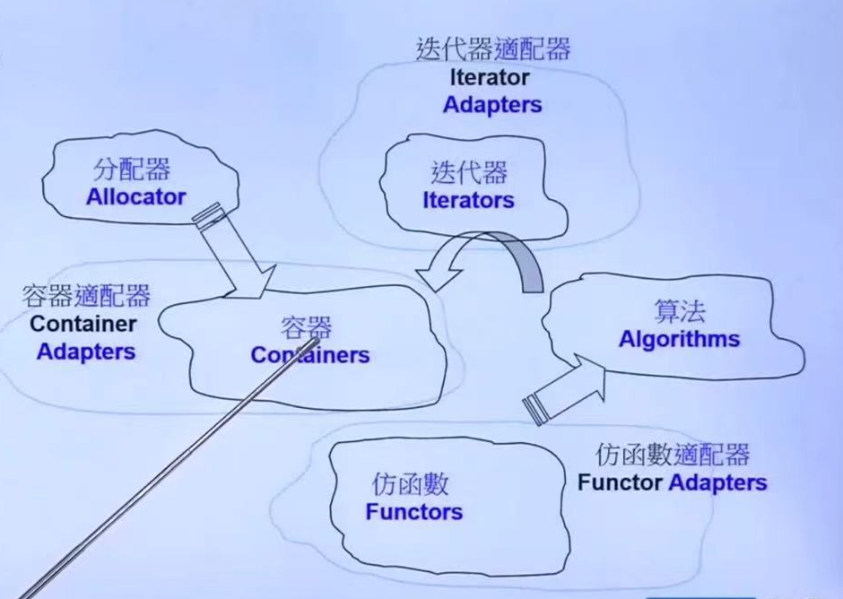

STL 6大组件

- 容器(Containers)：存放数据
- 分配器(Allocators)：为数据开辟内存
- 算法(Algorithms)：处理存放在容器中的数据
- 迭代器(Iterators)：为算法提供访问容器的方式
- 仿函数(Functors): 告诉算法如何处理
- 适配器(Adapters)
  - 容器适配器：将已有容器进行封装进而形成新的接口
    - stack、queue 基于deque实现
    - priority_queue 基于vector实现
  - 迭代器适配器
  - 仿函数适配器





一个例子说明6大组件

```C++
#include <iostream>
#include <vector>
#include <algorithm>
#include <functional>
using namespace std;

int main()
{
	int ia[6] = {27, 210, 12, 47, 109, 83};
	vector<int, allocator<int>> vi(ia,ia + 6);
	cout << count_if(vi.begin(), vi.end(),
			not1(bind2nd(less<int>(), 40))); // 输出大于等于四十的数的个数
	return 0;
}
```


- <>符号表示模板，allocator<int>是一个分配器模板。
  - 如果直接写vector<int>，则vector默认也会使用allocator<int>
- vector是一个容器containers
- count_if是一个算法algorithm，计算vi里符合条件的元素个数
- vi.begin(), vi.end()都是迭代器iterator
- less<int>是一个仿函数function
  - 仿函数，类对象重载了（）运算符

```c++
template <typename T>
struct less {
    bool operator()(const T& a, const T& b) const {
        return a < b;  // 直接调用 T 类型的 < 运算符
    }
};
```


- bind2nd是一个仿函数适配器，它将40绑定到less仿函数的第二个形参上
- notl也是一个仿函数适配器，表否定


综上所述，该程序返回满足$\geq40$的元素数量。


[DevC++下STL源码路径](D:\Devc++\Dev-Cpp\TDM-GCC-64\lib\gcc\x86_64-w64-mingw32\9.2.0\include\c++\bits)


容器分类

|    Sequential Containers     |  Associative Containers   | unordered Containers<br>(based on Hash-table) |
| :--------------------------: | :-----------------------: | :-------------------------------------------: |
|       Array(定长数组)        | Set(唯一值集合)/Multiset  |            Unordered Set/Multiset             |
| Vector (数组，后端动态扩充） | Map(键值对容器）/Multimap |            Unordered Map/Multimap             |
|   Deque(双端数组两端扩充)    |                           |                                               |
|        List(双向链表)        |                           |                                               |
|    Forward-List(单向链表)    |                           |                                               |


分配器 allocators

分配、回收内存所使用的函数allocate()、deallocate()的底层实现依赖于new()和delete()，而new()底层是靠C语言中的malloc实现的，delete()底层是靠C语言中的free()实现的。

malloc()是有开销的，它的内存中开辟的内存维护的值包含内存的大小，所以free()不需要知道开辟内存到底有多大。

|                 序列式容器                 |            关联式容器             |
| :----------------------------------------: | :-------------------------------: |
|           array/vector(连续空间)           |      rb_tree(红黑树)(非公开)      |
|                    heap                    |         set 有一个rb_tree         |
|  priority_queue 有一个heap帮助它管理数据   |         map 有一个rb_tree         |
|                 list 双向                  |             hashtable             |
|         slist(forward_list)，单向          |      hash_set(unordered_set)      |
|             deque 分段连续空间             |      hash_map(unordered_map)      |
| stack/queue(Container Adapter) 有一个deque | hash_multiset(unordered_multiset) |
|                                            | hash_multimap(unordered_multimap) |


# List 容器


# allocator 空间适配器

OOP(`Object-Oriented programming`)企图将datas和methods放在一起

GP(`Genetic Programming`)却是将datas和methods分开来


### new operator, operator new以及placement new的区别与联系

#### new operator

```c++
class Foo { ... }
Foo* pf = new Foo; // 配置内存，然后构造对象
delete pf; // 将对象析构，然后释放内存
```


指的是new关键字/表达式，编译器会将其分解为两个步骤

（1）调用 ::operator new 配置内存

（2）调用 Foo::Foo() 构造对象内容


#### operator new

```c++
void *operator new(std::size_t size) // 这是一个可重载的函数，底层调用malloc函数，向操作系统申请一块size大小的内存
```

Q:为什么使用`operator new`而不是`malloc`？

（1）异常处理机制

**`operator new`**：当内存分配失败时，它会抛出 `std::bad_alloc` 异常。

**`malloc`**：当内存分配失败时，它返回 `NULL`（或 `nullptr`）

（2）可重载性支持为特定类定制内存分配策略。


#### placement new

在已经申请的内存上构建对象。

```c++
#include <new.h>
template<class T1, class T2>
incline void constuct(T1* p, const T2& value) {
    new (p) T1(value);
}

// example
int buff[10];
int *p = new(buff) int(0);

```

