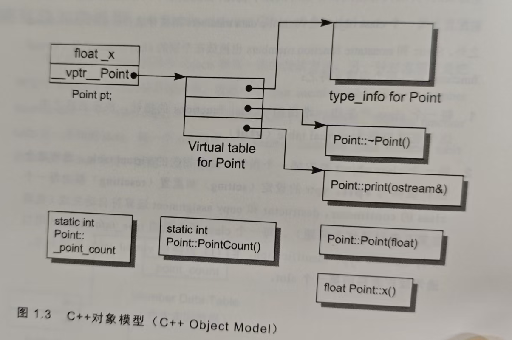

虚函数机制：执行期绑定

在C语言中，`数据`和处理数据的操作（`函数`）是分开声明的。

# 第1章 关于对象

## C++对象模型

在C++中，有两种class data members，分别是`static`和`nonstatic`。以及三种class member functions，分别是`static`，`nonstatic`，`virtual`。

```c++
class Point {
    public:
    	Point(float xval);
    	virtual ~Point();
    	float x() const;
    	static int PointCount();
    private:
    	virtual ostream& print(ostream& os) const;
    	float _x;
    	static int _point_count;
}
```

像上述这样一个类会在机器中如何表现呢？

1. 为了支持`virtual functions`，每个类产生一个指向`virtual functions`的指针，放在表格中，这个表格称为`virtual table`（`vtbl`)
2. 每一个类对象各有一个指针，指向同一类的`virtual table`，这个指针被称为`vptr`




class object（类对象）只存储`nonstatic data members`

```plaintext
class object
-----------
nonstatic data members
virtual pointer ->指向相关的virtual table

virtual table 存放的都是virtual functions 的指针
```


virtual 虚拟，也是共享的意思。


## 关键词struct和class

主要区别：struct内成员默认访问权限为public，而class的默认访问权限是private

## 多态

C++以下列方法支持多态：

1. 经由一组隐式的转化操作。例如把一个`derived class`指针转化为一个指向其`public base type`的指针。

```c++
shape* ps = new circle(); //很明显，是基类指针指向子类对象
```

2. 经由`virtual function`机制

```c++
ps->rotate();
```

3. 经由`dynamic_cast`和`typeid`运算符

```c++
if (circle* pc = dynamic_cast<circle*>(ps))...
```


# 第2章 构造函数

## 默认构造

```c++
class Foo {
    public:
    	int val;
    	Foo *pnext;
};

void foo_bar() { 
    Foo bar; // 由于没有定义构造函数，编译器会默认生成一个，但是这个构造函数什么也不做，所以编译不会报错，但是运行时未定义行为
    if (bar.val || bar.pnext)
        // do something
}
```

 下面是4种`nontrivial default constructor`有用的默认构造

### 带有 Default Constructor 的 Member Class Object

如果一个`class`没有任何`constructor`，但它内含一个`member object`，而后者有`default constructor`，那么这个`class`的`immplicit default constructor`就是有用的(书中用"nontrivial")。


编译器需要为此class合成出一个default constructor，不过这个合成操作只有在constructor真正需要被调用时才会发生。 


如果用户显式定义了构造函数，那么编译器会扩张已存在的constructors，使得user code被执行前，先调用必要的default constructors。

按照成员对象在类中的声明顺序初始化。

例如

```c++
class Dopey {public: Dopey(); ...};
class Sneezy {public: Sneezy(int); Sneezy(); ...};
class Bashful {public: Bashful(); ...};
class Snow_Write {
public:
    Dopey dopey;
    Sneezy sneezy;
    Bashful bashful;
    ...
private:
    int mumble;
}
// 如果没有定义默认构造，编译器就会合成一个有用的默认构造，依次调用上述三个类的默认构造函数，而mumble如果程序员不初始化，那么值将是未定义的。
```


### 带有 `Default Consturctor` 的 Base Class

如果没有任何构造函数的类，派生自一个带有默认构造函数的基类，那么编译器为派生类隐式生成的默认构造函数也不是无用的。

它将调用基类的默认构造函数。


### 带有 Virtual Function 的 Class


下面两种情况也需要合成一个default constructor(nontrivial)

1. class 声明（或继承）一个virtual function。
2. class派生自一个继承串链，其中有一个或更多的virtual base classes

这个主要是考虑到带虚函数的对象内保存有一个指向虚函数表的指针，编译器需要保证每个带虚函数的类对象其虚函数指针指向正确的地址。


### 带有 Virtual Base Class 的 Class

菱形继承

```c++
class X {public: int i; };
class A: public virtual X {public: int j;};
class B: public virtual X {public: int d;};
class C: public A, public B {public: int k;};
// if
class X;
class A;
class B;
class C;
```

可能的内存布局

 ```plaintext
 ------- // X的起始地址 假设是1000
 int i
 --------
 
 													  virtual table 假设是 2000
 -------  1004 // A的起始地址 假设机器是32位的				------------
 vbptr A // 虚指针放在对象起始位置能让编译器快速定位 -> 1000（X的起始地址）-1004（A的起始地址）=-4
 ------- 1008											-----------
 int j
 -------
 
 													virtual table 假设是 2004
 ------- 1012 B的起始地址  								-----------					
 vbptr B ------------------------------------>    1000 - 1012 = -12
 ------- 1016 									--------------------
 int d
 -------
 
 
 ------- 1020 C
 vbptr A    存的是 2000
 ------
 int j
 -------
 vbptr B    存的是 2004
 -------
 int d
 -------
 int k
 --------
 
 ```


## 拷贝构造

如果一个类没有声明拷贝构造，就会有隐式的声明出现。那如何判断这个隐式声明的拷贝构造是有用的还是无用的呢？

### 位逐次拷贝

如果一个类不展现出**位逐次拷贝**，就认为编译器声明的拷贝构造是有用的。

1. 当一个类内含一个成员对象，而该对对象声明了拷贝构造，编译器合成的拷贝构造就会调用后者的拷贝构造，是有用的。
2. 派生类继承自基类，基类有拷贝构造
3. 类内存在虚函数
4. 派生类继承自虚基类
