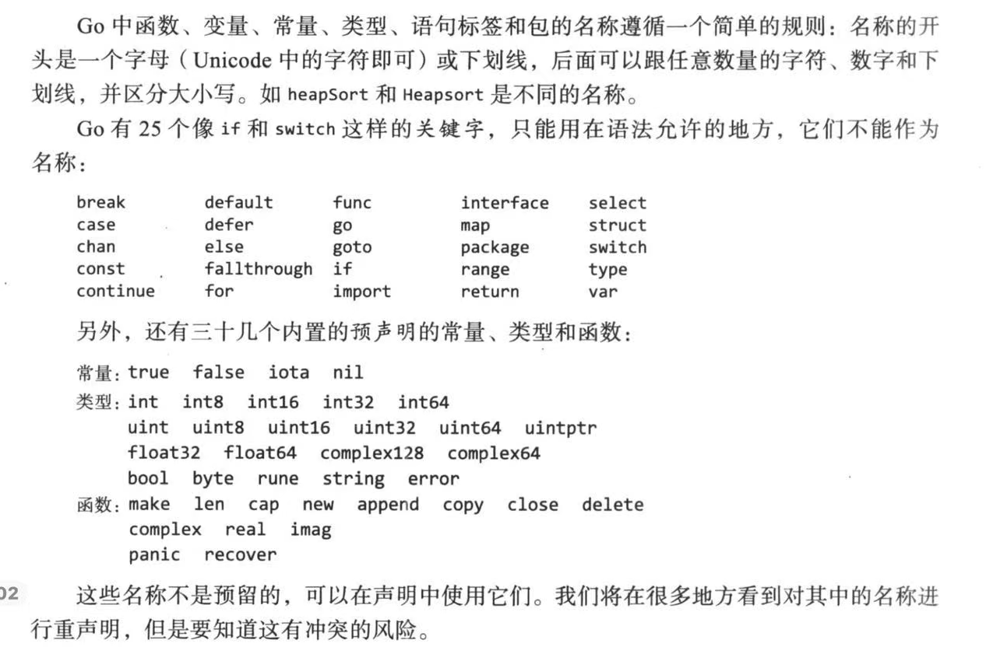

# 第1章 入门

`Go`是编译型语言。

```go
package main

import "fmt"

func main() {
	fmt.Println("Hello, 世界")
}
```

使用`go`命令配合子命令`run`对以`.go`为后缀的源文件进行编译、链接，然后生成可执行文件

```cmd
go run helloworld.go
```

如果该程序不是一次性的实验，我们可以通过`build`子命令生成名为`helloworld`的二进制程序

```cmd
go build helloworld.go
```


Go代码是使用包来组织的，包类似于库或者模块，一个包包含一个或多个.go源文件。


每一个源文件的开始都使用`package`声明，指明这个文件属于哪个包。

后面跟着它导入的其他包的列表。


`fmt`包中的函数用于**格式化输出和扫描输入**

`Println`是`fmt`中一个基本的输出函数，它输出一个或多个用空格分割的值，结尾自动添加换行符。


名为`main`的包用来定义一个可执行程序。

在`main`包中，函数`main`是特殊的，是程序开始执行的地方。


注意：必须精确地导入需要的包。缺失导入或者存在不需要的包，编译都会失败。


`import`声明必须跟在`package`声明之后。

`import`导入声明后面，是组成程序的函数、变量、常量、类型（以`func`、`var`、`const`、`type`开头）声明。


`gofmt`工具将代码以标准格式重写，go工具的`fmt`子命令使用`gofmt`工具来格式化指定包里的所有文件或者当前文件夹中的文件（默认情况下）。


```go
// echo1 输出其命令行参数
package main

import (
	"fmt"
	"os"
)

func main() {
	var s, sep string
	for i := 1; i < len(os.Args); i++ { // go语言只支持后缀
		s += sep + os.Args[i]
		sep = " "
	}
	fmt.Println(s)
}
```


`var`关键字声明了两个`string`类型的变量

变量可以声明时初始化。

如果没有明确初始化，则隐式初始化为该类型的空值，数字为0，字符串为空。


`os`包提供一些函数和变量，和操作系统打交道。

命令行参数以`os`包中`Args`名字的变量供程序访问，在`os`包外面，使用`os.Args`这个名字。

`os.Args`的数据类型是`[]string`字符串切片。

切片（`slice`）是 Go 语言中动态长度的序列容器，其特性与 C++ 中的 `vector<string>` 非常相似

```go
// echo2 输出其命令行参数
package main

import (
	"fmt"
	"os"
)

func main() {
	s, sep := "", ""
	// go不允许存在无用的临时变量
	for _, arg := range os.Args[1:] { // 每一次迭代，range产生一对值，索引和当前索引对应的元素
		s += sep + arg
		sep = " "
	}
    fmt.Println(s) // 使用%v(内置格式的任何值)格式化参数，追加换行符
}
```


撰写性能评估测试


```go
// dup1 输出标准输入中出现次数大于1的行，前面是次数
package main

import (
	"bufio" // 处理输入和输出
	"fmt"
	"os"
)

func main() {
	counts := make(map[string]int) // 内置的make函数可以新建map,map存储一个键值对集合
	input := bufio.NewScanner(os.Stdin)
	// os.Stdin是os包中的变量，类型是*os.File(文件指针)
	// bufio.NewScanner()创建一个带缓冲的输入处理器
	// 从os.Stdin按行读取数据，默认以换行符分割，返回值是指向 bufio.Scanner 结构体的指针
	for input.Scan() { // 返回bool值
		counts[input.Text()]++  // input.Text()返回当前扫描到的字符串
		// 等价于 line := input.Text()
		// counts[line] = counts[line] + 1
	}
	for line, n := range counts { // range是关键字 每次迭代得到键和值，键的迭代顺序是随机的
		if n > 1 {
			fmt.Printf("%d\t%s\n", n, line) //函数Printf默认不写换行符
		}
	}
}
```


```go
// dup2 打印输入中多次出现的行的个数和文本
// 从stdin 或 指定的文件列表中读取输入
package main

import (
	"bufio" // 处理输入和输出
	"fmt"
	"os"
)

func main() {
	counts := make(map[string]int) // 内置的make函数可以新建map,map存储一个键值对集合
	files := os.Args[1:] // []string（字符串切片)，切片中的每个元素都是字符串
	if len(files) == 0 {
		countLines(os.Stdin, counts)
	} else {
		for _, arg := range files {
			f, err := os.Open(arg) // f是*os.File 类型，即指向文件的指针
			// err是 error 接口类型 
			if err != nil { // nil是Go中的空值标识符，表示没有错误
				fmt.Fprintf(os.Stderr, "dup2: %v\n", err) //输出目标是标准错误流，自动调用err.Error()方法，输出一串字符串
				continue
			}
			countLines(f, counts)
			f.Close()
		}
	}
	for line, n := range counts { // range是关键字 每次迭代得到键和值，键的迭代顺序是随机的
		if n > 1 {
			fmt.Printf("%d\t%s\n", n, line)
		}
	}
}
	// 函数无需提前声明，定义后直接调用，map在go中是引用类型
func countLines(f *os.File, counts map[string]int) {
	input := bufio.NewScanner(f)
	for input.Scan() {
		counts[input.Text()]++
	}
}
```


小练习：获取一个`url`

```go
// 输出url获取的内容
package main

import (
	"fmt"      // 用于格式化输出和扫描输入
	"io"       // 处理各种i/o操作
	"net/http" // 用于实现 HTTP 客户端与服务端功能
	"os"
)

func main() {
	for _, url := range os.Args[1:] {
		resp, err := http.Get(url) //  resp是 HTTP 响应的结构体指针
		if err != nil {
			fmt.Fprintf(os.Stderr, "fetch: %v\n", err)
			os.Exit(1)
		}
		b, err := io.ReadAll(resp.Body)
		resp.Body.Close()
		if err != nil {
			fmt.Fprintf(os.Stderr, "fetch: reading %s: %v\n", url, err)
			os.Exit(1)
		}
		fmt.Printf("%s", b)
	}
}
```


并发获取多个`url`

```go
// 并发获取url并报告它们的时间和大小
package main

import (
	"fmt"
	"io"
	"net/http"
	"os"
	"time"
)

// main是主线程，go开辟的是子线程
func main() {
	start := time.Now()
	ch := make(chan string) // 内置函数make会默认初始化，创建一个字符串类型的通道
	for _, url := range os.Args[1:] {
		go fetch(url, ch) // 启动一个goroutine(轻量级线程)，运行fetch
	}
	for range os.Args[1:] {
		fmt.Println(<-ch) // 从通道ch接收
	}
	fmt.Printf("%.2fs elasped\n", time.Since(start).Seconds())
}

func fetch(url string, ch chan<- string) { // 浅拷贝
	start := time.Now()
	resp, err := http.Get(url)
	if err != nil {
		ch <- fmt.Sprint(err) // 发送操作 浅拷贝
		return
	}
	nbytes, err := io.Copy(io.Discard, resp.Body) // io.Discard，执行写操作，但是内部不做任何存储和输出处理
	resp.Body.Close()
	if err != nil {
		ch <- fmt.Sprintf("while reading %s: %v", url, err)
		return
	}
	secs := time.Since(start).Seconds()
	ch <- fmt.Sprintf("%.2fs %7d %s", secs, nbytes, url)
}
```

# 第2章 程序结构

---

## 2.1 名称





如果一个实体在函数中声明，则只在函数局部有效。

如果声明在函数外，它将对包里面的所有源文件可见。

实体的第一个字母的大小写决定其可见性是否跨包，大写字母开头表示是导出的，它对于包外是可见和可访问的，如`fmt`包中的`Printf`。


包名总是小写字母

Go程序员使用驼峰式风格

## 2.2 声明

Go程序存储在一个或多个以.go为后缀的文件里。

每个文件以`package`声明开头，表明文件属于哪个包。

`package`声明后面跟的是`import`声明。

然后是包级别的类型、变量、常量、函数的声明。（包级别的声明对于同一个包的所有源文件都可见）


## 2.3 变量

```go
// var 声明创建一个具体类型的变量，以下是通用形式
var name type(类型) = expression(表达式)
```

注：

1. 类型和表达式可以省略一个，但是不能都省略；
2. 若表达式省略，则变量的初始值将由**零值机制**保证，初始化为对应于类型的零值

```go
// example
var i, j, k int // int int int
var b, f, s = true, 2.3, "four" // bool float64 string
```

另，包级别的初始化在main之前进行，局部变量的初始化和声明在函数执行期间进行，很好理解。


### 短变量声明

自动推导类型

```go
// 语法
name := expression // name的类型将由expression决定
// example
f, err := os.Open(infile) // 短变量声明至少声明1个新变量
// 只有变量已经存在的情况下，短声明的行为才和赋值操作一样
```

### 指针

指针类型的零值是`nil`，表示未指向任何有效的内存地址


在Go中，返回局部变量的地址是安全的。


### new函数

创建变量的又一种方式。

```go
p := new(int) // p的类型是*int，指向未命名的int变量
```

new是一个内置的，预声明的函数，不是关键字


### 变量的生命周期


Q:垃圾回收器如何知道一个变量是否应该被回收？

每一个包级别的变量，以及每一个当前执行函数的局部变量，可以作为追溯该变量的路径的源头，通过指针和其他方式的引用可以找到该变量。

如果变量的路径不存在，那么变量变得不可访问，就应该垃圾回收了。


编译器可以选择使用堆或者栈上的空间来分配。

```go
var p = f()

func f() *int {
    v := 1
    return &v // p指向v，这时称变量逃逸出函数，编译器会自动将其分配在堆上，由垃圾回收器负责管理
}
```


## 2.5 类型声明

`type`声明定义一个新的命名类型，它和某个已有类型使用同样的底层类型。

```go
// 语法
type name underlying-type
// example
type Celsius float64
```

注：对于每个类型T，都有一个对应的类型转换操作T(x)将值x转换成类型T

## 2.6 包和文件

如果导入一个没有被引用的包，会触发错误。

包的初始化从初始化包级别的变量开始，变量又按照声明的顺序，在依赖已解析完毕的情况下，根据依赖的顺序进行初始化。


Go 中的 `init` 函数会在**包被导入时自动执行**，用于做一些初始化工作。

任何文件都可以包含任意数量的声明如下的函数

```go
func init { /* ... */ }
```

该函数不能被调用和被引用，它是普通函数。

当程序启动时，`init`函数按照它们生命的顺序自动执行。

# 第3章 基本数据

----

Go的数据类型分为四大类

- 基础类型（basic type)：数字、字符串（`string`）、布尔型
- 聚合类型（aggregate type)：数组、结构体
- 引用类型(reference type)：指针、$slice$、$map$、函数、通道
- 接口类型(interface type)


## 3.1 整数

Go支持有符号数和无符号数,如`int8`，`int16`，`int32`，`int64`，`uint8`。。。

`rune`类型是`int32`类型的同义词

`byte`类型是`unit8`类型的同义词


在Go中，尽管int天然就是32位，但是若要将int值当作int32使用，必须显示转换，反之亦然。


## 3.2 浮点数

`float32`和`float64`

`math`包中的`MaxFloat32`和`MaxFloat64`分别给出了浮点值的极限。

十进制下，前者的有效数字大约是6位，后者的大约是15位。


`math.IsNaN`函数判断其参数是否是非数值。

`math.NaN`函数返回非数值


## 3.3 复数

`complex64`和`complex128`

```go
var x complex128 = complex(1, 2) // 1 + 2i
```

`real`函数提取复数实部

`imag`函数提取复数虚部


## 3.4 布尔值

`true`和`false`

布尔值无法隐式转换成数值，反之也不行。


## 3.5 字符串

在`Go`语言中，字符串底层是只读的字节数组。切片操作不会复制原字符串的内容，而是会和原字符串共享同一块底层数组。该切片只记录起点和长度，因此操作十分高效。

但是，字符串的拼接操作会创建新的字符串。由于字符串的不可变性，拼接操作会重新计算字符串的长度，并为其分配新的内存。


与`c/cpp`不同，go中的字符串不以`\0`结尾。


字符串是**不可变**的字节序列。

这里的不可变意味着字符串内部的数据不允许更改。

内置的`len`函数返回字符串的字节数。例如

```go
s[0] = 'L' // 编译错误，s[0]无法赋值
```


子串生成操作`s[i: j]`，左闭右开区间，**和原串共用同一段底层内存**。

```go
s := "hello world"
sub := s[0:5] // sub是hello 与 s 共用底层内存
```


`Unicode`的理念是尽可能涵盖多的字符


其中，`utf-32`固定4字节编码，导致了不必要的存储空间消耗。

而`utf-8`兼容了ascii码，而其他常用的文书字符的编码只是2-3个字节。

Go的源文件总是以`utf-8`编码。


### 操作字符串常用的包

- `bytes`

用于操作字节类型的切片（字节类型的切片：动态长度的字节序列）

字节类型的切片，也即字节slice([]byte类型)，本身不存储数据，但包含3个部分：1）指向底层数组的指针；2）切片长度；3）切片容量


字符串和字节`slice`可以相互转换。

```go
s := "abc"
b := []byte(s) // 拷贝s含有的字节，为新的字节数组分配内存，编译器可能产生优化
s2 := string(b) // 也会拷贝
```


`bytes`包为处理`slice`提供了`Buffer`类型。

`Buffer`起初为空，动态扩容。


- `strings`

提供了许多函数，用于搜索，替换，比较，修整，切分与连接字符串


为了避免转换和不必要的内存分配，`bytes`包和`strings`包有许多函数

```go
// strings 包
func Contains(s, substr string) bool
func Count(s, sep string) int
func Fields(s string) []string
func HasPrefix(s, prefix string) bool
func Index(s, sep string) int
func Join(a, []string, sep string) string

// bytes包里面的对应函数
func Contains(b, subslice []byte) bool
func Count(s, sep []byte) int
func Fields(s []byte) [][]byte
func HasPrefix(s, prefix []byte) bool
func Index(s, sep []byte) int
func Join(a, [][]byte, sep []byte) []byte
```


- `strconv`

将布尔值、整数、浮点数转换成与之对应的字符串形式


整数转换为字符串

```go
x := 123
y := fmt.Sprintf("%d", x) // 第1种做法 不加换行
fmt.Println(y, strconv.Itoa(x)) // 123
```


将字符串类型的整数转换为整型

```go
x, err := strconv.Atoi("123") // x 是整型
y, err := strconv.ParseInt("123", 10, 64) // 十进制 最长为64位
```

- `unicode`


## 3.6 常量

在编译期计算表达式的值。

```go
const pi = 3.14159 // 在go语言中，类型推导机制使得即便没有提前声明，赋值运算符也可自行按照初始值推导其类型
// 类似地，还可以声明一系列常量
const (
	e = 2.718
    pi = 3.14159
)
```

常量生成器`iota`，默认从0开始递增。

### 无类型常量

go的常量自有其特殊之处。

虽然常量可以是任意数据类型，但是许多常量并不从属于某一具体类型。编译器讲这些从属类型待定的常量表示成某些值，这不仅可以使其具有更高的精度，而且还可以写进更多表达式中而无需转换类型（自动适配）。

如，一般的字面量默认是无类型常量。


只有常量才可以使无类型的。

```go
va f float64 = 3 + 0i // 无类型复数 -> float64
```


在变量声明中，如果没有显示指定类型，无类型常量会隐式转换成该变量的默认类型


# 第4章 复合数据类型

数组、`slice`、`map`和结构体。


Q：如何使用这些数据类型的结构化数据编码为`JSON`数据，从`JSON`数据转换为结构化数据，以及从模版生成`HTML`页面？

## 4.1 数组

```go
// 声明一个数组
var a [3]int // 索引从0到数组长度减1

// 默认情况下，一个新数组的元素初始值为元素类型的零值

var q [3]int{1, 2, 3} // 使用数组字面量初始化一个数组

var q [...]int{1, 2, 3} // ...表示数组的长度由初始化数组的元素个数决定

// 还可以这样，给出索引和索引对应的值，其余默认初始化
r := [...]int{99: -1} // 100个元素，最后1个元素值是1，其余被初始化为0
```

注意：与c/cpp一样的是，数组的长度必须在编译期确定。


如果一个数组的元素类型是可比较的，那么这个数组也是可比较的

```go
a := [2]int{1, 2}
b := [...]int{1, 2}
fmt.Println(a == b) // true
```


在go语言中，调用函数时，传入的参数是拷贝的副本，也即值传递。

Go中只有值传递。当传递数组的指针给函数时，也会产生拷贝。不过拷贝的指针仍然指向原始数组。


## 4.2 `slice`

`slice`表示一个拥有相同类型元素的可变长度的序列。

`slice`是一种**轻量级**的数据结构，它有三个属性：

1. 指针。指向底层数组的第一个可访问的元素。该元素不一定是数组的第一个元素。
2. 长度。`slice`中的元素个数。
3. 容量。

内置函数`len`和`cap`用来返回`slice`的长度和容量。


因为`slice`包含了指向数组元素的指针，所以将一个`slice`传递给函数时，可以修改底层数组。


和数组不同的是，`slice`无法做比较。

标准库仅对字节`slice`（[]byte)提供了函数`bytes.Equal`来比较两个字节。


Q：在Go语言中，为什么数组可以做比较，但是`slice`不可以？


数组长度固定，编译期可知，比较时可以逐元素对比，因此可以比较；

而`slice`是动态的，包含指针，长度和容量三个属性。是比较指针还是底层数组的元素，语义不确定。


`slice`类型的零值是`nil`，允许它和`nil`做比较。

值为`nil`的`slice`长度和容量都是0，没有对应的底层数组。


内置函数`make`可以创建一个具有指定元素类型、长度和容量的`slice`。其中，容量参数可以省略。在这种情况下，`slice`的长度和容量相等。

```go
make([]T, len)
make([]T, len, cap)
```

### append函数

将元素追加到`slice`后面。

`slice`可能是下面这种聚合类型。

```go
type IntSlice struct {
    ptr *int
    len, cap int
}
```

内置的`append`函数可以给`slice`添加多个元素

```go
var x []int
x = append(x, 1, 2, 3)
```

## 4.3 `map`

散列表。

键值对元素的无序集合。

键的值是唯一的。


在Go语言中，`map`是散列表的引用。`map`的类型是`map[k]v`，其中k和v是字典的键和值对应的数据类型。


键的类型可以用`==`进行比较，进而检测一个键是否存在。

```go
// 内置函数make可以用来创建一个map
ages := make(map[string]int)

// 还可以这样
map[string]int{}
```

可以使用内置函数`delete`从字典中根据键移除元素。即使键不在map中，操作也是安全的。

`map`中元素的迭代顺序也是不固定的，不同的实现方式会使用不同的散列算法。


如果需要按照某种顺序遍历map中的元素，可以显式地给键排序。

```go
import "sort" //Strings

var names []string 
for name := range ages { // ages是散列表
    names = append(names, name)
}

sort.Strings(names)

for _, name := range names {
    fmt.Printf("%s\t%d\n", name, ages[name])
}
```


`map`类型的零值是`nil`


访问不存在的键时，会返回该值类型的零值


## 4.4 结构体

下面的语句定义了一个叫`Employee`的结构体和结构体变量

```go
type Employee struct {
    ID int
    Name string
    Address string
    DoB time.Time
    Position string
    Salary int
    ManagerID int
}

var dilbert Employee
```

在Go语言中，.同样可以用于结构体指针。

```go
//例如 dilbert是一个Employee类型

var employeeOfTheMonth *Employee = &dilbert
employeeOfTheMonth.Position += "proactive team player"
// 等价于(*employeeOfTheMonth).Position += ...
```

如果一个人结构体的成员变量名称是首字母大写的，那么这个变量是可导出的。

### 结构体字面量

```go
type Point struct{X, Y int}
p := Point{1, 2}
```

在Go这种按值调用的语言中，调用的函数接收到的是实参的副本，因此传入结构体时一般用指针。

```go
pp := &Point{1, 2}
// 等价于
pp := new(Point)
*pp = Point{1, 2}
```

### 结构体比较

如果结构体的所有成员变量都可以比较，那么这个结构体就是可比较的。

和其他可比较的类型一样，可比较的类型都可以作为`map`的键类型。

### 结构体嵌套和匿名成员

为什么需要匿名成员？

```go 
//一个简单的例子
type Point struct {
    X, Y int
}
type Circle struct {
    Center Point
    Radius int
}
type Wheel struct {
    Circle Circle
    Spokes int
}
//如果要从Wheel访问成员X就很麻烦
```

Go允许我们定义不带名称的结构体成员，只需要指定类型即可，这种结构体成员叫做匿名成员。

```go
type Circle struct {
    Point // 匿名成员
    Radius int
}
type Wheel struct {
    Circle
    Spokes int
}
// 访问最终需要的变量时可以省略中间的匿名成员
```

初始化

```go
w = Wheel{Circle{Point{8, 8}, 5}, 20}
// 另一种
w = Wheel {
    Circle: Circle {
        Point: Point {X: 8, Y: 8},
        Radius: 5,
    },
    Spokes: 20, // 尾部的,是必须的
}
```

## 4.5 JSON（待补充）

`JavaScript`对象表示法(JSON)是一种发送和接收格式化信息的标准之一。

Go通过标准库`encoding/json、encoding.xml`对于相关格式的编码和解码提供了支持。

`JSON`是`JavaScript`的`Unicode`编码。


JSON最基本的类型是数字、布尔值和字符串。


# 第5章 函数

函数的类型叫做**函数签名**

当两个函数拥有相同类型的形参列表和返回列表时，认为函数的签名是相同的。

只有提供的实参包含引用类型，如指针、slice、map、函数或者通道，才可能间接地修改实参变量。


### 5.3 多返回值

一个函数如果有命名的返回值，可以省略`return`语句的操作数，这称为裸返回。


### 5.4 错误

`error`是内置的接口类型。


#### 5.4.2 文件结束标志

`io`包保证任何由文件结束引起的读取错误，会得到一个与众不同的错误`io.EOF`。


### 5.5 函数变量

简而言之，可以声明一个变量，将该函数传递给它。

```go
func square(n int) int { return n * n }
f := square // f的类型是func(int) int
fmt.Println(f(3)) // 9
```


### 5.6 匿名函数

举个例子

```go
func squares() func() int {
    var x int
    return func() int { // 返回一个匿名函数
        x++
        return x * x
    }
}
```

Go程序员通常把函数变量称为闭包。


### 5.8 延迟函数调用

`go`语言的`defer`机制。

`defer`是一个用于延迟函数调用的关键字。

执行时机：推迟到当前函数返回前执行。

```go
package ioutil

func ReadFile(filename string) ([]byte, error) {
    f, err := os.Open(filename)
    if err != nil {
        return nil, err
    }
    defer f.Close()
    return ReadAll(f)
}
// 这个函数会在正常返回，return执行，异常提出这些情况下执行f.Close()
```


### 5.9 宕机

在 Go 语言中，**runtime** 是 Go 程序的**运行时系统**，它是一套由 Go 官方提供的底层支持组件，负责管理 Go 程序的执行过程，涵盖了内存管理、并发调度、垃圾回收等核心功能。

可以将其看做幕后的管家，其职责之一是并发调度（goroutine 管理）

负责调度所有 `goroutine` 的执行：将大量 `goroutine` 合理分配到操作系统线程上运行，实现高效的并发切换，这也是 `goroutine` 能轻量且高效的核心原因。


函数这部分讲的也太烂了。


# 第6章 方法

面向对象编程

```plaintext
对象
 |---属性
 |---方法
```

例子1

```go
func (c Celsius) String() string {
    return fmt.Sprintf("%g°C", c)  
}
// 解释： Celsius这个类型，它有一个String()方法，这个方法不需要任何参数，只是返回一个string
// 前面括号中附加的参数叫做方法的接收者。
```

例子2

```go
type Point struct {X, Y float64}
// 普通函数
func Distance(p, q Point) float64 {
    return math.Hypot(q.X - p.X, q.Y - P.Y) // 计算直角三角边的斜边长度
}
// Point方法
func (p Point) Disturbance(q Point) float64 {
    return math.Hypot(q.X - p.X, q.Y - P.Y)
}

// 函数调用
Distance(p, q)
// 方法调用
p.Disturbance(q)
```

在 Go 语言中，**字段（Field）** 是**结构体（Struct）** 中的一个成员变量，用于描述结构体所表示实体的属性。因为每个类型都有自己的命名空间，所以当方法和字段重名时，编译器会报错。

## 6.2 指针接收者的方法

```go
func (p *Point) ScaleBy(factor float64) {
    p.X *= factor
    p.Y *= factor
}
// 接收者是一个Point指针
```

如果接收者是Point类型变量，但是方法需要对应类型的指针，这样是可以的

```go
p.ScaleBy(2) // 假设该方法在实现的时候接受者恰好需要一个指针，
// 但是我们提供的是对应类型的变量
// 那么编译器会对其进行&p的隐式转换
```

类似地，如果接收者是相应类型的指针，但是方法需要对应的类型，编译器会隐式转换为(*p)


## 6.3 结构体内嵌组成类型

内嵌使得结构体的定义更加简便，我们可以直接使用结构体内的所有字段。

同理，内嵌的字段的所有方法也可以被结构体直接调用。


实际上，内嵌字段会告诉编译器生成额外的包装方法。


匿名字段类型可以是指向命名类型的指针。


## 6.4 方法变量和表达式

可以将某个方法传递给某个变量，这样这个方法变量就绑定了接收者，只需要形参。


如果将某个类型的方法传递给某个变量，这个变量就叫做方法表达式，其中方法的接收者默认是第一个形参。


## 6.6 封装

不能通过对象访问某些方法和变量，这叫做封装。

也即数据隐藏。

在go语言中，首字母大写的标识符是可以从包中导出的，首字母不大写就不导出。

类似地，在结构体中，单个字段的首字母不大写，则称之为封装的变量。


# 第7章 接口

接口是一种抽象类型。

举个例子。

```go
package fmt
func Fprintf(w io.Writer, format string, args ...interface{}) (int, error)
func Printf(format string, args ...interface{}) (int error) {
    return Fprintf(os.Stdout, format, args...) // 把结果发到标准输出，os.Stdout 是一个 *os.File 类型的指针变量
}
```

`Fprintf`的第一个参数是一个接口，底层要求变量实现了`write`方法。`fmt.Fprintf` 最终会调用 `io.Writer`（比如 `os.Stdout`）的 `Write` 方法。

类似地

```go
func Sprintf(format string, args ...interface{}) string {
    var buf bytes.Buffer // bytes 包中定义的结构体类型 实现了write,read等方法
    Fprintf(&buf, format, args...)
    return buf.String()
}
```

## 7.2 接口类型

一个接口类型定义了一套方法，如果一个具体类型要实现该接口，就必须实现接口定义中的所有方法。

如果一个类型实现了接口定义中的所有方法，那么这个类型实现了这个接口，可以说xx(具体类型)是一个特定的接口类型，比如，`*os.File`是一个`io.ReaderWriter`。


当方法的接收者是类型T时，`T` 类型的变量 和 `*T` 类型的指针变量，都能调用该方法。

当方法的接收者是*T时，只有 `*T` 类型的指针变量能调用该方法。（临时变量的地址可能失效，为了避免非法访问，所以不允许将T隐式转换成`*T`。


**空接口类型**

对于实现类型没有任何要求，因为可以将任何值赋给空接口类型。


## 7.5 接口值

一个接口类型的值包含两个部分：一个具体类型 和 该类型的一个值。二者分别称为动态类型、动态值。

静态类型，编译期确定。

```go
var w io.Writer // 静态类型是io.Writer，接口初始化，零值是把动态类型和动态值都设置为nil

// 只有当动态类型和动态值都是nil时，接口变量才会被判定成nil
```


## 7.10 类型断言

基本语法

```go
x.(T) // x是一个接口类型，T是一个类型，通常被称之为断言类型
```

举个例子

```go
var w io.Writer // w的静态类型是io.Writer，编译器确定，初始化为nil
w = os.Stdout // 动态类型是*os.File 动态值是os.Stdout
f := w.(*os.File) // 如果断言类型T是一个具体类型，且w的动态类型就是T，那么断言的结果是w的动态值，也即os.Stdout
c := w.(*bytes.Buffer) // 否则崩溃
```

这还算好理解。

再举个例子，如果T是接口类型。

```go
var w Writer
w = os.Stdout // 动态类型是*os.File，动态值是os.Stdout
rw := w.(io.ReadWriter) // 断言：检查w的动态类型是否实现了io.ReadWriter接口，断言成功。
// rw的编译期类型是io.ReadWriter，动态类型是*os.File，动态值是os.Stdout

w = new(ByteCounter) // 动态类型是*ByteCounter 只有write方法，没有read方法
rw = w.(io.ReadWriter) // 断言失败，崩溃
```

# 第8章 goroutine和通道

`Go`有两种并发编程的风格。`goroutine`和通道`channel`支持通信顺序进程(`Communicating Sequential Process，CSP`)，这是一种并发模式。


## 8.1 goroutine

在Go中，每个并发执行的活动称为`goroutine`。

当一个程序启动时，只有一个`goroutine`来调用`main`函数，称它为主`goroutine`。新的`goroutine`通过`go`语句创建。

语法上，

```go
go f() // 新建一个调用f()的goroutine，不用等待
```

当主`goroutine`结束时，所有的`goroutine`都会直接终结。


## 8.4 通道

**通道**是让一个`goroutine`发送特定值到另一个`goroutine`的通信机制。每一个通道是一个具体类型的导管，叫做通道的元素类型。

一个有`int`类型元素的通道写为`chan int`。

使用内置的`make`函数来创建通道。

```go
ch := make(chan int) // ch的类型是chan int
```

和`map`一样，通道是一个使用`make`创建的数据结构的引用。和其他引用的类型一样，通道的零值是`nil`

关于通道的两个操作，发送和接收，二者称为通信。

```go
ch <- x // 发送语句
x = <- ch // 赋值语句
<- ch // 接收语句，丢弃结果
```

通过内置的`Close(ch)`函数来关闭通道。

关闭每一个通道不是必需的，可以通过垃圾回收器根据它是否可以访问来决定是否回收它。


使用简单的`make`调用创建的通道叫做**无缓冲通道**。

```go
ch = make(chan int, 3) // 容量为3的缓冲通道
```


### 8.4.1 无缓冲通道

无缓冲通道被称为**同步通道**。例如，当无缓冲通道上的发送方想要发送数据时将会先阻塞，直到另一个`goroutine`在对应的通道上执行接收操作。只有接收值后发送方的`goroutine`才会被再次唤醒。


Go提供了单向通道类型，仅仅导出发送或接收操作。

类型`chan <- int`是一个**只能发送**的通道，允许发送但不允许接收。反之，`<-chan int`是一个只允许接收的通道。

### 8.4.2 缓冲通道


缓冲通道有一个元素队列，队列的最大长度在创建时由`make`指定。

如果通道满，发送操作会被阻塞；类似地，通道为空，接收操作会被阻塞。


如果使用无缓冲通道，因为`goroutine`在发送结果的时候没有通道接收，发送方会永久阻塞，这种情况叫做**goroutine泄漏**，泄漏的`goroutine`不会自动回收。


### 补充语法

**Go中的switch**

```go
age := 2
switch age { // switch { switch后的表达式不是必须的
case age < 18:
    fmt.Println("未成年") // 自动break,无需显式添加
case age < 60: // case可以匹配多个值，用,分割
   ...
default:  
}
```

**select**

专门用于**处理通道（channel）操作**的控制语句，它能同时监控多个通道的发送或接收操作，并根据通道的就绪状态（即可执行的操作）随机选择一个分支执行。其核心作用是实现 goroutine 之间的**并发通信与同步**。

```go
// 基本语法
select {
case 通道操作1:  // 发送（ch <- val）或接收（val <- ch）
    // 分支逻辑
case 通道操作2:
    // 分支逻辑
...
default:  // 可选，所有通道操作都不可执行时执行
    // 默认逻辑
}
```

`default` 子句让 `select` 变成非阻塞的：如果所有通道都未准备好，就执行 `default`。

如果没有 `default` 且所有通道都阻塞，`select` 会一直等待，直到某个操作可以进行。


# 第9章 并发

## 9.1 竞态

Q1：什么是并发？

两个或多个事件在**一段时间内**同时发生。


**并行**：两个或多个事件在 **同一时刻** 同时发生


操作系统的并发：多个程序在计算机系统中“同时”运行，宏观上是同时运行，但微观上交替运行的
对于单核CPU，同一时刻只能执行一个程序，多个程序只能并发执行
但是对于多核CPU，同一时刻可以执行多个程序，多个程序可以并行执行


Q2：并发安全

一个能在串行程序中正确工作的函数，在并发调用时仍能正常工作，那么这个函数就是并发安全的。

可导出的包级别函数通常可以认为是并发安全的。


Q3：什么是竞态？

指的是多个`goroutine`按照某些交错顺序执行时程序无法给出正确的结果。


数据竞态：两个`goroutine`并发读写同一个变量且至少一个是写入时。

```go
// 以银行存钱为例
A1r 0 // Alice读余额
B 100 // Bob往里存钱
A1w 200 
A2 = "200" // 账户余额
```

如何避免数据竞态？

## 9.2 互斥锁：`sync.Mutex`

`sync`包有一个单独的`Mutex`类型来支持互斥锁模式。

```go
var (
	mu sync.Mutex // 保护balance
    balance int
)

func Deposit(amount int) {
    mu.Lock() // 获取一个互斥锁，如果其它goroutine已经取走了互斥锁，那么该操作会被阻塞
    balance = balance + amount // 临界区域
    mu.Unlock()
}
```


## 9.3 读写互斥锁: `sync.RWMutex`

Q:有了互斥锁，为什么还要读写互斥锁？

- 读写互斥锁允许多个 goroutine 同时**读**（共享访问），不阻塞彼此；
- 仅当有 goroutine 进行**写**操作时，才会阻塞所有读和其他写操作（独占访问）
- 在 “读多写少” 场景下大幅提升并发性能。


多读单写锁：只读操作可以并发执行，但写操作需要获得完全独享的访问权限

```go
var mu sync.RWMutex
var balance int

func Balance() int {
    mu.RLock() // 获取一个读锁，也称共享锁，比普通的互斥锁慢
    defer mu.RUnlock()
    return balance
}
```

## 9.4 内存同步

计算机一般有多个处理器，每个处理器都有内存的本地缓存。

为了提高效率，对内存的写入是缓存在每个处理器中的，只在必要时才刷回内存。


## 9.5 延迟初始化: `sync.Once`

理念：预先初始化一个变量会增加程序的启动延时，并且如果实际执行时可能根本用不上这个变量，那么初始化也不是必须的。

`Once`包含一个布尔变量和一个互斥量，布尔变量记录初始化是否已经完成，互斥量则负责保护这个布尔变量和客户端的数据结构。

`Once`的唯一方法`Do`以初始化函数作为它的参数，传入的实参无参无返回值，（可以理解为传入的是函数在内存中的入口地址）。


## 9.6 竞态检测器

Go语言运行时和工具链装备了一个精致并易于使用的动态分析工具：竞态检测器

`-race`命令行参数加入到`go build`、`go run`、`go test`命令中即可使用该功能。


## 9.8 goroutine与线程

### 9.8.1 可增长的栈

每个OS线程都有一个固定大小的栈内存（通常是2MB），栈内存区域用于保存在其他函数调用期间那些正在执行或者临时暂停的函数中的局部变量。

对于一个轻量级的goroutine而言，在其生命周期开始时只有一个很小的栈，通常为2KB。**它可以按需增大和缩小。**


### 9.8.2 goroutine调度

OS线程由OS内核调度。

大致的流程如下：

每隔几号秒，一个硬件时钟中断通知CPU调用一个叫**调度器**的内核函数，该函数暂停当前正在运行的线程，并将其寄存器的信息保存到内存，接着查看线程列表，从内存中恢复下一个待运行线程的注册表信息。


而Go运行时包含一个自己的调度器。这个调度器使用一个称为**m:n调度**的技术（它可以复用/调度m个goroutine到n个OS线程。

与操作系统的线程调度器不同的是，Go调度器并非硬件时钟触发，而是由特定Go语言结构触发。

比如通道阻塞，调度器就会将该goroutine设为休眠模式，**不需要切换到内核**，因此调用一个goroutine比调度一个线程的成本低很多。


Q：为什么在许多操作系统和编程语言中，每个线程都有一个独特的标识，而goroutine没有呢？

其实goroutine也是有的，只是官方没有在标准库中公开获取这个标识的接口。

# 第10章 包和 go 工具

Go程序的编译比其他语言要快，原因是

1. 所有的导入都在每个源文件的开头显式列出，这样编译器在确定依赖性的时候就不需要读取和处理整个文件；
2. 所有包可以独立甚至并行编译；

# 第11章 测试

## 11.1 go test 工具

在一个包目录中，以`_test.go`结尾的文件不是`go build`命令编译的目标，而是`go test`编译的目标。

在`*_test.go`文件中，三种函数需要特殊对待。

- 功能测试函数

是以`Test`前缀命名的函数，用于检测一些程序逻辑的正确性，`go test`运行测试函数，并且报告结果是`PASS`还是`FAIL`

- 基准测试函数

以`Benchmark`开头，用于测试某些操作的性能，`go test`汇报操作的平均执行时间。

- 示例函数

以`Example`开头，用来提供机器检查过的文档？？？


## 11.2 Test 函数

每一个测试文件必须导入`testing`包。

功能测试函数必须以Test打头，可选的后缀名也必须以大写字母开头，参数必须是`t *testing.T`。

```go
//example
func TestSin(t *testing.T) { /* ... */ }
```


在Go语言中，反引号用于表示原始字符串字面量，例如`/n`会原样保留


## 11.4 Benchmark 函数

