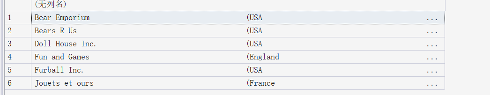
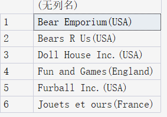

# 20250728

## 01 了解SQL

数据库：保存数据的容器

表：存放**同一类型**的数据。在一个数据库中，每张表都有一个唯一的名字来标识自己。

例如，顾客的清单 和 订单的清单，这便是两张表。


模式：描述一张表如何存储、存储的数据类型等信息。

主键：表中的每一行都有一列来标注自身。例如，每个顾客都有自己的顾客编号。

- 主键列不允许出现空值（NULL）
- 主键列的值不允许修改和更新


SQL Structured Query Language 结构化查询语言，和数据库沟通交流

设计SQL的目的是为了读写数据


## 02 检索数据

```sql
SELECT prod_name FROM Products; -- 从Products表中检索出prod_name这一列的列名
```

SQL语句不区分*大小写*

SQL开发人员喜欢对SQL关键字使用大写，而对列名和表名使用小写

`*`表示通配符号

```sql
SELECT * -- 表示检索所有列
```

`SELECT`返回匹配的所有行，但是可能一些行一样都满足条件，可以使用`DISTINCT`关键字进行过滤，只返回不同值（去重）。

```sql
SELECT DISTINCT vend_id FROM Products;
SELECT TOP 5 prod_name FROM Products; -- 可以返回指定数量的行
```


# 20250730

简单了解一下当前流行的数据库

RDBMS(Relational Database Management System)，关系数据库

- **MySQL**
- **PostgreSQL**
- **Oracle Database**
- **Microsoft SQL Server**
- **IBM DB2**
- `duckDB`

非关系型数据库 NoSQL(Not Only SQL)

- 文档型数据库：**MongoDB**
- 键值型数据库：**Redis**、**Amazon DynamoDB**

......

其实还有很多，但不再一一列举。

可能这些数据库的实现不完全一致，但总体上差不多，例如注释

基于SQL Server

```sql
-- 这是行内注释
/* 
这是多行注释
*/
# 有的支持行间用#表示注释，有的则不支持
```


## 排序检索数据

子句：SQL语句由子句构成，有些子句是可选的，例如 SELECT cust_id FROM Customers中的FROM Customers就是子句。

为了对检索出的数据进行排序

```sql
SELECT prod_name FROM Products ORDER BY prod_name;
-- ORDER BY 子句一定要在最后面
-- 根据非选择列排序也是合法的

SELECT prod_id, prod_price, prod_name 
FROM Products 
ORDER BY prod_price, prod_name; -- 首先按照价格排序，价格相同，才会按照名称排序，注意默认是升序

SELECT prod_id, prod_price, prod_name 
FROM Products 
ORDER BY 2, 3; -- 还可以这样，按照相对位置

SELECT prod_id, prod_price, prod_name 
FROM Products 
ORDER BY prod_price DESC, prod_name; -- 按照价格降序排列 Descending 价格相同 按照名称升序
-- 默认升序 ASC ascending
```

在对文本数据进行排序时，A和a相不相同，谁在前谁在后，取决于数据库的设置方式。


# 20250731

## 过滤数据

SELECT 中的 WHERE 子句

WHERE 子句根据特定条件对检索内容进行过滤，下面来看一个例子：

```sql
SELECT prod_name, prod_price 
FROM Products
WHERE prod_price = 3.49;
-- 在同时使用ORDER BY 和 WHERE 子句时，ORDER BY 要位于 WHERE 之后

SELECT vend_id, prod_name
FROM Products
WHERE vend_id <> 'DLL01'; -- 检索出vend_id中不等于DLL01的值
-- 注意：字符串必须是单引号才符合规范
```

WHERE 子句操作符

一些特别的

| 操作符  | 说明                                                     |
| ------- | -------------------------------------------------------- |
| ！>     | 不大于                                                   |
| BETWEEN | 在指定的两个值之间                                       |
| IS NULL | 为NULL值                                                 |
| <>      | 不等于，可以和`!=`互换，但并非所有DBMS都支持这两种操作符 |
|         |                                                          |

范围值检查

```sql
SELECT prod_name, prod_price
FROM Products
WHERE prod_price BETWEEN 5 AND 10; -- 开始值和结束值要用AND关键字分隔开， 是全闭区间[a, b]
```

空值检查

在创建表时，可以指定其中的列能否不包含值。不包含值时，称其包含空值`NULL`(它与字段包含0、空字符串或仅包含空格不同)。

```sql
SELECT prod_name
FROM Products
WHERE prod_price IS NULL; -- 返回所有没有价格的商品名称
```


## 过滤数据进阶

组合WHERE子句 联合 `AND` 子句或 `OR` 子句

```sql
SELECT prod_id, prod_name, prod_price
FROM Products
WHERE vend_id = 'DLL01' AND prod_price <= 4; -- 类似地，还有OR

-- 如果有多个操作符可以使用圆括号()
SELECT prod_name, prod_price
FROM Products
WHERE (vend_id = 'DLL01' OR vend_id = 'BRS01')
	AND prod_price >= 10;
```

`IN` 操作符可以指定条件范围，范围中的每个条件都可以进行匹配

```sql
SELECT prod_name, prod_price
FROM Products
WHERE vend_id IN ('DLL01', 'BRS01')
ORDER BY prod_name;
```

`NOT` 操作符否定跟在后面的条件

```sql
SELECT prod_name
FROM Products
WHERE NOT vend_id = 'DLL01'
ORDER BY prod_name; -- 检索出只要vend_id不等于‘DLL01'的列
```

## 用通配符进行过滤

通配符：用来匹配值的一部分特殊字符

搜索模式：由字面值、通配符或两者构成的搜索条件

谓词：


注意，通配速搜索只能用于文本字符串。

- %通配符

%表示任何字符出现任意次。

```sql
SELECT prod_id, prod_name
FROM Products
WHERE prod_name LIKE 'fish%'; -- 检索 任意以fish开头的词

-- %bean bag% 检索带有bean bag的字符串
-- F%y 检索以F开头并以y结尾的字符串
-- % 不会匹配NULL行
```

**Microsoft SQL Server**似乎默认检索不区分大小写。

- _通配符

下划线只匹配单个字符，且DB2不支持通配符_

```sql
SELECT prod_id, prod_name
FROM Products
WHERE prod_name LIKE '__ inch teddy bear';
```

- []通配符

不是所有的DBMS都支持这种通配符

```sql
SELECT cust_contact
FROM Customers
WHERE cust_contact LIKE '[JM]%'
ORDER BY cust_contact; -- 找出所有以J或者M起头的联系人
-- []通配符用于匹配方括号中的任意一个字符，注意只能匹配单个字符

SELECT cust_contact
FROM Customers
WHERE cust_contact LIKE '[^JM]%'
ORDER BY cust_contact; -- 找出所有不以J且不以M起头的联系人
```

尽管通配符很有用，但是代价是搜索更耗时。


# 20250801

## 计算字段

所谓计算字段，就是我们需要在检索出相应数据之后，对得到的数据进行二次加工，例如求平均值。


- 拼接字段

SQL Server 用 `+`

DB2、Oracle、PostgreSQL和SQLite用 `||`

```sql
SELECT vend_name + '(' + vend_country + ')'
FROM Vendors
ORDER BY vend_name; 
```

查询结果如下



许多数据库默认保存填充为列宽的文本值，可以使用`RTRIM(字符串)`函数来去除这些空格。

right trim 字符串处理函数，移除字符串右侧空格

类似地，`ltrim`和`trim`

```sql
SELECT RTRIM(vend_name) + '(' + RTRIM(vend_country) + ')'
FROM Vendors
ORDER BY vend_name;
```



 列别名。

通过`AS`给查询的列指定一个别名

```sql
SELECT RTRIM(vend_name) + '(' + RTRIM(vend_country) + ')'
AS vend_title
FROM Vendors
ORDER BY vend_name; -- 因为是查询语句，所以该操作不会改变原表结构
-- 别名可以是单词或者字符串，如果是字符串的话，应该括在引号中。
```

- 算术计算

```sql
SELECT prod_id, quantity, item_price, quantity*item_price 
AS expanded_price
FROM OrderItems
WHERE order_num = 20008;
```

SQL通常支持`+`、`-`、`*`、`/`操作符


## 函数

| 函数                                    | 说明                                               |
| --------------------------------------- | -------------------------------------------------- |
| 提取子串`substr()`[^1]、substring()[^2] | DB2、`ORacle`等用第1个，MYSQL、SQL Server用第第2个 |
| 数据类型转换CAST()[^1]、CONVERT()[^2]   |                                                    |
| 获取当前日期                            | MYSQL用`curdate()`、SQL Server用DATE()             |
|                                         |                                                    |

- 文本处理函数
  - 将文本转换成大写upper()
  - lower()
  - length()


SQL不区分大小写。

- 日期和时间处理函数

```sql
SELECT order_num
FROM Orders
WHERE DATEPART(yy, order_date) = 2020; -- 从order_date中返回年份
```

- 数值处理函数
  - abs()
  - cos()
  - exp()
  - pi()
  - sin()
  - sqrt()
  - tan()


挑战题

```sql
SELECT cust_id, cust_name, upper(substring(cust_contact, 1, 2) + substring(cust_city, 1, 3))
AS user_login
FROM Customers; -- sql字符串索引从1开始
```

# 20250803

## 汇总数据

- 聚集函数：用于汇总数据、分析数据和报表生成

| 聚集函数 | 说明         |
| -------- | ------------ |
| AVG()    |              |
| COUNT()  | 返回某列行数 |
| MAX()    |              |
| MIN()    |              |
| SUM()    |              |

example

```sql
SELECT AVG(DISTINCT prod_price) AS avg_price
FROM Products
WHERE vend_id = 'DLL01'; -- 检索出指定列的均值
-- 注：1.AVG只能确定单个列的平均值
-- 2. AVG()忽略列值为NULL的行

SELECT COUNT(*) AS num_cust
FROM Customers; -- 对表中行进行计数，此时并不忽略NULL行
-- 如果指定列名，则忽略NULL行
-- DISTINCT不能用于count(*)
```


## 分组数据

`GROUP BY`子句

```sql
SELECT vend_id, COUNT(*) AS num_prods
FROM Products
GROUP BY vend_id; -- GROUP BY 子句必须在 WHERE 子句之后， ORDER BY子句之前
-- 根据vend_id 找出其到底有多少行
```

`HAVING`子句

`WHERE`过滤行，`HAVING`过滤分组

```sql
SELECT cust_id, COUNT(*) AS orders
FROM Orders
GROUP BY cust_id
HAVING COUNT(*) >= 2; -- count（*)相同的cust_id被分到一组，计算一组多少行
-- HAVING只保留行数>= 2的
```

SELECT 子句顺序

| 子句     | 说明       |
| -------- | ---------- |
| select   |            |
| from     | 从哪个表中 |
| where    | 筛选的条件 |
| group    |            |
| having   |            |
| order by |            |
|          |            |

# 20250804

## 子查询

```sql
SELECT order_num -- order_num 订单编号
FROM OrderItems
WHERE prod_id = 'RGAN01'; -- prod_id 商品编号
-- 选择订单编号中包含这个商品编号的

SELECT cust_id
FROM Orders
WHERE order_num IN(20007, 20008);
-- 从上一个查询的输出结果中我们知道订单编号为20007和20008订购了该商品
-- 于是我们可以从另一个表中查出该订单对应的客户编号

-- 子查询：将上述两次查询变为一次
SELECT cust_id 
FROM Orders
WHERE order_num IN (SELECT order_num 
					FROM OrderItems 
					WHERE prod_id = 'RGAN01');


SELECT cust_name, cust_contact
FROM Customers
WHERE cust_id IN (SELECT cust_id 
				  FROM Orders
				  WHERE order_num IN (SELECT order_num 
									  FROM OrderItems 
									  WHERE prod_id = 'RGAN01'));
```


注意，子查询总是从内向外处理

```sql
SELECT cust_name, cust_state, (SELECT COUNT(*)
							   FROM Orders
							   WHERE Orders.cust_id = Customers.cust_id)
							   AS orders
FROM Customers
ORDER BY cust_name;
-- 计算每个顾客下了多少订单
```

# 20250805

## 联结表

### 关系数据库

理念：相同的数据不要多次出现

把信息分成多个表，一类数据一张表，各表通过某些值相关联(可以是等值联结)

example

```sql
select vend_name, prod_name, prod_price
from Vendors, Products -- from联结了两张表
where Vendors.vend_id = Products.vend_id -- 通过where子句建立联结关系

select vend_name, prod_name, prod_price
from Vendors
INNER JOIN Products ON Vendors.vend_id = Products.vend_id; -- 也可以这样写
-- join默认是inner join,连接两张表中满足匹配条件的行
```

DBMS运行时关联指定的每个表，以处理联结。联结表越多，性能越不好。

使用联结代替子查询

```sql
SELECT cust_name, cust_contact
FROM Customers
WHERE cust_id IN (SELECT cust_id 
				  FROM Orders 
				  WHERE order_num IN (SELECT order_num
									  FROM OrderItems
									  WHERE prod_id = 'RGAN01'));

-- 使用联结查询代替子查询
SELECT cust_name, cust_contact
FROM Customers, Orders, OrderItems
WHERE Customers.cust_id = Orders.cust_id 
AND Orders.order_num = OrderItems.order_num
AND OrderItems.Prod_id = 'RGAN01';
```

### 高级联结

SQL支持给表名取别名。

例如

`FROM Customers as C`

`oracle`不支持`AS`关键字

三种联结

1. 自联结：将表与自身进行联结，本质上是把一个表当作两个不同的表来使用
2. 自然联结：自动根据**两个表中名称相同的列**进行联结，自动去除联结表中的同名列（无需显式指定`ON`条件）
3. 外联结

```sql
-- join默认是内联结,取两张表的公共数据

-- 自联结：
SELECT c1.cust_id, c1.cust_name, c1.cust_contact
FROM Customers AS c1, Customers AS c2
WHERE c1.cust_name = c2.cust_name 
AND c2.cust_contact = 'Jim Jones'; -- 用于查找与 "Jim Jones" 所在公司同名的所有客户信息。
-- 这样理解，现在表2中筛选出与'Jim Jones'有关的表，然后再对第一章表中符合条件的进行筛选

-- 自然联结：自动去除联结表中的同名列
SELECT C.*, O.order_num, O.order_date, OI.prod_id, OI.quantity, OI.item_price
FROM Customers AS C, Orders AS O, OrderItems AS OI
WHERE C.cust_id = O.cust_id
AND OI.order_num = O.order_num
AND prod_id = 'RGAN01'; -- 

-- 自然联结
SELECT * 
FROM Orders 
NATURAL JOIN Customers;

-- 内联结：筛选并关联两个或多个表中符合条件的记录
SELECT Customers.cust_id, Orders.order_num
FROM Customers
INNER JOIN Orders ON Customers.cust_id = Orders.cust_id; --检索下单的客户和订购的数量
-- 只保留匹配的记录

-- 左外联结
SELECT Customers.cust_id, Orders.order_num
FROM Customers
LEFT OUTER JOIN Orders ON Customers.cust_id = Orders.cust_id; 
-- 左外联结：保留左表中的所有记录，即便在右表中没有匹配项
-- 检索下单或是未下单的客户
-- 类似地，还有右外联结

-- 全外联结
SELECT Customers.cust_id, Orders.order_num
FROM Customers
FULL OUTER JOIN Orders ON Customers.cust_id = Orders.cust_id;
-- 保留左表和右表的所有记录，无论是否匹配
```

# 20250806

------

## 组合查询

组合查询又叫做并或复合查询。

主要应用于以下场景：

1. 在一个查询中从不同的表返回结构数据
2. 对一个表执行多个查询，按一个查询返回数据（叽里咕噜说什么呢）

### `UNION`

```sql
-- union指示DBMS执行这两条select语句，
-- 并把输出组合成一个查询结果集
select cust_name, cust_contact, cust_email
from Customers
where cust_state IN ('IL', 'IN', 'MI')
UNION
SELECT cust_name, cust_contact, cust_email
from Customers
where cust_name = 'Fun4All'
```

注意：

1. `union`必须由两条或两条以上的`select`语句组成，语句之间用关键字`union`分割
2. `union`对于查询的结果自动去重（默认去重，但是有时为了不取消重复行，可以使用`UNION ALL`
3. 在涉及`union`的情况下，涉及多个查询，`order by`子句必须位于最后

## 插入数据

:wilted_flower:

`insert`

- 插入行
- 插入行的一部分
- 插入某些查询的结果

```sql
-- 插入行

-- 将一个新顾客插入到Customers表中
insert Customers
VALUES('1000000006', 'Toy Land', '123 Any Street', 'New Tork', 'NY', '11111', 'USA', NULL, NULL);

-- 编写依赖于特定列次序的sql语句是不安全的
insert Customers(cust_id, cust_name, cust_address, cust_city, cust_state, cust_zip, cust_country, cust_contact, cust_email)
VALUES('1000000006', 'Toy Land', '123 Any Street', 'New Tork', 'NY', '11111', 'USA', NULL, NULL);
-- 指定列，更繁琐
-- 在Customers这张表中，cust_id是主键
-- 因为主键具有唯一性，因此第二次插入数据失败
```

注意：在`sql server`的`insert`后面不需要跟`info`关键字，但是有的DBMS需要。

:wavy_dash:

```sql
-- 插入部分行
-- 在向Customers表中插入数据时没有给cust_contact和cust_email两列提供值
insert Customers(cust_id, cust_name, cust_address, cust_city, cust_state, cust_zip, cust_country)
VALUES('1000000006', 'Toy Land', '123 Any Street', 'New Tork', 'NY', '11111', 'USA');
```

注意：是因为这两列允许`NULL`，所以才可以省略

如果表定义给出默认值，而你不提供值，就用默认值

### 插入检索出的数据

```sql
-- 从一张名为CustNew的表中读出数据并插入到Customers中
insert Customers(cust_id, cust_contact, cust_email, cust_name, cust_address, cust_city, cust_state, cust_zip, cust_country)
select cust_id, cust_contact, cust_email, cust_name, cust_address, cust_city, cust_state, cust_zip, cust_country
from CustNew;
```

### 从一个表复制到另一个表

`create select`

将数据复制到一个新表

```sql
create table CustCopy as select * from Customers 
-- 这是sql中的标准写法
```

如果是`sql server`，则这样写

```sql
select * INTO CustCopy from Customers
-- select语句创建一个名为CstCopy的新表
-- 并把Customers表中的内容复制到新表中
-- 要想复制部分列，可以直接给出列名
```

## 更新和删除数据

`update`

- 更新表中的特定行
- 更新表中的所有行

```sql
-- update 语法
-- update 要更新的表
--		  列名和他们的新值
--	      确定要更新哪些行的过滤条件

update Customers
set cust_email = 'kim@thetoystore.com', -- set子句用于将新值赋给带更新的列
    cust_contact = 'Sam Roberts'
where cust_id = 1000000005;
```

注意：`update`语句中可以使用子查询

要删除某个列的值，如果允许NULL值，则可以将其设置成NULL

### 删除数据

`delete`

- 从表中删除特定行
- 从表中删除所有行

```sql
delete from Customers
where cust_id = 1000000006 -- delete删除的是某一行的数据
```

# 20250807

## 创建、更改、删除表

----

### 创建表

```sql
-- 创建表
-- 表名跟在CREATE TABLE后面
CREATE TABLE myProducts 
(
	prod_id CHAR(10) NOT NULL, -- 列名在表中是唯一的 固定窗长度，存储10个字符，不允许为空
	vend_id CHAR(10) NOT NULL,
	prod_name CHAR(254) NOT NULL,
	prod_price DECIMAL(8, 2) NOT NULL, -- 总长度为8位，小数点后固定保留两位
	prod_desc VARCHAR(1000) NULL -- 可变长度字符串，最长为1000，允许为空
	-- 可变长度更节省存储，但读取时需计算长度	
)
```

注意：如果不指定`NOT NULL`，就认为可以为`NULL`

`null`表示没有值，与`' '`空字符串不同，空字符串也是一个有效值


SQL 允许指定默认值

```sql
CREATE TABLE OrderItems 
{
	quantity INTEGER NOT NULL DEFAULT 1,
}
```

通过指定引用系统日期的函数，将系统日期设置成默认日期

获得系统日期

| DBMS         | 函数           |
| ------------ | -------------- |
| `MySQL`      | current_date() |
| `sql server` | GETDATE()      |

### 更新表

```sql
ALTER TABLE Vendors
ADD vend_phone CHAR(20); -- 添加一列 默认为NULL
```


```sql
ALTER TABLE myProducts
DROP COLUMN vend_phone; -- 删除表中一列

DROP TABLE CustCopy; -- 删除一张表
```

## 视图

```sql
-- 创建视图
CREATE VIEW ProductCustomers 
AS
SELECT cust_name, cust_contact
FROM Customers, Orders, OrderItems
WHERE Customers.cust_id = Orders.cust_id
	AND OrderItems.order_num = Orders.order_num
	AND prod_id = 'RGAN01';
GO -- 在 SQL Server Management Studio (SSMS) 等工具中，GO 用于标识批处理的结束，执行视图创建语句后通常需要加上

SELECT *
FROM ProductCustomers;
```

视图为虚拟的表。它们包含的不是数据，而是根据需要检索数据的查询。

因此不能在创建视图时进行排序，而是应该在查询视图时排序。


# 20250808

----

## 存储过程

我感觉，就是包装成函数。

不是感觉，它就是。

- 执行存储过程 `execute`

```sql
execute AddNewProduct('JTS01', 'Stuffed Eiffel Tower') // execute 函数名（参数）
```

- 创建存储过程，以`sql server`为例

```sql
CREATE PROCEDURE MailingListCount // 该存储过程没有参数
AS
DECLARE @cnt INTEGER -- sql server中的局部变量名都以@开头
SELECT @cnt = COUNT(*) 
FROM Customers
WHERE NOT cust_email IS NULL;
RETURN @cnt;

-- 执行上述存储过程
DECLARE @ReturnValue INT -- 在sql server中，int等价于integer
EXECUTE @ReturnValue=MailingListCount;
SELECT @ReturnValue;

-- 再来看一个案例
CREATE PROCEDURE NewOrder @cust_id CHAR(10) -- 该存储过程带有参数
AS
...
```


这一章的最后谈论到

```sql
-- sql server中称一些自动增量的列为标识字段，其他DBMS则称为自动编号/序列
CREATE PROCEDURE NewOrder @cust_id CHAR(10)
AS
-- 插入新订单
INSERT INTO Orders(cust_id)
VALUES(@cust_id);
-- 返回订单号
SELECT order_num = @@IDENTITY; -- IDENTITY是一个全局变量，sql server用@@表示全局变量
-- 注意：该过程也包括select语句
```


剩下的我们需要补充`sql`有关存储过程的介绍。


## 管理事务处理

> 是一种机制，保证一组操作要么完全执行，要么执行错误回溯到执行起点。

- 事务：一组`sql`语句
- 回退：撤销指定`sql`语句的过程
- 提交：将尚未存储的`sql`语句结果写入数据库表
- 保留点：事务处理中设置的临时占位符，可以对它发布回退

事务处理可以用来管理`insert`、`update`、`delete`语句。但不能回退`select`语句，原因是`select`只做查询，对数据库表无影响。

```sql 
-- 以sql server为例，事务处理块的开始与结束
BEGIN TRANSATION
...
COMMIT TRANSATION -- commit只在上述操作不出错时对数据库表进行更改

-- 回退
DELETE FROM Orders;
ROLLBACK; -- 撤销delete

-- 使用保留点
-- 如果事务处理块很长，那完全回退并不好，因此在sql中可以使用保留点回退部分事务
-- 仍以sql server为例
SAVE TRANSACTION delete1 -- 保留点的名字唯一
ROLLBACK TRANSACTION delete1;

-- 案例
begin transaction
insert into Customers(cust_id, cust_name)
values(100000010, 'Toys')
save transaction startOrder; -- 定义一个保留点
insert into Customers(cust_id, cust_name)
values(100000010, 'Yoys')；
if @@error <> 0 -- 如果error非0，表示有错误发生
rollback transaction startOrder;
commit transaction

```


## 游标

> 被select检索出来的结果集。

- 创建游标，以`sql server`为例

```sql
DECLARE CustCursor CURSOR -- declare声明了一个名为CustCursor的游标
FOR
SELECT * FROM Customers
WHERE cust_email IS NULL;
```


未完待续

这三章不同的`SQL`具体实现不同，简单了解一下即可。

## 高级SQL特性

### 约束

> 管理如何插入或处理数据库数据的规则

举个例子，`sql server`是关系型数据库，这就意味着你要插入数据时要考虑多重因素。

- **主键**：

创建表时应该定义主键

```sql
CREATE TABLE Vendors {
	vend_id CHAR(10) NOT NULL PRIMARY KEY,
} -- 在创建表时定义主键

ALTER TABLE Vendors
ADD CONSTRAINT PRIMARY KEY (vend_id); -- 也可添加约束
-- 注意：在关系型数据库中，一张表只允许一个主键
-- 主键值不允许修改或更新
-- 每一行的主键值都是唯一的
-- 主键值不能重用，被删除后，主键值不分配给新行
```

- **外键**：表中的一列，却是另一张表的主键

例如，Orders记录每个订单的信息，主键是`订单号`，该表中有一列是`cust_id`，这一列恰好是客户表的主键。

```sql
CREATE TABLE Orders {
	order_num INTEGER NOT NULL PRIMARY KEY,
	cust_id CHAR(10) NOT NULL REFERENCES Customers(cust_id)
}

-- 类似地
ALTER TABLE Orders
ADD CONSTRAINT
FOREIGN KEY (cust_id) REFERENCES Customers (cust_id);
```

- 唯一约束：用来保证一列中的数据是唯一的

- 检查约束：用于保证一列中的数据满足一组指定的条件

```sql
CREATE TABLE OrderItems {
	quantity INTERGER NOT NULL CHECK(quantity > 0) -- 检查约束
}

ADD CONSTRAINT CHECK (gender LIKE '[MF]')
```

- 索引

```sql
CREATE INDEX prod_name_ind
ON Products (prod_name);
```


- 触发器：与单张表相关联

触发器内的代码可以访问以下数据

1. `insert1`操作中的所有新数据
2. `update`操作中的所有新数据和旧数据
3. `delete`操作中删除的数据
