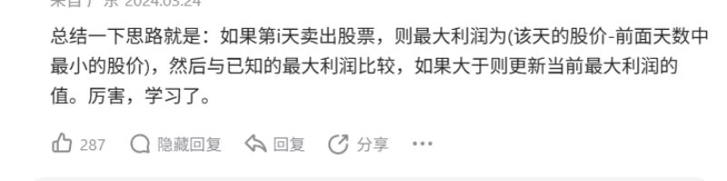

# 2025

## 11-W1

### 03

- [x] 剪绳子
- [x] `Leecode` 27 移除元素
- [x] `Leecode` 26 删除有序数组的重复项

### 04

- [ ] 剑指Offer 位运算 我觉得这种想法对我来说是一种比较新的

- [x] 《Go程序设计语言》 9.7 并发非阻塞缓存 自己敲一敲 最后我没敲，因为我想着还是专修C++吧
- [x] `Leecode` 80 删除有序数组中的重复项II


### 05

- [ ] 剑指Offer 面试题16 数值的整数次方 一点也不简单
- [x] 关于Go基础语法的学习暂时就到这里
- [x] `Leecode` 169 多数元素

> 多数元素出现的次数超过数组长度的一半。基于这个特性，我们可以通过**抵消**的思想找到多数元素


## 11-W2

### 10

- [ ] 删除链表中重复的节点
- [ ] Leecode 122 买卖股票的最佳时机 I



几句话给我说清了，还是高手在民间。


### 11

- [x] 看计算机网络八股
- [ ] 剑指Offer 面试题19 正则表达式

既然是人想出来的，那就没有多难。我一定可以做出来。


递归逻辑，从后往前遍历

Q1：为什么从后往前遍历？

是因为如果遇到*，我们需要判断前面的字符是否重复多次。

Q2：为什么先判断`j<0`是否成立？

如果说字符串中没有*

```c++
bool isMatch(string s, string p) {
    int i = 0, j = 0;
    while (i < s.size() && j < p.size()) {
        if (s[i] == p[j] || p[j] == '.') {
            i++; j++;
        } else {
            return false;
        }
    }
    // 退出循环
    // 1. i == s.size()
    // 2. j == p.size()
    // 3. i == s.size() && j == p.size() 只有这种情况才说明模式串与主串是匹配的
    return i == s.size() && j == p.size(); 
}
```


j<0 表明模式串p已经遍历完，这时如果 s < 0 说明 s也遍历完，这是匹配的情况，逻辑比较简单；

```c++
class Solution {
public:
    bool isMatch(string s, string p) {
        return dfs(s, p, s.size() - 1, p.size() - 1);
    }
    // 判断主串s[0, i]和模式串p[0, j]是否匹配
    bool dfs(string& s, string& p, int i, int j) {
        if (j < 0) { // 如果p已遍历完，
            return i < 0;
        }
        // 如果s遍历完
        if (i < 0) { // 程序走到这里j >= 0
            // 判断p[0, j]是否是x*y*...形式，匹配空字符串 这种形式j一定是奇数
            if ((j & 0x1) == 0) { // 说明是偶数
                return false; 
            }
            for (int k = 1; k <= j; k += 2) {
                if (p[k] != '*')
                    return false;
            }
            return true;
        }
        if (p[j] != '*') {
            return (s[i] == p[j] || p[j] == '.') && dfs(s, p, i - 1, j - 1); // p[j] == '.' || 'c'
        } else { // p[j] == '*'
            return dfs(s, p, i, j - 2) || ((s[i] == p[j - 1] || p[j - 1] == '.') && dfs(s, p, i - 1, j));
            // 1. p[j - 1]出现0次，比较s[i]和p[j - 2]
            // 2. p[j - 1]出现多次，
        }
    }
};

// 时间复杂度:O(2^(m + n) 当遇到*，递归会产生两个分支 跳过 x* 和 继续匹配 x*
// 空间复杂度:O(m + n) 
// 每次递归可能是
// 1. 同时减少i和j
// 2. i不变
// 3. j不变
```


动态规划（记忆化搜索是动态规划的一种实现方式）

```c++
class Solution {
public:
    bool isMatch(string s, string p) {
        // 记忆化搜索
        int m = s.size(), n = p.size();
        vector<vector<int>> dp(m + 1, vector<int>(n + 1, -1)); // dp[i][j]表示s前i个字符和p前j个字符是否匹配
        // -1 未计算
        // 0  不匹配
        // 1 匹配
        // 初始化
        dp[0][0] = 1;
        dp[0][1] = 0;
        for (int i = 1; i <= m; ++i) {
            dp[i][0] = 0;
        }
        // 如果i == 0，那么j一定要是x*y*的形式
        for (int j = 1; j <= n; j++) {
            if ((j & 0x1) == 0) { // 如果j是偶数
                dp[0][j] = (p[j - 1] == '*') && dp[0][j - 2];
            } else {
                dp[0][j] = 0;
            }
        }
        return dfs(s, p, m, n, dp);
    }
    // 判断主串s[0, i]和模式串p[0, j]是否匹配
    bool dfs(string& s, string& p, int i, int j, vector<vector<int>>& dp) {
        if (dp[i][j] != -1) {
            return dp[i][j] == 1;
        }
        int& ret = dp[i][j];
        if (p[j - 1] != '*') { // i和j至少为1
            ret = (s[i - 1] == p[j - 1] || p[j - 1] == '.') && dfs(s, p, i - 1, j - 1, dp); // p[j] == '.' || 'c'
        } else { // p[j] == '*'
            ret = dfs(s, p, i, j - 2, dp) || ((s[i - 1] == p[j - 2] || p[j - 2] == '.') && dfs(s, p, i - 1, j, dp));
            // 1. p[j - 1]出现0次，比较s[i]和p[j - 2]
            // 2. p[j - 1]出现多次，
        }
        return ret == 1;
    }
};
```

总算做出来了，还算OK


- [x] 配置环境


### 12

- [ ] 买卖股票的最佳时机 II

在每一天你可以选择买入/卖出股票，每天结束最多允许持有1股，返回你能得到的最大利润。


解题：

定义 $dp(i, 0)$ 表示**第 i 天结束** 未持有股票时的最大利润。

定义 $dp(i, 1)$ 表示**第 i 天结束** 持有股票时的最大利润。

递归 超时

```c++
class Solution {
public:
    int maxProfit(vector<int>& prices) {
        int n = prices.size();
        return dfs(prices, n - 1, false); // 最后一天，一定不会持有股票
    }
    int dfs(vector<int>& prices, int i, bool flag) {
        if (i == -1) {
            return flag == true ? -INT_MAX / 2: 0;
        }
        /*
        if (i == 0) {
            return flag == true ? -prices[0]: 0; // 递归边界，这里需要保证prices数组不是空的
        }
        */
        int max_profit = 0;
        if (flag) { // 第 i 天结束时，持有股票
            max_profit = max({max_profit, dfs(prices, i - 1, false) - prices[i], dfs(prices, i - 1, true)});
        } else {
            max_profit = max({max_profit, dfs(prices, i - 1, false), dfs(prices, i - 1, true) + prices[i]});
        }
        return max_profit;
    }
};

// 时间复杂度 O(2^n)
// 空间复杂度 O(n)的递归调用栈
```

记忆化搜索 有待进一步完善

```c++
class Solution {
public:
    int maxProfit(vector<int>& prices) {
        int n = prices.size();
        vector<array<int, 2>> dp(n + 1, {-1, -1}); // -1 没计算过
        return dfs(prices, n, 0，dp); // 最后一天，一定不会持有股票
    }
    int dfs(vector<int>& prices, int i, int hold, vector<vector<int>>& dp) {
        if (i == 0) {
            return flag == true ? -INT_MAX / 2: 0;
        }
        /*
        if (i == 0) {
            return flag == true ? -prices[0]: 0; // 递归边界，这里需要保证prices数组不是空的
        }
        */
        int& ret = dp[i][hold];
       	if (ret != -1) {
            return ret;
        }
        if (hold) { // 第 i 天结束时，持有股票
            ret = max({ret, dfs(prices, i - 1, 0, dp) - prices[i], dfs(prices, i - 1, 1, dp)});
        } else {
            ret = max({ret, dfs(prices, i - 1, 0, dp), dfs(prices, i - 1, 1, dp) + prices[i]});
        }
        return ret;
    }
};

// 时间复杂度 O(2^n)
// 空间复杂度 O(n)的递归调用栈
```


