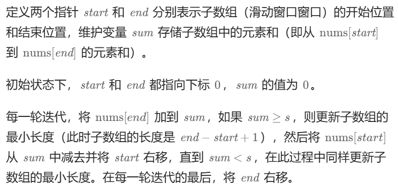

# 20250222

## 1991 寻找数组的中间索引

1.先整体遍历一遍求和

2.从左往右依次判断是否满足中间索引的条件：如果left_sum*2 + 当前值 == sum 则表示找到了中间索引

### 笔记

前缀和法

```C++
class Solution {
public:
    int findMiddleIndex(vector<int>& nums) {
        int total = accumulate(nums.begin(), nums.end(), 0); //<algorithm>算法库中用于操作容器的算法，同时还需要<numeric>库：计算范围内元素的累计和
        //int sum = accumulate(vec.begin(), vec.end(), 0)
        int left_sum = 0;
        for (int i = 0; i < nums.size(); ++i)
        {
            if (left_sum == total - leftsum - nums[i])
            {
                return i;
            }
            left_sum += nums[i];
        }
        return -1;
    }
};
```

时间复杂度：**O(n)**

# 20250223

## 068 搜索插入位置

二分查找

```C++
class Solution {
public:
    int searchInsert(vector<int>& nums, int target) {
          //二分查找，左闭右闭区间 
        int left = 0, middle, right = nums.size() - 1;
        while (left <= right) //停止范围要注意
        {
            middle = (left + right) / 2;
            if (nums[middle] == target)
                return middle;
            else if (nums[middle] < target)
                left = middle + 1;
            else if (nums[middle] > target)
                right = middle - 1;
        }
        return left; 
    }
};
```

### 思考：为啥最后返回left?

因为循环结束时left永远指向第一个大于等于target的位置，也即target应该插入的位置。

### 笔记

```C++
//如果区间是左闭右闭
left = 0;
right = vec.size() - 1;
while(left <= right) //这里之所以用<=，是因为[1, 1]也是一个合法的区间
{
    middle = left + right /2; //这里如果直接相加的话C++可能产生溢出的问题，
    //解决办法：middle = left + (right - left) / 2;
    if (num[middle] > target)
        right = middle - 1;  //因为已经判断过middle的值大于target了，所以这里是middle-1
	else if (num[middle] < target)
		left = middle + 1;
	else
		return middle;
}
return -1;
```

```C++
//如果区间是左闭右开
left = 0;
right = vec.size();
while(left < right) //这里之所以用<,是因为[1,1)，此时如果left=right就不再是合法区间了
{
	middle = left + right /2;
	if (num[middle] > target)
		right = middle; //开区间右侧取不到，所以直接可以等于middle
	else if (num[middle] < target)
		left = middle + 1;
	else
		return middle;
}
return -1;
```

# 20250224

## 56 合并区间

### 思路

1.先排序。排序的思路是先比较starti。如果起始位置相同，再比较结束位置endi

2.初始化。创建一个新数组merged用于存储合并后的区间，并将排序后的第一个区间加入到merged数组中，作为初始合并区间

3.遍历区间。从第二个空间对排序后的区间进行遍历。对于每个遍历到的区间，检查它是否与merged数组的最后一个区间重叠。

如果重叠，则更新merged数组的最后一个区间的结束位置作为这两个区间结束位置的较大值

如何判断区间是否重叠？

[a, b], [c, d]

当且仅当c <= b && a <= d时这两个区间产生重叠，而经过排序后a肯定是最小的，所以只需要比较b和d哪个大就可以了。

如果不重叠，则将该区间添加到merged数组中。

4.返回结果。

```C++
class Solution {
public:
    vector<vector<int>> merge(vector<vector<int>>& intervals) {
       //1.冒泡排序
       int n = intervals.size();
       int start = 0, end = 1;
       for (int i = 0; i < n - 1; ++i)
       {
           bool swapped = false;
           for (int j = 0; j < n - 1 - i; ++j)
           {
               if (intervals[j][start] > intervals[j+1][start])
               {
                   swap(intervals[j], intervals[j+1]); //<algorithm>中的swap函数
                   swapped = true;
               }
               else if (intervals[j][start] == intervals[j+1][start])
               {
                   if (intervals[j][end] > intervals[j+1][end])
                   {
                       swap(intervals[j], intervals[j+1]);
                       swapped = true;
                    }
               }
           }
           if (!swapped) break;  
       }
       //2.初始化
       vector<vector<int>> merged;
       merged.push_back(intervals[start]);
       //3.遍历区间
       for (int i = 1; i < n; ++i)
       {
           int current_start = intervals[i][start];
           int current_end = intervals[i][end];
           int last_start = merged.back()[start];
           int last_end = merged.back()[end];
           if (current_start <= last_end && last_start <= current_end) //区间重叠
           //逆否命题即 排序后a>d是不可能的，所以只剩c>b
           {
               merged.back()[end] = max(merged.back()[end], current_end);
           }
           else
                merged.push_back(intervals[i]);
       }
       return merged;
    }
};
```

时间复杂度 O(n^2)

### 官方题解

#### 方法一：排序

```C++
class Solution {
public:
    vector<vector<int>> merge(vector<vector<int>>& intervals) {
        if (intervals.size() == 0)
            return {};
        // return {}会返回一个不包含任何元素的 vector<int> 对象。
        // 这是因为容器类通常提供了接受初始化列表的构造函数，当列表为空时，就会构造出一个空容器。
        // 还能这样写吗？ 我还不太理解。
        sort(intervals.begin(), intervals.end()); //<algorithm>排序算法，默认排序规则：升序，第一个数一样的话，再按照第二个数升序排列
        vector<vector<int>> merged;
        for (int i = 0; i < intervals.size(); ++i) 
        {
            int L = intervals[i][0], R = intervals[i][1];
            if (!merged.size() || merged.back()[1] < L) // vec.size()为空返回0
                merged.push_back({L, R}); 
                //{L， R}利用初始化列表创建一个临时的vector<int>对象			
            else
                merged.back()[1] = max(merged.back()[1], R);
        }
        return merged;
    }
};
```

#### 方法二：双指针

参考别人的思路，这是我写的，其实感觉跟我最初写的差不多，思想也是这么个思想。

```C++
class Solution {
public:
    vector<vector<int>> merge(vector<vector<int>>& intervals) {
        if (intervals.empty())
            return {};
        int start = 0, end = 1;
        int current_start, current_end; //双指针
        sort(intervals.begin(), intervals.end()); //1.先排序
        
        vector<vector<int>> merged; //2.初始化新数组
        merged.push_back(intervals[start]);
        
        current_start = merged.back()[start];
        current_end = merged.back()[end];
        
        for (int i = 1; i < intervals.size(); ++i)
       	{
            if (intervals[i][start] <= current_end)
                merged.back()[end] = max(intervals[i][end], current_end); //区间重复，归并
            else
            {
                merged.push_back(intervals[i]);
                current_start = merged.back()[start]; //更新左指针，不更新也OK
            }
            current_end = merged.back()[end]; //更新右指针
       }
       return merged;
    }
};
```

## 交换排序


## 选择排序

### 简单选择排序

基本思想：在待排序的数据中选出最大（小）的元素放在其最终的位置


```C++
for (int i = 0; i < vec.size() - 1; ++i) //外循环n-1次
{
	int minIndex = i;
	for (int j = i + 1; j < vec.size(); ++j) //内循环从第2个元素开始比较
	{
		if (vec[j] < vec[minIndex]) 
            minIndex = j; //更新最小值索引
	}
    
        swap(vec[i], vec[minIndex]);
}
```

时间复杂度：

- 记录移动次数

  - 最好情况：0次

  - 最坏情况：3(n-1) 每次交换执行3条语句，最多比较n-1次
- 比较次数
  - （n-1)+(n-2)+...+1=n(n-1)/2
- 时间复杂度
  - O(n^2)
- 算法稳定性
  - 简单选择排序是不稳定排序（改变了两个相等元素的相对顺序，就称该排序是不稳定的。）
- 空间复杂度
  - O(1) 交换时需要一个中间变量

# 20250225

## 48 旋转矩阵

### 思路分析

AI的思路，我不会。

（不占用额外内存空间)通过两步操作来实现矩阵的顺时针旋转 90 度：

1. **转置矩阵**：将矩阵沿着主对角线（从左上角到右下角）进行翻转，即把矩阵 `matrix[i][j]` 和 `matrix[j][i]` 交换位置。
2. **水平翻转**：将转置后的矩阵每一行进行反转，也就是把每一行的第一个元素和最后一个元素交换，第二个元素和倒数第二个元素交换，依此类推。

```C++
class Solution {
public:
    void rotate(vector<vector<int>>& matrix) {
        for (int i = 0; i < matrix.size(); ++i) //1.先转置矩阵
        {
            for (int j = i+1; j < matrix.size(); ++j) //这里为啥是i+1,因为我们只要对上三角作交换即可。
            {
                if (i == j)
                    continue;
                else
                {
                    int temp = matrix[i][j];
                    matrix[i][j] = matrix[j][i];
                    matrix[j][i] = temp;
                }
            }
        }
        for (int i = 0; i < matrix.size(); ++i)
        {
            for (int j = 0; j < matrix.size() / 2; ++j) //2.水平翻转
            {
                int temp = matrix[i][j];
                matrix[i][j] = matrix[i][matrix.size()-j-1];
                matrix[i][matrix.size()-j-1] = temp;
            }
        }
        
    }
};
```

时间复杂度：O(N^2)

空间复杂度：O(1)

### 官方题解

#### 方法一：辅助数组

我的理解是，[1 2 3; 4 5 6; 7 8 9];顺时针旋转90度，[7 4 1; 8 5 2; 9 6 3],这样写看着并不直接。

但第i行第i列的元素变成了倒数第i列的第i个元素。

```C++
class Solution {
public:
    void rotate(vector<vector<int>>& matrix) {
        vector<vector<int>> matrix_new(matrix); //调用拷贝构造函数复制个一模一样的，这是值拷贝,也叫深拷贝
//深拷贝：创建一个新的对象，将原对象的值复制到新对象中，新对象和原对象在内存中是完全独立的，修改其中一个对象的值不会影响另一个对象。
        for (int row = 0; row < matrix.size(); ++row)
        {
            for (int col = 0; col < matrix.size(); ++col)
            {
                matrix[col][matrix.size()-1-row] = matrix_new[row][col];
            }
        }
    }
};
```

时间复杂度：O(N^2)

空间复杂度：O(N^2)

#### 思考：深拷贝、浅拷贝、引用拷贝，你区分得开吗？

浅拷贝：创建了新对象，但是新对象里的成员可能和原对象里的成员共同指向同一片内存，这就可能引发问题：如重复释放内存导致程序崩溃

深拷贝：创建的新对象和原对象完全独立。

引用拷贝：没有创建新对象，只是为对象起个别名。

#### 方法二：原地旋转

这个方法真的很妙

```C++
class Solution {
public:
    void rotate(vector<vector<int>>& matrix) {
        int n = matrix.size();
        for (int i = 0; i < n / 2; ++i) //外层循环旋转的是层数，以3*3为例 旋转1层
            for (int j = 0; j < (n+1)/2; ++j) //内层控制每层需要旋转的元素 一共旋转8个
            {
                int temp = matrix[i][j];
                matrix[i][j] = matrix[n-j-1][i];
                matrix[n-j-1][i] = matrix[n-i-1][n-j-1];
                matrix[n-i-1][n-j-1] = matrix[j][n-i-1];
                matrix[j][n-i-1] = temp;
            }
    }
};//4*4 旋转2层，一共旋转16块2*2*4
//5*5 旋转2层，一共旋转24块 2*3*4
```

时间复杂度：O(N^2)

空间复杂度：O(1)

## 01 两数之和

方法一：暴力检索。

时间复杂度：O(n^2)

空间复杂度：O(1)

```C++
class Solution {
public:
    vector<int> twoSum(vector<int>& nums, int target) {
        for (int i = 0; i < nums.size(); ++i) //暴力检索
        {
            for (int j = i+1; j < nums.size(); ++j)
            {
                if (nums[i] + nums[j] == target)
                {
                    return {i, j};
                }
            }
        }
        return {};
    }
};
```

方法二：

# 20250227

## LC 零矩阵

#### 方法一：标记数组

```C++
class Solution {
public:
    void setZeroes(vector<vector<int>>& matrix) {
        //1.先检索0坐标
        int m = matrix.size();
        int n = matrix[0].size();
        vector<int> row(m), col(n); //未显式初始化时构造函数默认为0
        for(int i = 0; i < m; ++i)
            for (int j = 0; j < n; ++j) 
            {
                if (!matrix[i][j])
                    row[i] = true, col[j] = true;
            }
        //2.开始清0
        for (int i = 0; i < m; ++i)
           for (int j = 0; j < n; ++j)
           {
           		if (row[i]||col[j])
           			matrix[i][j] = 0;
           }
    }
};
```

时间复杂度：O(M*N)

空间复杂度：O(M+N)

这个方法我觉得理解起来也很简单。

#### 方法二：使用两个标记变量(这个循环烦死个人)

```C++
//用原数组的第一行和第一列来记录对应的行列是否有出现0元素；
//可以通过两个元素来记录是否原先首行首列就有0元素（因为在用首行首列记录0元素的时候，可能本身没有，后续更新以后就有了）
class Solution {
public:
    void setZeroes(vector<vector<int>>& matrix) {
        //1.先检索0坐标
        int m = matrix.size();
        int n = matrix[0].size();
        int flag_row0 = false, flag_col0 = false; //假设第0行和第0列都不含0
        for (int i = 0; i < m; ++i) //遍历第1列
        {
            if (!matrix[i][0])
                flag_col0 = true; //第1列有0
        }
        for (int j = 0; j < n; ++j) //遍历第1行
        {
            if (!matrix[0][j])
                flag_row0 = true; //第1行有0
        }
        for (int i = 1; i < m; ++i) 
            for (int j = 1; j < n; ++j)
            {
                if (!matrix[i][j])
                    matrix[i][0] = matrix[0][j] = 0; //然后就可以把0行0列当作标记，反正都是要清0的
            }
        for (int i = 1; i < m; ++i) //清0操作
        {
            for (int j = 1; j < n; ++j)
            {
                if (!matrix[i][0] || !matrix[0][j])
                    matrix[i][j] = 0;
            }
        }
        if (flag_col0) //最后再给0行0列清0
            for (int i = 0; i < m; i++)
                matrix[i][0] = 0;
        if (flag_row0)
            for (int j = 0; j < n; ++j)
                matrix[0][j] = 0;
    }
};
```

思路大概是这样：先记住0行0列是否需要清0（两个变量）...这个方法还好，就是实现的过程我暂时或许想不到

时间复杂度：O(M*N)

空间复杂度：O(1)

# 20250228

## LC 对角线遍历

呜呜呜，好难啊，这道题就是和官方思路是极为类似的，不愧是AI。

```C++
class Solution {
public:
    vector<int> findDiagonalOrder(vector<vector<int>>& mat) {
        int m = mat.size();
        int n = mat[0].size();
        int x = 0, y = 0;
        bool up = true;
        vector<int> res;
        for (int i = 0; i < m + n -1; ++i) //外层循环是m+n-1次，这个我也看出来了
        {
            if (up)
            {
                x = (i < m)? i: m - 1; //发现每次循环时x+y==i,而且斜向上时
                y = (i < m)? 0: i - (m - 1); //观察每次起点
                while (x >= 0 && y < n)
                {
                    res.push_back(mat[x][y]);
                    x--, y++;
                }
            }
            else
            {
                x = (i < n)? 0: i - (n - 1);
                y = (i < n)? i: n - 1;
                while (x < m && y >= 0)
                {
                    res.push_back(mat[x][y]);
                    x++, y--;
                }
            }
            up = !up;
        }
        return res;    
    }
};
```

# 20250303

## 14.最长公共前缀

第一次做这种题，啥也不会很正常，我常常这样安慰自己。

### 方法一：横向扫描

```C++
class Solution {
public:
    string longestCommonPrefix(vector<string>& strs) {
       //横向扫描法
       if (!strs.size())
            return "";
       string common_prefix = strs[0]; //1.初始化公共前缀
       for (int i = 1; i < strs.size(); ++i) //2.逐个比较字符串
       {
            int index = 0;
            string current = strs[i];
            int length = min(common_prefix.size(), current.size());
            while (index < length && current[index] == common_prefix[index])
            {
                ++index;
            }
            common_prefix = common_prefix.substr(0, index); //如果我不知道有这样一个处理字符串的函数，我是做不出来的
           //string substr (size_t pos = 0, size_t len = npos) const;
           //两个参数都是默认值，const表示只读，不会修改原来的string
           //不包括npos
            if (common_prefix.empty())
                return "";
       }
       return common_prefix; 
    }
};
```

时间复杂度：O(m*n)，外层循环n-1次，内层循环最多m次,假设字符串的长度为m

空间复杂度：O(1)

### 方法二：纵向扫描

```C++
class Solution {
public:
    string longestCommonPrefix(vector<string>& strs) {
        //纵向扫描
        if (strs.empty()) //边界检查
            return "";
        string prefix = strs[0];
        int length = prefix.size();
        for (int i = 0; i < length; ++i)
        {
           char current_char = prefix[i];
           for (int j = 1; j < strs.size(); ++j)
           {
               if (i == strs[j].size() || strs[j][i] != current_char)
                    return prefix.substr(0, i);
           }
        }
        return prefix;
    }
};
```

时间复杂度：O(m*n)，外层循环m次，字符串长度，内层循环n-1次

空间复杂度：O(1)

剩下的两个题解写得跟屎一样

### 方法三：分治

分治算法的核心思想是将一个复杂的问题分解为若干个规模较小、相互独立且与原问题形式相同的子问题，然后递归地解决这些子问题，最后将子问题的解合并得到原问题的解。

```C++
class Solution {
public:
     string CommonPrefix(const string& leftPrefix, const string& rightPrefix)
        {
            int length = min(leftPrefix.size(), rightPrefix.size());
            int index = 0;
            while (index < length && leftPrefix[index] == rightPrefix[index])
            {
                ++index;
            }
            return leftPrefix.substr(0, index);
        }
    string longestCommonPrefix(const vector<string>& strs, int start, int end)
        {
            if (start == end) //容器中只有一个字符串
                return strs[start];
            else
            {
                int mid = start + (end - start) / 2;
                string leftPrefix = longestCommonPrefix(strs, start, mid);
                string rightPrefix = longestCommonPrefix(strs, mid + 1, end);
                return CommonPrefix(leftPrefix, rightPrefix);
            }
        } 
    string longestCommonPrefix(vector<string>& strs) {
       //分治
       if (strs.empty())
            return "";
        return longestCommonPrefix(strs, 0, strs.size() - 1);
    }
};
```

时间复杂度：先这样理解，假设n个字符串，每个字符串的平均长度为m,那每次合并一次最坏的情况就是O(m),一共有n个字符串，所以合并的次数上限是O(n)，时间复杂度是O(n*m)

空间复杂度：O(mlogn)，m是字符串的平均长度，logn是递归调用的深度

### 方法四：二分查找

```C++
class Solution {
public:
    string longestCommonPrefix(vector<string>& strs) {
       //二分查找
       if (strs.empty())
            return "";
        int minLen = strs[0].size(); //先找出最短字符串的长度
        for (int i = 0; i < strs.size(); ++i)
        {
            if (strs[i].size() < minLen)
                minLen = strs[i].size();
        }
        int left = 0, right = minLen - 1;
        while (left <= right)
        {
            int middle = left + (right - left) / 2;
            if (isCommonPrefix(strs, middle))
                left = middle + 1;
            else
                right = middle - 1;
        }
        return strs[0].substr(0, left);
    }
    bool isCommonPrefix(const vector<string>& strs, int length)
    {
        for (int i = 1; i < strs.size(); ++i)
        {
            string str = strs[i];
            for (int j = 0; j <= length; ++j)
            {
                if (strs[0][j] != str[j])
                    return false;
            }
        }
        return true;
    }
};
```

时间复杂度：O(nmlogm)，m是字符串的最短长度

空间复杂度：O(1)

# 20250305

## 05 最长回文子串

我的暴力解法，真无语，和豆包争论了半个小时，一直说我边界问题边界问题，说也不说清楚。

暴力破解运行时间太长。

时间复杂度：O(N^3)

空间复杂度: O(n)

官方的暴力解法：

```C++
class solution
{
public:
	string longestPalindrome(string s)
	{
		int len = s.length();
        if (len < 2) // len = 0 / 1
            return s;
        int start = 0; //起始位置
        int maxlen = 1; //截取长度
        for (int i = 0; i < len - 1; ++i) //因为j的起点是i+1，所以i不能取len - 1
            for (int j = i + 1; j < len; ++j) //j表示子串的结束位置，之所以是i+1，是因为一个字母一定是回文子串，有啥好判断的，
            {
                int current_len = j - i + 1;
                if (isPalindrome(s,i, j) && current_len > maxlen) //如果当前字符串长度
                {
                    maxlen = current_len; //更新最长回文串长度
                	start = i; //更新字符串的起点
                }
            }
        return s.substr(start, maxlen);
	}
private:
    bool isPalindrome(string s, int left, int right) //验证是否为回文子串
    {
        while (left < right) //注意这里不能带等号，因为偶数的话left>right;奇数的话Left==right在最中间，若是回文串，则无需再次检验
        {
            if (s[left] != s[right])
                return false;
            ++left;
            --right;
        }
        return true;
    }
};
```

### 方法一：动态规划

```C++
class Solution
{
public:
    string longestPalindrome(string s)
    {
        int len = s.length();
        if (len < 2)
            return s;
        int maxlen = 1;
        int start = 0;
    	vector<vector<bool>> dp(len, vector<bool>(len, false)); //vector<bool>(len, false)是一个匿名对象，然后调用拷贝构造函数n*n
    	for (int i = 0; i < len; ++i) //单个字符一定是回文串
        	dp[i][i] = true; //第一个i表示起点，第二个i表示终点
    	for (int L = 2; L <= len; ++L) //L表示的是子串长度
    	{
        	//枚举左边界
        	for (int i = 0; i <= len - L; ++i) //i是左边界
        	{
            	int j = i + L - 1; //j是右边界
            	if (s[i] != s[j])
                	dp[i][j] = false;
            	else if (s[i] == s[j] && L <= 3)
					dp[i][j] = true;
            	else //s[i] == s[j],L>3
                	dp[i][j] = dp[i+1][j-1];
                if (dp[i][j] && L > maxlen)
                {
                    maxlen = L;
                    start = i;
                }      
        	}
    	}
    return s.substr(start, maxlen);
    }
};
```

时间复杂度:O(N^2)

空间复杂度:O(N^2)

### 方法二：中心扩散

```C++
class Solution
{
public:
	string longestPalindrome(string s)
	{
		int len = s.length();
		if (len < 2)
			return s;
		int start = 0;
		int maxlen = 1;
		for (int i = 0; i < len - 1; ++i) //这里为啥依旧是len-1?因为偶数i+1
		{
			int oddlen = expandAroundCenter(s, i, i); //奇数
			int evenlen = expandAroundCenter(s, i, i+1); //偶数
			int curMaxLen = max(oddlen, evenlen); //#include<algorithm>
            if (curMaxLen > maxlen)
            {
                maxlen = curMaxLen;
                start = i - (maxlen - 1) / 2; //i是回文中心下标,maxlen - 1是因为偶数回文串
            }	
		}
        return s.substr(start, maxlen);
	}
private:
	int expandAroundCenter(string s, int left, int right)
	{
        int len = s.length();
		int i = left;
		int j = right;
		while (i >= 0 && j < len)
		{
			if (s[i] == s[j]) //左指针左移，右指针右移，达到扩展的目的
			{
				--i,++j;
			}
			else
				break;
		} //跳出while循环时恰好满足s[i] != s[j]，此时回文串长度是j-i-1;
		return j - i - 1;
	}
};
```

时间复杂度: O(n^2)

空间复杂度: O(1)

# 20250307

## 181 字符串的单词反转

啊啊啊！这次是我自己亲手做出来的！

```C++
class Solution {
public:
    string reverseMessage(string message) {
        if (message.empty())
            return "";
        int n = message.length();
        int wordstart = 0, wordlength = 0;
        stack<string> str;
        for (int i = 0; i < n; ++i) //起点
        {
            if (message[i] != ' ')
            {
                wordstart = i;
                do
                {
                    ++i;
                    ++wordlength;
                }while (i < n && message[i] != ' ');
                str.push(message.substr(wordstart, wordlength));
                wordlength = 0;
            }
        }
        string res = "";
        while (!str.empty())
        {
            res += str.top();
            str.pop();
            if (!str.empty())
                res += ' ';
        }
        return res;
    }
};
```

时间复杂度:O(n)

空间复杂度:O(n)

### 方法一：双指针

```C++
class Solution {
public:
    string reverseMessage(string message) {
        if (message.empty())
            return "";
        //双指针
        int n = message.length();
        int wordleft = 0, wordright = 0;
        string res = "";
        for (int i = n - 1; i >= 0; --i) //倒序遍历
        {
            if (message[i] != ' ')
            {
                wordright = i;
                do
                {
                    --i;
                }while (i >= 0 && message[i] != ' '); //跳出循环时i一定指向空格
                wordleft = i + 1;
                if (!res.empty())
                {
                    res += ' ';
                }
                res += message.substr(wordleft, wordright - wordleft + 1);
            }
        }
        return res;
    }
};
```

其实这个做法和我用栈差不多，不过这个方法稍微好那么一丢丢

## 双指针技巧

情形一:
	指针向中间或两端移动，移动方向始终相对
情形二：
	指针向同侧移动，形成前后指针或快慢指针

# 20250308

## KMP算法-在主串S中寻找目标子串

## 笔记

### 求next数组

最长前缀： 最长前缀是说以第一个字符开始，但是不包含最后一个字符。
最长后缀： 最长后缀是说以最后一个字符开始，但是不包含第一个字符。
next 数组定义：在模式串中（下标从0开始），next[j] 表示模式串中以下标j 处字符结尾的子串的最大相同前后缀的长度。(存放的是子串不匹配时这个j回退的位置)

```
模式串
aabaaf
012345
next[j]
010120
//求next数组，next数组中记录的是模式串指针应该回退的下标
记j为公共前缀末尾的下一个位置，i为公共后缀末尾的下一个位置
void getNext(int* next, string& t) {
	int i = 1, k = 0; //i是字符串下标索引，
	//k，一方面记录当前子串公共前后缀的长度，另一方面又表示...
	next[0] = 0;
	while (i < t.length()) {
		if (t[i] == t[k]) { //如果相等
			++k;
			next[i] = k;
			++i;
		}
		else { //如果不相等
			if (k == 0) {
                next[i] = k;
                ++i;
			}
			else
				k = next[k-1];
		}
	}
}
```

### KMP算法实现

```C++
//假设主串 aabaabaaf 模式串 aabaaf
//aabaab aabaaf b和f不相等,j回退到2
int Index_KMP(string s, string t, int pos = 0) {
    int i = pos;
    int j = 0;
    vector<int> next(t.length(), 0);
    getNext(&next[0], t);
     while (i < s.length() && j < t.length()) { //这里不用'\0'，原因是C++中的string不以\0结尾。
         if (s[i] == t[j]) {
             	++i, ++j;
         }
         else {
             if (j == 0)
                 ++i;
             else
                 j = next[j-1];
         }    
     }
    if (j == t.length())
        return i - j;
   	else
        return 0;
}
```

时间复杂度：O(m+n)

### 暴力匹配

```C++
int BF(char S[], char T[])
{
	int i = 0, j = 0;
	while (S[i] != '\0' && T[j] != '\0')
	{
		if (S[i] == T[j])
			++i,++j;
		else
			i = i - (j - 1), j = 0; //i-j则回溯到起点，+1则是回溯到下一个字符
	}
	if (T[j] == '\0') //说明找到了
		return i - j;
	else
		return -1;

}
时间复杂度：n*m
```

# 双指针

## 20250414

### 27 移除元素

给一个数组，给一个目标值，在数组中删除等于这个目标值的元素，然后返回新数组的大小。

#### 方法一：暴力做法 

第一层for循环检索要删除的元素，第二层for循环实现该元素后面的元素整体向前移动的操作。

```C++
class Solution {
public:
  int removeElement(vector<int>& nums, int val) {
  	//暴力算法试着写一写
    int n = nums.size();
    for (int i = 0; i < n; ++i)
    {
        if (nums[i] == val)
        {
            for (int j = i; j < n - 1; ++j) 
            //for循环可以换成nums.erase(nums.begin()+i);
       		//vector.erase()是一个O(n)的操作，在数组中删除元素，是要将元素后面的元素整体向前覆盖一位，并将vec.size()-1,不仅仅是逻辑上删除，erase在物理上也将该元素做了处理。
            {
                nums[j] = nums[j + 1];
            }
            --n; //逻辑上的删除操作
            --i;
        }    
    }
    return n;
  }
};
//时间复杂度:O(n^2)
//空间复杂度:O(1)
```

#### 第二种 双指针思路

首先，定义一个fast指针和一个slow指针，fast指针指向我们新数组所需要的元素，新数组的下标值就是slow。

因此，需要更新的下标就是slow指针，也即把fast指针获得的值赋给slow指针

快指针迅速遍历数组，当快指针指向的值不等于val时，就把这个值给慢指针，快慢指针都递增；

当快指针指向的值等于Val时，快指针继续递增，慢指针不动即可。

##### 双指针解法

```C++
class Solution {
public:
    int removeElement(vector<int>& nums, int val) {
        int n = nums.size();
        int slow = 0; //慢指针
        for (int i = 0; i < n; ++i) //快指针
        {
           if (nums[i] != val)
           {
               nums[slow] = nums[i];
               slow++;
           }
        }
        return slow;
    }
};
//时间复杂度:O(n)
```

### 344 反转字符串

### LCR 181 翻转字符串里的单词

# 20250310

## 2269 找到一个数字的K美丽值

枚举

```C++
class Solution
{
public:
	int divisorSubstrings(int num, int k)
	{
		string s = to_string(num); //C++11标准库函数，将一些基本数值类型转换为string
		int n = s.length();
		int res = 0;
		for (int i = 0; i < n - k + 1; ++i) // 尤其是循环范围要注意
		{
			int temp = stoi(s.substr(i, k)); //枚举子串，stoi()将字符串转换成int类型
			if (temp && num % temp == 0)
				++res;
		}
	}
}
```

我的方法基本也是这样的，不过又麻烦了许多。

##  209 长度最小的子数组

### 笔记

给你一个数组，找到大于等于s的连续的最小长度的区间。

暴力解法就是两层for循环，一个for循环控制起始位置，一个for循环控制终止位置，把所有区间情况全都枚举出来，然后判断大于等于s的最小长度是多少，然后这个最小值。

```C++
class Solution {
public:
    int minSubArrayLen(int target, vector<int>& nums) {
        int n = nums.size();
        int minlen = n + 1;
        for (int i = 0; i < n; ++i) //起点
        {
            int sum = 0;
            for (int j = i; j < n; ++j)
            {
                sum += nums[j];
                if (sum >= target)
                {
                    int L = j - i + 1;
                    minlen = min(minlen, L);
                    break;
                }
            }
        }
        return minlen == n + 1? 0: minlen;
    }
};
```

暴力解会超时。。。

另一个做法是==滑动窗口==（类似于双指针）。



按照滑动窗口的思路写的

```C++
class Solution {
public:
    int minSubArrayLen(int target, vector<int>& nums) {
       //滑动窗口
       int n = nums.size();
       int minlen = n + 1;
       int sum = 0;
       int start = 0, end = 0;
       while (end < n) {
            sum += nums[end];
            while (sum >= target) {
                minlen = min(minlen, end - start + 1);
                sum -= nums[start];
                start++;
            }
            end++;
       }
       return minlen == n + 1? 0: minlen;
    }
};
```

时间复杂度:O(n)

空间复杂度:O(1)

# 20250311 

## 2012 数组美丽值求和

豆包给的方法。

```C++
class Solution {
public:
    int sumOfBeauties(vector<int>& nums) {
       int n = nums.size();
       int ans = 0;
       vector<int> prefixMax(n);
       prefixMax[0] = nums[0];
       for (int i = 1; i < n; ++i) //寻找i的前缀最大值
       {
            prefixMax[i] = max(prefixMax[i-1], nums[i]);
       }
       vector<int> suffixMin(n);
       suffixMin[n-1] = nums[n-1];
       for (int i = n - 2; i >= 0; --i) //寻找i的后缀最大值
       {
            suffixMin[i] = min(suffixMin[i+1], nums[i]);
       }
       for (int i = 1; i < n - 1; ++i)
       {
            if (prefixMax[i - 1] < nums[i] && suffixMin[i + 1] > nums[i])
                ans += 2;
            else if (nums[i - 1] < nums[i] && nums[i+1] > nums[i])
                ans += 1;
       }
       return ans;
    }
};
```

# 20250312

## 元音辅音字符串计数 I(滑动窗口有待回顾)

方法一：暴力解法，双重循环遍历所有可能的子串

```C++
class Solution {
public:
    int countOfSubstrings(string word, int k) {
      //暴力枚举
      int n = word.size();
      int res = 0;
      set<char> vowels = {'a', 'e', 'i', 'o', 'u'};
      for (int i = 0; i < n; ++i) //子串起点
      {
            set<char> occur; //用于记录当前子串中出现的元音字符
            int consonants = 0; //记录辅音字母的数量
            for (int j = i; j < n; ++j)
            {
                if (vowels.count(word[j])) //set.count()返回该元素在集合内出现的次数，因为set容器仅含唯一元素，所以只能返回1或者0。如果容器中存在该值，则返回1
                {
                    occur.insert(word[j]); //因为题目说的是每个元音字母至少出现一次，再加之set容器仅含唯一元素
                }
                else    ++consonants;
                if (occur.size() == 5 && consonants == k)
                    res++;
            }
      }
      return res;
    }
};
```

方法二：滑动窗口(这个方法太痛苦了，看了半天没看懂啥意思)

lambda 表达式是C++11引入的一种匿名函数机制

```C++
[capture list](parameter list) mutable(optional) expectation(optional) -> return type
{
	function body
}
//eg.
auto count = [&](int m) -> long long //auto自动推断返回值类型,count是匿名函数的名称，可以像普通函数一样调用它
{
	//[&] 以引用方式捕获外部变量
	//如果指定了mutable，则可以在内部修改以值捕获的变量
	//exception:用于指定异常规范
}
```

思路是，一个慢指针，一个快指针，快速遍历字符串。


```C++
class Solution {
public:
    int countOfSubstrings(string word, int k) {
      set<char> vowels = {'a', 'e', 'i', 'o', 'u'};
      auto count = [&](int m)->long long {
            int n = word.size(), consonants = 0;
            int res = 0;
            map<char, int> occur;
            for (int i = 0, j = 0; i < n; ++i) //i是左边界,j是右边界
            {
                while (j < n && (consonants < m || occur.size() < vowels.size())) {
                    if (vowels.count(word[j])) {
                        ++occur[word[j]]; //如果元音字母不在occur中就插入键值，返回对应键值的引用
                    }
                    else ++consonants;
                    ++j;
                }
                //跳出循环时，1.consonants == m; 2.occur.size()==vowels.size()3.也有可能两种情况都满足
                if (consonants >= m && occur.size() == vowels.size()) res += n - j + 1; //辅音字母至少为m的子串，这里多计算了一个？
                if (vowels.count(word[i])) { //如果i是元音
                    --occur[word[i]];
                    if (occur[word[i]] == 0)
                        occur.erase(word[i]); //擦除掉值为0的键值对
                }
                else --consonants;
            }
            return res;
        };
        return count(k) - count(k+1); //count(k)包含了辅音字母至少为m的子串
    }
};
```

# 20250317（有待回顾）

## 1963 使字符串平衡的最小交换次数

开始学习别人的思路，自己是没有思路的。

平衡字符串，如“[[[[[]]]]]"，左括号的数量都大于等于右括号的数量。

根据这一性质，从左到右遍历字符串，遇到左括号就+1，遇到右括号就-1；如果计数值恒大于等于0，说明字符串平衡。

那如果计数值为0，此时再遇到一个"]",就要-1，应该交换了，和谁交换最优呢？

要找最右边的左括号进行交换。

```C++
class Solution {
public:
	int minSwaps(string s) {
		int ans = 0, c = 0;
		int j = s.size() - 1; //指向字符串倒数第二个位置，我的意思是'\0'前面的字符
		for (char b: s) {
			if (b == '[') ++c;
			else if (c > 0) --c;
			else { //c == 0
			while (s[j] == ']')
				--j;
			}
			s[j] = ']'; //此处省略了s[i] = '[';
			++ans;
			++c;
		}
		return ans;	
	}
};
```

时间复杂度: O(N)

空间复杂度:O(1)

好难理解，，，

# 20250320 

## 有序数组的平方 977(OK)

### 笔记

一个有序的数组，返回一个所有元素的平方之后，依然是一个有序数组。（但是现在数组中有负数）

输出由小到大的集合，我们先取最大，再取次大

一种做法是在所有元素平方之后再给元素重新排个序；

另一种做法是==双指针==。

```C++
//首先，定义一个新的数组，来重装数组平方之后的元素。
//其次，定义一个索引下标K = nums.size() - 1，
//在循环中定义两个下标
for (i=0, j = nums.size()-1; i<=j;) //这里用<=是因为当i=j的时候也有一个元素，如果没有=，那么这个元素就被落下了
	if (nums[i]^2 > nums[j]^2) {
		result[k--] = nums[i]^2;
		i++;
	}
	else {
		result[k--] = nums[j]^2;
		j--;
	}
```

**双指针**

```C++
class Solution {
public:
    vector<int> sortedSquares(vector<int>& nums) {
        int n = nums.size(); //数组长度
        vector<int> result(n);
        int k = n - 1; //这个索引下标指向数组的最后一个元素
        for (int i = 0, j = k; i <= j; )
        {
            if (abs(nums[i]) > abs(nums[j]))
            {
                result[k] = nums[i]*nums[i];
                i++;
            }
            else
            {
                result[k] = nums[j]*nums[j];
                j--;
            }
            k--;
        }
        return result;
    }
};
```

# 20250321 

## 螺旋矩阵II 59

```C++
class Solution {
public:
    vector<vector<int>> generateMatrix(int n) {
        int startx = 0, starty = 0;
        int offset = 1;
        int count = 1;
        vector<vector<int> > ans(n, vector<int>(n)); //我还在想，如何创建一个n*n的矩阵呢
        int i = startx, j = starty; //注意: 这里没有调用拷贝构造函数
        for (int k = 0; k < n/2; ++k) {
            for (j = starty; j < n - offset; ++j) {
                    ans[startx][j] = count++; //这里为什么第一个小标不是i，而是startx?
            } //因为最后的话i依然指向0，++的是startx
            for (i = startx; i < n - offset; ++i) {
                ans[i][j] = count++;
            }
            for ( ; j > starty; j--) {
                ans[i][j] = count++;
            }
            for (; i > startx; i--) {
                ans[i][j] = count++;
            }
            ++offset; ++startx; ++starty;
        }
        if (n%2 != 0)
            ans[startx][starty] = count;
        return ans;
    }
};
```

## 移除链表元素 203

有生之年，第一次三下五除二就做出来的简单题，只修改了一次就成功啦。

```C++
/**
 * Definition for singly-linked list.
 * struct ListNode {
 *     int val;
 *     ListNode *next;
 *     ListNode() : val(0), next(nullptr) {}
 *     ListNode(int x) : val(x), next(nullptr) {}
 *     ListNode(int x, ListNode *next) : val(x), next(next) {}
 * };
 */
class Solution {
public:
    ListNode* removeElements(ListNode* head, int val) {
        if (head == nullptr) {
            return head;
        }
        while (head->val == val) {
           if (head->next != nullptr) {
                ListNode *p = head;
                head = p->next;
                delete p;
           }   
            else {
                head = nullptr;
                return head;
            }
        }
        ListNode* cur = head;
        while (cur->next != nullptr) {
            ListNode *s = cur->next;
            if (s->val == val) {
                cur->next = s->next;
                delete s;
            }
            else 
                cur = cur->next;
        }  
        return head;  
    }
};
```

### 笔记

```
//不用虚拟头结点的方法
//1.先判断头结点是否为空，同时头结点指向的值==target,下面是伪代码
while (head != nullptr && head->val ==target) {
	delete head;
	head = head->next;
}
//2.定义一个指针指向head
ListNode* cur = head;
while(cur->next != nullptr) {
	if (cur->next->val == target)
		cur->next = cur->next->next;
	else
		cur = cur->next; 
}
//上面这个思路和我的已经基本很像了
//使用虚拟头结点
ListNode* dummyHead = new ListNode;
dummyHead->next = head;
ListNode* cur = dummyHead;
while (cur->next != nullptr) {
 //类似的操作
}
return dummyhead->next;
//虚拟头结点的方法比较好
```

# 20250322

## 设计链表 707

```C++
struct listNode {
    int val; //当前节点值
    listNode* next;
    listNode(int val) : val(val), next(nullptr) {};
};
class MyLinkedList {
public:
    MyLinkedList() {
        length = 0;
        dummyHead = new listNode(0); //虚拟头节点
    }

    int get(int index) {
        if (dummyHead->next == nullptr || index < 0 || index >= length)
            return -1;
        listNode* cur = dummyHead->next;
        int count = 0;
        while (cur != nullptr) {
            if (count == index)
                return cur->val;
            else {
                cur = cur->next;
                ++count;
            }
        }
        return -1;
    }

    void addAtHead(int val) {
        listNode* cur = new listNode(val);
        if (!dummyHead->next) {
            dummyHead->next = cur;
        }
        else {
            cur->next = dummyHead->next;
            dummyHead->next = cur;
        }
        ++length;
    }

    void addAtTail(int val) {
        listNode* s = new listNode(val);
        listNode* cur = dummyHead;
        while (cur->next != nullptr) {
            cur = cur->next;
        }
        cur->next = s;
        ++length;
    }

    void addAtIndex(int index, int val) {
        if (index < 0 || index > length)
            return;
        else if (index == length) {
            addAtTail(val);
            return;
        }
        else {
            listNode* s = new listNode(val);
            int count = 0;
            listNode* cur = dummyHead;
            while (cur != nullptr) {
                if (count == index) {
                    s->next = cur->next;
                    cur->next = s;
                    break;
                }
                else {
                    cur = cur->next;
                    ++count;
                }
            }
            ++length;
        }

    }

    void deleteAtIndex(int index) {
        if (index < 0 || index >= length)
            return;
        else {
            int count = 0;
            listNode* cur = dummyHead;
            while (cur->next != nullptr) {
                if (count == index) {
                    listNode* s = cur->next;
                    cur->next = s->next;
                    delete s;
                    break;
                }
                else {
                    cur = cur->next;
                    count++;
                }
            }
            --length;
        }

    }
    void print()
    {
        listNode* cur = dummyHead->next;
        while (cur != nullptr) {
            cout << cur->val << " -> ";
            cur = cur->next;
        }
        cout << endl;
    }
private:
    listNode* dummyHead;
    int length;
};
```

这道题，一做就要debug好长时间。

## 反转链表 24

```C++
/**
 * Definition for singly-linked list.
 * struct ListNode {
 *     int val;
 *     ListNode *next;
 *     ListNode() : val(0), next(nullptr) {}
 *     ListNode(int x) : val(x), next(nullptr) {}
 *     ListNode(int x, ListNode *next) : val(x), next(next) {}
 * };
 */
class Solution {
public:
    ListNode* reverseList(ListNode* head) {
        if (head == nullptr)
            return head;
        //头插
        ListNode* dummyHead = new ListNode(0);
        dummyHead->next = head; //虚拟头结点
        ListNode* cur = head->next;
        while (cur != nullptr) {
            head->next = cur->next;
            cur->next = dummyHead->next;
            dummyHead->next = cur;
            cur = head->next;
        }
        return dummyHead->next;
    }    
};
```

### 双指针

```
cur指向头结点
pre指向cur的前一位
遍历链表

```

```C++
class Solution {
public:
    ListNode* reverseList(ListNode* head) {
        //双指针
        ListNode* pre = nullptr; 
        ListNode* cur = head; 
        ListNode* temp;
        while (cur != nullptr) {
            temp = cur->next;
            cur->next = pre;
            pre = cur;
            cur = temp;
        }
        return pre;
    }    
};
```

### 递归

```C++
class Solution {
public:
    ListNode* reverseList(ListNode* head) {
        //递归
        return reverse(head, nullptr);
    }  
private:
    ListNode* reverse(ListNode* cur, ListNode* pre)
    {
        if (cur == nullptr)
            return pre;
        ListNode* temp = cur->next;
        cur->next = pre;
        return reverse(temp, cur);
    }
};
```

# 20250323

## 两两交换链表中的结点 24

```C++
/**
 * Definition for singly-linked list.
 * struct ListNode {
 *     int val;
 *     ListNode *next;
 *     ListNode() : val(0), next(nullptr) {}
 *     ListNode(int x) : val(x), next(nullptr) {}
 *     ListNode(int x, ListNode *next) : val(x), next(next) {}
 * };
 */
class Solution {
public:
    ListNode* swapPairs(ListNode* head) {
        //双指针
        if (head == nullptr || head->next == nullptr)
            return head;
        ListNode* dummyHead = new ListNode;  //先虚拟一个头结点
        dummyHead->next = head->next;
        ListNode* pre = head;
        ListNode* cur = head->next;
        ListNode* temp;
        while (cur != nullptr) {
            temp = cur->next;
            cur->next = pre;
            pre->next = temp;
            pre = temp;
            if (pre == nullptr || pre->next == nullptr)
                break;
            else {
                cur = cur->next;
                cur->next = pre->next;
                cur = pre->next;
            }
        }
        return dummyHead->next;    
    }
};
```

也算是自己做出来了，开心，哈哈哈

### 题解

```C++
//先虚拟头结点
dummyHead->next = head;
cur = dummyHead; //这样就可以操作首元节点和第二个结点
ListNode* temp; //辅助指针
while (cur->next != nullptr && cur->next->next != nullptr) { //如果是奇数个结点，cur->next->next 为空
    //偶数个结点，cur->next ==nullptr
    temp = cur->next;
    cur->next = temp->next;
    temp->next = cur->next->next;
    cur->next->next = temp;
    cur = temp;
}
return dummyHead->next;
```

# 20250324

## 删除链表中倒数第n个结点 19

很顺利地成功了，也没咋debug，我的思路是先整体遍历一遍获取链表长度，再遍历删除元素。

```C++
/**
 * Definition for singly-linked list.
 * struct ListNode {
 *     int val;
 *     ListNode *next;
 *     ListNode() : val(0), next(nullptr) {}
 *     ListNode(int x) : val(x), next(nullptr) {}
 *     ListNode(int x, ListNode *next) : val(x), next(next) {}
 * };
 */
class Solution {
public:
    ListNode* removeNthFromEnd(ListNode* head, int n) {
        //统计链表中结点个数
        ListNode* dummyHead = new ListNode;
        dummyHead->next = head;
        int len = 0; //链表长度
        ListNode * cur = dummyHead;
        while (cur->next != nullptr) {
            len += 1;
            cur = cur->next;
        }
        //删除链表第n = 2,倒数第2个，也就是len - n + 1;,删除第4个,n一定是合法得
        cur = dummyHead;
        int count = 0;
        int target = len - n + 1;
        while (cur->next != nullptr) {
            if (count == target - 1) {
                ListNode* s = cur->next;
                cur->next = s->next;
                delete s;
                return dummyHead->next;
            }
            else {
                ++count;
                cur = cur->next;
            }
        }
        return dummyHead->next;
    }
};
```

### 笔记

```
//双指针：快指针先向前移动N步，然后慢指针与快指针一同移动，直到快指针指向NULL，此时慢指针指向被删除地结点。
//因此快指针要先向前移动N+1步，这样慢指针地Next指向地才是要被删除的元素，太妙了
++n;
while (n-- && fast != nullptr) {
	fast = fast->next; //快指针先向前移动n+1步
}
while (fast != nullptr) { 
	fast = fast->next;
	slow = slow->next;
}
//跳出循环时，fast指向空，slow->next指向要删除的元素
```

## 环形链表  141

#### 1.是否有环 2.找到环形入口

```C++
//双指针查找是否有环？
/**
 * Definition for singly-linked list.
 * struct ListNode {
 *     int val;
 *     ListNode *next;
 *     ListNode(int x) : val(x), next(NULL) {}
 * };
 */
class Solution {
public:
    bool hasCycle(ListNode *head) {
        ListNode* dummyHead = new ListNode(0);
        dummyHead->next = head;
        //fast每次走两步，slow每次走一步，
        //若有环，则fast总会碰见slow;
        //若无环,fast最后指向Nullptr
        ListNode* fast = dummyHead;
        ListNode* slow = fast;
        while (fast != nullptr && fast->next != nullptr) {
            fast = fast->next->next;
            slow = slow->next;
            if (fast == slow)   
                return true;
        }
        return false;
    }
};
```

#### 题解

```
//slow = x + y;
//fast = x + y + n*(y + z);
x+y+n*(y+z) = 2*(x+y)
n*(y+z) = x + y;
x = n*(y+z) - y; n >= 1;
x = (n - 1)*(y + z) + z;
```

如何找到环的入口呢？

```C++
//注意，这里一定要虚拟头结点，这样返回的才刚好是target的索引。
while () {
	if (slow == fast) {//如果快慢指针相遇
		index1 = slow;
		index2 = head;
		while (index1 != index2) {
			index1 = index1->next; //x从头开始跑，
			index2 = index2->next; //另一个从相遇处开始跑
		}
		return index1;
	}
}
return nullptr;
```

# 20250325 

## 相交链表

看着评论区写的。

```C++
/**
 * Definition for singly-linked list.
 * struct ListNode {
 *     int val;
 *     ListNode *next;
 *     ListNode(int x) : val(x), next(NULL) {}
 * };
 */
class Solution {
public:
    ListNode *getIntersectionNode(ListNode *headA, ListNode *headB) {
        //双指针
        ListNode* dummyHeadA = new ListNode(0);
        ListNode* dummyHeadB = new ListNode(0);
        dummyHeadA->next = headA;
        dummyHeadB->next = headB;
        ListNode* indexA = dummyHeadA;
        ListNode* indexB = dummyHeadB;
        ListNode* temp;
        bool flagA = true, flagB = true;
        while (indexA != nullptr && indexB != nullptr) { //循环条件是啥
            indexA = indexA->next;
            indexB = indexB->next;
            if (indexA == nullptr && flagA) {
                indexA = dummyHeadB;
                flagA = false;
            }
            if (indexB == nullptr && flagB) {
                indexB = dummyHeadA;
                flagB = false;
            }
            if (indexA == indexB) { //依次检查后面结点是否都相等
                return indexA;
            }
        }
        return nullptr;    
    }
};
```

呜呜呜，原来是简单题，我都还看评论区。

```C++
if (headA == nullptr || headB == nullptr)
       return nullptr;
ListNode* pA = headA;
ListNode* pB = headB;
while (pA != pB) {
    pA = pA == nullptr ? headB: pA->next;
    pB = pB == nullptr ? headA: pB->next;
}
 return pA;  
```

这个思路感觉有点厉害；此时A走的距离是m+n,B也是；如果有相交的，就返回共同指向的；如果没有，两个在编译m+n后一定同时为空，太厉害了！

# 20250326

## 奇偶链表

```C++
/**
 * Definition for singly-linked list.
 * struct ListNode {
 *     int val;
 *     ListNode *next;
 *     ListNode() : val(0), next(nullptr) {}
 *     ListNode(int x) : val(x), next(nullptr) {}
 *     ListNode(int x, ListNode *next) : val(x), next(next) {}
 * };
 */
class Solution {
public:
    ListNode* oddEvenList(ListNode* head) {
        if (head == nullptr || head->next == nullptr || head->next->next == nullptr)
            return head;
        ListNode* dummyHead = new ListNode(0, head); //链表头结点
        ListNode* dummyHeadEven = new ListNode(0, head->next); //偶数链表头结点
        ListNode* odd = head;
        ListNode* even = head->next;
        while (even != nullptr && even->next != nullptr) { //执行到最后EVEN可能为空，
            odd->next = even->next; //所以even->next才会报错
            odd = even->next;
            even->next = odd->next;
            even = even->next;
        }  
        odd->next = dummyHeadEven->next;
        return dummyHead->next;  
    }
};
```

虽然我写的有点复杂了，不过思路和题解是一样的。

## 回文链表

方法一：将链表中的值复制到数组中，然后判断是不是回文数组。

```C++
class Solution {
public:
    bool isPalindrome(ListNode* head) {
       //将链表中的值复制到数组中
       vector<int> arr;
       ListNode* cur = head;
       while(cur != nullptr) {
            arr.push_back(cur->val);
            cur = cur->next;
       }
       int n = arr.size();
       int start = 0, end = n - 1;
       while (start < end) {
            if (arr[start] != arr[end])
                return false;
            ++start;
            --end;
       }
        return true;
    }
};
```

这样时间复杂度和空间复杂度都是O(n)

方法二，寻找中间结点+反转链表

```C++
//明白了，睡一觉就忘了。
```

# 20250327

## 有效的字母异位词 242

```
//哈希表 常用的数据结构有数组，set,map
//范围可控用数组，
```

# 20250404

## 翻转字符串里的单词 LCR 181

```C++
class Solution {
public:
    string reverseMessage(string message) {
        //1.去除多余空格(开头、中间、结尾)
       int n = message.length();
       int slow = 0; //双指针
       for (int fast = 0; fast < n; ++fast) { //快指针迅速遍历一遍字符串，一旦遇到有效字符，
            if (message[fast] != ' ') { //就将字符赋给slow指针指向的，slow++;
                if (slow != 0) //此外，每个单词之间要留一个空格，所以在slow不为0的情况下
                    message[slow++] = ' '; //
                while (fast < n && message[fast] != ' ') {
                    message[slow] = message[fast];
                    ++slow;
                    ++fast;
                }    
            }
       }
       message.resize(slow); //此时slow指向新字符串的末尾，表示新字符串的长度
       //2.将原字符串做一个整体的反转
       myReverse(message, 0, slow);
       //3.再对单词进行反转
        n = slow;
        int start = 0;
        for (int i = 0; i <= n; ++i) {
            if (message[i] == ' ' || message[i] == '\0') {
                myReverse(message, start, i);
                start = i + 1;
            }
        }
        return message;
    }
private:
    void myReverse(string& message, int start, int end) {
        int left = start, right = end - 1;
        while (left < right) {
            swap(message[left], message[right]);
            ++left;
            --right;
        }
    }
};
```

# 20250408

## 459 重复的子字符串

给定一个非空的字符串 `s` ，检查是否可以通过由它的一个子串重复多次构成。

思路一：暴力算法

1. 从头开始截取子串 实现方式：一层for循环

   Q1. 为什么从头截取，而不是截取中间部分的呢？

   Answer: 字符串s如果能由它的子串所组成，那么子串一定能表示字符串s前面的部分

2. 每次截取完子串，都和字符串s进行匹配，这样做可以，但是会超时。

3. 进一步优化：如果字符串s能由子串重复构成，那么字符串的长度一定是子串长度的倍数。这样就可以跳过很多不必要的检查子串。

4. 拼接子串

   ```C++
   //具体实现方式
   bool repeatedSubstringPattern(string s) {
       //暴力解法
       //取所有子串，一个一个比较
   	int n = s.length();
   	int start = 0; //子串起点
   	bool ans = false; //假设不可以
   	for (int j = 1; j < n; ++j) { //子串长度
   		if (n % j == 0) {//这是我们要找的子串
   			string t = s.substr(start, j); //获取子串 
   			string temp = t;
               for (int i = 1; i < n/j; ++i) { //n/j是拼接次数
                   temp += t;
               }
               if (temp == s)
                   return true;
           }
   	}
   	return false;
   }
   时间复杂度：O(N^3)
   ```

思路二：移动匹配

s+s，去头去尾后若是子串s，就说明这个字符串是由重复子串构成的。

时间复杂度：O(N^2)

思路三：KMP算法

时间复杂度：O(M+N)

## 


# 树


## 二叉树


### 二叉树的遍历方式


#### 前序遍历 144


```C++
/* 递归 */
void treversal(TreeNode* root, vector<int>& vec) {
    if (root == nullptr)
        return {};
    vec.push_back(root->val);
    traversal(root->left, vec);
    traversal(root->right, vec);
}

vector<int> preorderTraversal(TreeNode* root) {
    vector<int> vec;
    traversal(root, vec);
    return vec;
}
```


```C++
/* 栈 */
vector<int> preorderTraversal(TreeNode* root) {
    if (root == nullptr)
        return {};
    vector<int> vec;
    stack<TreeNode*> st;
    st.push(root);
    while (!st.empty()) {
        TreeNode* node = st.top();
        st.pop();
        vec.push_back(node->val);
        if (node->right) //栈 先入后出， 根左右
            st.push(node->right);
        if (node->left)
            st.push(node->left);
    }
    return vec;
}
```


#### 中序遍历 94


```C++
/* 栈 */
vector<int> inorderTraversal(TreeNode* root) {
    if (root == nullptr)
        return {};
    stack<TreeNode*> st;
    vector<int> vec;
    TreeNode* cur = root;
    while (cur != nullptr || !st.empty()) {
        if (cur != nullptr) {
            st.push(cur);
            cur = cur->left; //左子树为空
        }
        else {
            cur = st.top();
            st.pop();
            vec.push_back(cur->val);
            cur = cur->right; //右子树为空
        }
    }
    return vec;
}
```


#### 后序遍历 145


#### 层序遍历 102


```C++
/* 队列 */
vector<vector<int>> levelOrder(TreeNode* root) {
    if (root == nullptr)
        return {};
    queue<TreeNode*> que;
    vector<vector<int>> result;
    que.push(root);
    while (!que.empty()) {
        int size = que.size();
        vector<int> vec;
        for (int i = 0; i < size; ++i) {
            TreeNode* node = que.front();
            que.pop();
            vec.push_back(node->val);
            if (node->left)
                que.push(node->left);
            if (node->right)
                que.push(node->right);
        }
        result.push_back(vec);
    }
    return result;
}
```


### 二叉树的属性


- 对称二叉树 101

怎么是个简单题​?:cry:


- 二叉树的最大深度 104

- 二叉树的最小深度 111

- 完全二叉树的节点个数 222


- 平衡二叉树 110

- 二叉树的所有路径 257

- 左叶子之和 404

- 找树左下角的值 513

- 路径总和 112


### 二叉树的修改与构造


- 翻转二叉树

- 从中序序列和后序序列构造二叉树 106

- 最大二叉树 654

- 合并二叉树 617


### 关于二叉搜索树


- 二叉搜索树的搜索 700

- 验证二叉搜索树 98

- 二叉搜索树中的最小绝对差 530

- 二叉搜索树中的众数 501

- 将二叉搜索树转换为累加树 538


### 二叉树公共祖先问题


- 二叉树的最近公共祖先 236
- 二叉搜索树的最近公共祖先 235


### 二叉搜索树的修改与构造


- 二叉搜索树的插入 701
- 删除二叉搜索树中的节点 450
- 修剪二叉搜索树 669


# 01 两数之和 1


这道题之前我做过，所有稍微有点印象。

哈希表主要用到vec，set/unordered_set，map/unordered_map

这个没啥可说的。


## 02 字母异位词分组 49


也是哈希。

我最初的想法是，每个字母异位词的ASCII总和一定是相等的，但是没有考虑'ac'和'd'也是相等的，所以用ASCII做key是不合适的。

看了题解。

思路是哈希+排序。

排序用的是<algorithm>中的sort算法。

sort算法本身是一个模版函数，主要是通过容器的迭代器来访问和修改元素。

还有一点，sort是在原地修改。

然后遍历map得到的是对组pair，pair有两个成员first，second

贴一下大神的算法，非常简洁，非常优雅

```C++
class Solution {
public:
    vector<vector<string>> groupAnagrams(vector<string>& strs) {
        unordered_map<string, vector<string>> m;
        for (string& s : strs) {
            string sorted_s = s;
            ranges::sort(sorted_s); // 把 s 排序，作为哈希表的 key
            m[sorted_s].push_back(s); // 排序后相同的字符串分到同一组
        }

        vector<vector<string>> ans;
        ans.reserve(m.size()); // 预分配空间
        for (auto& [_, value] : m) {
            ans.push_back(value); // 哈希表的 value 保存分组后的结果
        }
        return ans;
    }
};

作者：灵茶山艾府
链接：https://leetcode.cn/problems/group-anagrams/solutions/2718519/ha-xi-biao-fen-zu-jian-ji-xie-fa-pythonj-1ukv/
来源：力扣（LeetCode）
著作权归作者所有。商业转载请联系作者获得授权，非商业转载请注明出处。
```


笔记

1. ranges library

```
ranges::sort(string); //C++20引入ranges library
//这样使用sort算法就已经暗含了迭代的范围
```

2. 给vector预分配空间
   - 可以减少因动态内存分配和数据复制导致的性能开销。

3. `[_, value]` 是一个结构化绑定（structured binding），它允许你同时获取键值对中的键和值。在这个例子中，`_` 是一个占位符，用于表示键，而 `value` 是一个变量，用于存储当前遍历到的值。

​	使用 `_` 作为键的占位符是一种常见的做法，当你对键不感兴趣，只关心值的时候。这样可以使代码更加简洁，因为你不需要为键声明一个变量。


# 03 最长连续序列 128


自己做出来了，排序，但是题目说不能用排序。

因为要求的时间复杂度是 $O(n)$ ，而 sort排序算法的时间复杂度是 $O(n\log n)$


set底层基于**红黑树**

==? 红黑树==

有时间学习一下


查找的时间复杂度是 $O(\log n)$

而unordered_set基于哈希表，查找元素的时间复杂度是 $O(1)$

然后C++20为set添加了成员函数contains()，这个模版函数的返回值是true or false


这道题，遍历的是set！！！


# 04 移动0


算法库中的模版函数fill，它可以在支持随机迭代的容器中填充固定的值

```C++
fill(vec.begin(), vec.end(), 0); //底层实现是for循环，O(n)
```

双指针这种方法还挺妙


# 05 盛最多水的容器 11


最笨的办法，暴力检索，$O(n^{2})$


我也想到了双指针，但是我没搞清楚这两个指针应该咋移动。

看了评论区，说是移动较短的线才可能找到更长的线，进而增加容器容量。


---

有了新的理解


假设两头两条线，我们先选中==更短的==那一条，假设在右边。

那就是说，当前容量，取决于短的。

如果在中间，找到比短的更短的，高度减少，宽度也减少，容量只会更少；

如果在中间，找到比短的更长的，高度不变，宽度减少，容量更少；

因此，为了增大容量，肯定不包含短的这条线。


# 06 三数之和 15


想到了双指针，但没想到排序

以防下一次还是没有思路

```C++
class Solution {
public:
    vector<vector<int>> threeSum(vector<int>& nums) {
        if (nums.empty())
            return {};
        ranges::sort(nums); //先排序 O(nlogn)
        vector<vector<int>> result;
        for (int i = 0; i < nums.size() - 2; ++i) { //i的取值范围是0~i-3
            int x = nums[i];
            if (i != 0 && x == nums[i-1]) //如果当前的i等于前一个i，就跳过
                continue;
            //第1个优化点
            if (x + nums[i+1] + nums[i+2] > 0)
                break; //因为排序后后面的数只能越来越大
            //第2个优化点
            if (x + nums[nums.size() -1] + nums[nums.size() - 2 ] < 0)
                continue; //直接枚举下一个x，因为x可能变大
            int j = i + 1; 
            int k = nums.size() - 1;
            while (j < k) {
                int s = x + nums[j] + nums[k];
                if (s > 0)
                    --k;
                else if (s < 0)
                    ++j;
                else {
                    result.push_back({x, nums[j], nums[k]});
                    ++j; //这里++j，是因为当前的j已经用过了，所以要++
                    while (j < k && nums[j] == nums[j-1])
                    	++j;
                    --k;
                    while (j < k && nums[k] == nums[k+1])
                    	--k;
                } 
            }
        }
        return result;
        
    }
};
```


这个思路真的很棒，感觉比代码随想录好多了。

在32/64位windows系统，

| 数据类型  | 字节数 |
| --------- | ------ |
| int       | 4      |
| long      | 4      |
| long long | 8      |


两数之和

两数之和 II

三数之和

四数之和

四数之和II：这个我确实没想到，即便是做过一遍了。


# 07 接雨水 42


这个思路简直了！


把横坐标每个方块都想象成水桶，一个水桶能接多少水取决于，它左边的水桶最高有多高，右边的水桶最高有多高，左右取小，再减去桶中石块的高度，就得到了我们想要的结果。

```C++
class Solution {
public:
    int trap(vector<int>& height) {
        if (height.empty())
            return 0;
        int n = height.size();
        vector<int> prefix(n), suffix(n);
        //记录当前位置的最大前缀
        int maxPrefix = height[0];
        for (int i = 0; i < n; ++i) {
            if (height[i] > maxPrefix) {
                maxPrefix = height[i];
            }
            prefix[i] = maxPrefix;
        }
        int maxSuffix = height[n-1];
        for (int i = n - 1; i >= 0; --i) {
            if (height[i] > maxSuffix) {
                maxSuffix = height[i];
            }
            suffix[i] = maxSuffix;
        }
        int ans = 0;
        for (int i = 0; i < n; ++i) {
            ans +=  min(prefix[i], suffix[i]) - height[i];
        }
        return ans;   
    }
};
/* 时间复杂度：O(n) 
   空间复杂度：O(n)
*/
```


继续优化空间复杂度

这个方法我也是看了好一会才稍微有点明白

一个桶的接水量取决于石块的高度和左右最矮的那块板。

```C++
class Solution {
public:
    int trap(vector<int>& height) {
        if (height.empty())
            return 0;
        int n = height.size();
        int left = 0, right = n - 1;
        int maxPrefix = 0, maxSuffix = 0;
        int ans = 0;
        while (left <= right) {
            maxPrefix = max(maxPrefix, height[left]);
            maxSuffix = max(maxSuffix, height[right]);
            if (maxPrefix < maxSuffix) {
                ans += maxPrefix - height[left];
                ++left;
            }
            else {
                ans += maxSuffix - height[right];
                --right;
            }
        }
        return ans;
    }
};
```


# 08 无重复字符的最长子串 3


嘿嘿嘿，虽然从前做过一遍，但是已经不记得当初咋做的了。

不打紧，自己也做出来了，嘿嘿嘿。

我的做法是 双指针+哈希


# 09 找到字符串中所有字母异位词 438


OK，这道题没有一点思路，被难住了。

看题解吧，脑子不够用了。


看完上面那个异位词之后，我感觉我又行了。


不行，还是不会写。

直觉是双指针+哈希，头大。


1456 定长子串中元音的最大数目


# 20250609

## **25 K个一组翻转链表**

咋一看没什么思路。

想了想，每次反转要先检查元素链表长度是否大于等于K，然后反转这段链表。

写不出来。

然后翻题解 反转链表II 依旧写不出来。


# 20250610

## **138 随机链表的复制**

今天感觉把题给看明白了，但是遍历一遍只是深拷贝的每个元素的值，还要再遍历一遍来确定random的值。

random如何确定这个问题把我给难住了。

```c++
/*
// Definition for a Node.
class Node {
public:
    int val;
    Node* next;
    Node* random;

    Node(int _val) {
        val = _val;
        next = NULL;
        random = NULL;
    }
};
*/
//我没有用哈希表，但是debug好久
class Solution {
public:
    Node* copyRandomList(Node* head) {
        // 深拷贝复制链表
        Node* dummyHead = (Node*)new Node(0);
        dummyHead->next = head;
        Node *cur = dummyHead, *p = dummyHead;
        while (cur->next) {
            Node* tmp = (Node*)new Node(cur->next->val);
            cur = cur->next;
            p->next = tmp;
            p = p->next;
        } 
        // 填充random
        // 从头开始填充
        // 每次都遍历一遍链表
        cur = head, p = dummyHead->next;
        while (cur) {
            Node* s = cur->random;
            if (!cur->random) {
                p->random = nullptr;
            } else {
                int index = 0;
                for (Node* tmp = head; tmp; tmp = tmp->next) {
                    if (tmp != s) //寻找正确下标
                        index++;
                    else
                        break;
                }
                Node* tmp = dummyHead->next;
                for (int i = 0; i < index; ++i) {
                    tmp = tmp->next;
                }
                p->random = tmp;
            }
            p = p->next;
            cur = cur->next;
        }
        return dummyHead->next;
    }
};
```

太艰难了。

时间复杂度：$O(n^{2})$

空间复杂度：$O(1)$


明天再看题解吧，一会儿要考试了！


# 20250614

LRU缓存，least recently used，最近最少使用替换算法。

cache内存储着有限的页数。


# 20250615

依旧觉得递归很难。

但是跟着思路走，好像确实只是自己没有想清楚。

就拿二叉树是否抽对称这道题为例。

我要判断二叉树是否轴对称，函数参数只给了一个root，那root为空自然轴对称，否则我就要看它的左右子树是否呈现轴对称。

那左右子树是否轴对称？

左子树左子节点=右子树右子节点，左子树右子节点=右子树左子结点。


# 20250629

```c++
class Solution {
publi
    vector<int> dailyTemperatures(vector<int>& temperatures) {
        int n = temperatures.size();
        vector<int> res(n); // vector默认初始化为0
        // 暴力做法
        // 时间复杂度：O(n^2)
        // 空间复杂度：O(n)
        for (int i = 0; i < n; ++i) {
            int target = temperatures[i];
            for (int j = i + 1; j < n; ++j) {
                if (temperatures[j] > target) {
                    res[i] = j - i;
                    break;
                }
            }
        }
        return res;    
    }};
```


# 20250701

老是记不住C++`优先队列`

它是一个基于vector的容器适配器，默认是less，大顶堆。如果我们要定义一个小顶堆，example

```c++
priority<int, vector<int>, myCompare> pq;
class myCompare {
    public:
    	bool operator()(int v1, int v2) {
            return v1 > v2;
        }
}
```

