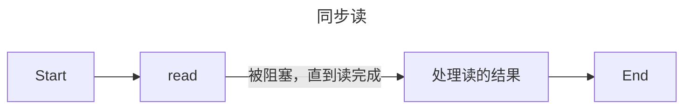

# 第5章 Linux网络编程基础API

## 主机字节序和网络字节序

### 大端字节序

### 小端字节序

整数的高位字节存储在内存的高地址处。


现代PC多用小端，因此小端也叫主机字节序。

网络字节序，也叫大端字节序。


Linux提供了函数来完成转换

```c++
#include <netinet/in.h>
unsigned long int htonl(unsigned long int hostlong); // host to network long
// ...
```


IP地址转换函数

```c++
#include <arpa/inet.h>
in_addr_t inet_addr(const char* strptr); // 将点分十进制字符串的iPv4地址转换为网络字节序整数表示的ipv4地址
int inet_aton(const char* cp, struct in_addr* inp);
char* inet_ntoa(struct in_addr in); // 将网络字节序整数表示的IPV4地址转化为用点分十进制字符串表示的IPV4地址
```


Q:为什么在创建`socket`之后要立即为它分配地址呢？

对 TCP/UDP 而言，对端发回来的报文必须携带“目的 IP+端口”。如果你的 socket 没有通过 `bind()` 显式声明这两个值，内核就不知道该把收到的报文交给哪个 socket。


# 第8章 高性能服务器程序框架

## 服务器模型

### C/S（客户端/服务器）模型

```plaintext
1.服务器启动后，首先创建一个或多个监听socket，并调用bind函数将其绑定到服务器感兴趣的端口上，然后调用listen函数等待客户连接。
2.客户端调用connect函数向服务器发起连接。（异步事件）
3.当服务器监听到连接请求后，服务器就调用accept函数接受它，并分配一个逻辑单元为新的连接服务。逻辑单元可以是新创建的子进程、子线程。
4.逻辑单元读取客户请求，处理该请求，然后将处理结果返回给客户端。
5.在处理一个客户请求的同时，服务器还会继续监听其他客户请求。
```

Q：什么是异步事件/同步事件？

同步事件：事件必须在发生的当下立即被处理，否则整个执行流就卡在那里不动。

异步事件：事件发生时，系统先记录，等程序方便时再处理。


缺点：服务器是通信的中心。当访问量过大，可能所有客户都将得到很慢的响应。


### P2P（Peer to Peer，点对点）模型


## I/O模型

### 阻塞I/O

阻塞的文件描述符为阻塞I/O。

针对阻塞I/O执行的系统调用可能因为无法立即完成而被操作系统挂起（沦为**阻塞态**），直到等待的事情发生。

### 非阻塞I/O

系统调用总是立即返回，不管事件是否已经发生。


Q:什么是I/O复用？

这是一种经常使用的I/O通知机制。

应用程序通过I/O复用函数向内核注册一组事件，内核通过I/O复用函数把其中就绪的事件通知给应用程序。

注：I/O复用函数本身是阻塞的，例如`select`、`poll`、`epoll_wait`，但是它们之所以可以提升效率，是因为它们具有同时监听多个I/O事件的能力。

<font color="red">对I/O本身的读写操作是非阻塞的。</font>


SIGIO信号：信号触发读写就绪事件


## 两种事件处理模式

### `Reactor`事件处理模式

主线程只负责监听文件描述符上是否有事件发生，有则通知工作线程处理。

使用同步I/O模型（以`epoll_wait`为例）实现的Reactor模式的工作流程：

```plaintext
1. 主线程往epoll内核事件表中注册socket上的读就绪事件
2. 主线程调用epoll_wait等待socket上有数据可读
3. 当socket上有数据可读时，epoll_wait通知主线程，主线程将socket可读事件放入请求队列
4. 睡眠在请求队列上的某个工作线程被唤醒，它从socket读取数据，并且处理客户请求，然后往epoll内核事件表中注册该socket上的写就绪事件
5. 主线程调用epoll_wait等待socket可写
...
```


### `Proactor`事件处理模式

将所有I/O操作都交给主线程和内核来处理，

使用异步I/O模型实现的`Proactor`模式的工作流程：

```plaintext
1. 主线程向内核注册socket上的读完成事件，并告诉内核用户读取缓冲区的位置，以及读操作完成后如何通知应用程序。（以信号为例）
2. 主线程急需处理其他逻辑。
3 当socket上的数据被读入用户缓冲区后，内核将向应用程序发送一个信号，以通知应用程序数据可用。
4. 应用程序预先定义好的信号处理函数选择一个工作线程来处理客户请求...
```


## 两种并发模式

### 半同步/半异步模式



在并发模式中，同步指的是程序完全按照代码序列的顺序执行；

异步指的是程序的执行由系统事件来驱动。


### 领导者/追随者模式

在任意时间点，程序仅有一个领导者线程，它负责监听I/O事件。而其他线程都是追随者，它们休眠在线程池中等待成为新的领导者。当前的领导者如果检测到I/O事件，首先要从线程池中推选出新的领导者，然后处理I/O事件。


# 第10章 信号

发送信号

```c++
#include <sys/types.h>
#include <signal.h>
int kill(pid_t pid, int sig); // 把sig发送给pid指定的目标进程
```

