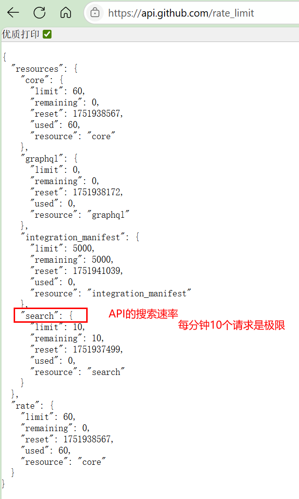

# 20250624

python自带在终端窗口运行的解释器`IDLE SHELL`

## 字符串

在python中，双引号和单引号没有区别，都表明字符串。


使用方法修改字符串

`.title()`

- 将字符串中每个单词的首字母都改为大写

.upper()

.lower()

合并拼接字符串直接 +


\n 换行

\t 制表位

`.rstrip()`[^1]

- 去掉字符串尾端的空白字符

[^1]: right strip，类似地，还有lstrip()，strip()


## 浮点数

python将带小数点的数字都称为浮点数

函数str()可将非字符串类型表示成字符串。

在python3中，执行除法不会向下取整，例如3 / 2 = 1.5


python用#表示注释。

```python
# 这是一行注释
# 2025.06.24
import this

```

The Zen of Python, by Tim Peters

Beautiful is better than ugly.
Explicit is better than implicit.
Simple is better than complex.
Complex is better than complicated. 复杂胜于繁琐
Flat is better than nested. 胜于嵌套
Sparse is better than dense. 稀疏
Readability counts. 可读性很重要
Special cases aren't special enough to break the rules.
Although practicality beats purity.
Errors should never pass silently.
Unless explicitly silenced.
In the face of ambiguity, refuse the temptation to guess.
There should be one-- and preferably only one --obvious way to do it.
Although that way may not be obvious at first unless you're Dutch.
Now is better than never. 现在做胜于不做
Although never is often better than *right* now. 尽管有时不做比立即做好
If the implementation is hard to explain, it's a bad idea. 实现
If the implementation is easy to explain, it may be a good idea.
Namespaces are one honking great idea -- let's do more of those!


# 20250625

## 列表

### 一些操作列表的方法和函数

python用`[]`表示列表，这个类似于C语言的数组。

python将最后一个元素索引指定为`-1`。

python中的列表是动态的，类似于`vector`。

`.append()`

- 在列表末尾添加元素

`.insert(0, '')`

- 在列表固定位置插入元素

知道元素位置，可以使用`del motocycles[0]`删除元素。

`.pop()`

- 删除列表末尾的元素
- 先记录列表末尾的元素，再删除`deleted = motocycles.pop()`
- 也可以使用`pop(index)`删除指定位置的元素

`.remove()`

- 根据值删除元素
- 只删除第1个指定的值

`.sort()`

- 从小到大，原地排序
- 若要从大到小，可以使用`.sort(reverse=True)`

`.reverse()`

- 原地反转列表

函数`sorted()`

- 对列表临时排序
- 注意，以上都是方法，`sorted()`确是函数。

函数`len()`

- 计算列表长度


### 遍历列表

`for item in list_of_items:`

> python中的print()函数默认换行。

python根据`缩进`判断代码行与前一个代码行的关系。


函数`rang(1, 6)`

- 可以生成1-5的数字
- 第3个参数指定步长，默认为1

example

```python
for value in range(1, 6):
    print(value)
```

1

2

3

4

5


函数`list()`

- 可以将`range()`的结果直接转换为列表

> 在python中，**表示乘方运算，value\*\*2即value^2

### 对数字列表执行简单运算的函数

`min()`

`max()`

`sum()`

注意：这是函数。


### 列表解析

example

```python
squares = [value**2 for value in range(1, 11)]
```


### 列表切片

处理切片，需要指定使用的第一个元素，和最后一个元素的索引，注意是`左闭右开`区间。

example

```python
players = ['charles', 'martina', 'michael', 'florence', 'eli']
print(players[0: 3]) # 第0， 1， 2
# 如果没有指定第1个索引，则默认从头开始；末尾亦是如此
print(players[-3: ]) # -3 -2 -1
```


遍历列表，也可以使用切片

复制列表`another_players = players[:]`


## 元组

不允许修改的列表称为元组。

元组用`()`标识。

example

```python
dimensions = (200, 50)
dimension[0] = 250 # error
dimensions = (400, 100) # 但是可以重新赋值，有点像是新建了一个对象。
```


## python代码格式

1. 每级缩进空四格
2. 每行不建议超过80字符
3. 注释行长不建议超过72字符
4. 要将程序的不同部分分隔开，用一个空行


## if语句

example

```python
cars = ['audi', 'bmw', 'subaru', 'toyota']
for car in cars:
    if car == 'bmw':
        print(car.upper())
    elif:
        ...
    else:
    	...
```

> 使用`and`和`or`可以检查多个条件


`in`

- 可以检查某个元素是否在列表中

example

```python
'bmw' in cars
True
```

类似地，还有`not in`

> 布尔表达式`True`，`False`


## 字典

字典是一系列`键值对`

python用`{}`标识。

`del`

- 删除键值对


### 遍历字典

example

```python
user_0 = {
    'username': 'efermi',
    'first': 'enrico',
    'last': 'fermi',
}
for key, value in user_0.iterms():
    ...
# 不需要值，只需要键时
for key in user_0.keys():
    ...
# 类似地，如果只需要值，就用方法values()
```

在使用values，为了剔除重复项，可以使用集合`set()`[^ 1]。

[^1]: 集合set类似于列表，但每个元素都是独一无二的


# 20260626

## 用户输入和while循环

函数`input()`

- 让程序暂停，等待用户输入
- 将输入解释成字符串

函数`int()`

- 可以将输入的字符串转换成数值

函数`float()`

- 转换为浮点数


## 函数

example

```python
def greet_user(username='jesse'): //username是形参,在编写函数时，可以指定默认值
    """显示简单的问候语"""
    print("Hello, " + username.title() + "!")
greet_user('jesse')
greet_user(username='jesse') # 关键字实参是传递给函数的名称-值对
```

在函数中修改列表是永久性的，如果要禁止函数修改列表，传递参数时可以传递列表的临时副本、切片。


传递任意数量的实参

example

```python
def make_pizza(*toppings) # *topping中的*让python创建一个空元组，来接收值
	"""打印顾客点的所有配料"""
    print(toppings)
make_pizza('mushrooms', 'green peppers', 'extra cheese')
# 类似地，形参如果是**toppings会让python创建一个空字典
def build_profile(first, last, **user_info)
	"""创建一个字典，其中包含我们知道的有关用户的一切"""
    profile = {}
    profile['first_name'] = first
    profile['last_name'] = last
    for key, value in user_info.items():
        profile[key] = value
    return profile
user_profile = build_profile('albert', 'einstein', location='princeton', field='physics') # 这里使用的语法叫做关键字参数，即name = value
```

### **关键字参数（Keyword Argument）**

在函数调用时，通过 `参数名=值` 的形式明确指定参数的值，而不必按照参数定义的顺序传递。关键字参数与函数定义时是否有默认值无关。

```python
def greet_user(username='jesse'):
    print(f"Hello, {username}!")

# 结合默认参数和关键字参数
greet_user(username="alice")  # 使用关键字参数覆盖默认值
greet_user()                # 使用默认值
```

在 Python 中，`f"Hello, {username}!"` 是 **f-strings**（格式化字符串字面量）的语法，它是 Python 3.6 及以后版本引入的一种字符串格式化方式。其核心特点是在字符串前加 `f` 或 `F` 前缀，然后在字符串中使用 `{}` 直接嵌入表达式。

```python
name = "Alice"
age = 30

# 使用 f-strings 格式化字符串
message = f"Hello, {name}! You are {age} years old."

print(message)  # 输出: Hello, Alice! You are 30 years old.
```

- `{name}` 和 `{age}` 中的变量会被替换为实际值。


# 20250627

## 模块

```python
import module_name # 导入模块
module_name.function_name() # 使用模块里的函数，要用模块名作为前缀
# 从模块中导入特定函数，不用再写模块前缀
from module_name import function_name1， function_name2 
from module_name import function_name1 as fn1 # 给函数指定别名

import module_name as mn # 给模块指定别名

from module_name import * # 导入模块中的所有函数
```

## 面向对象

```python
class Dog(): # 首字母大写表示类
    """一次模拟小狗的简单尝试"""
    
    def __init__(self, name, age): # 类中函数称为方法
        """初始化属性name和age"""
        self.name = name
        self.age = age # self有点像是C++中的*this，这个类似于构造函数？
        
    def sit(self): 
        """模拟小狗命令时蹲下"""
        print(self.name.title() + "is now sitting.") #传入self，以self为前缀的变量都可供类中方法使用
        
my_dog = Dog('willie', 6)    # 创建实例    
```


类中每个属性都必须有初始值，需要在\__init__(self,...)中设置。


## 继承

一个类继承另一个类，它将自动获得另一个类的所有属性和方法，同时还可以定义自己的属性和方法。

原有的类称为父类，新类称为子类。

```python
class  VillageDog(Dog): # 创建子类时，父类必须包含在当前文件中，且位于子类前面
    """土狗的独特之处"""
    
    def __init__(self, name, age, skill):
        """初始化父类的属性"""
        super().__init__(name, age)
        # super()是一个特殊函数，帮助python将子类和父类关联起来
        # 这行代码让python调用父类的方法__init()，父类也称为超类superclass
        self.skill = "I can eat ..."
```


导入类

```python
from dog import Dog, Village_dog # 从文件中导入多个类
# 类似地，还可以导入整个模块
```


## Python标准库

模块`collections`中有一个类叫做`OrderedDict`

`有序字典`。

```python
from collections import OrderedDict # 导入类
favorite_languages = OrderedDict() # 创建了一个类的实例

```


模块`random`包含以各种方式生成随机数的函数

随机数

```python
from random import randint # 函数randint()返回一个位于指定范围内的整数
x = randint(1, 6) # 1-6
```


要进一步了解Python标准库，请访问[Python Module of the Week](http://pymotw.com/)


类名应采用驼峰命名法，类名的每个单词首字母都要大写，而且不用下划线。

实例和模块名都采用小写，单词之间加下划线。


导入库函数，先导入标准库，空行，再导入你写的。


# 20250628

## 文件和异常

### 读文件

```python
with open('pi_digits.txt') as file_object: # open()接受打开文件的名称，返回的对象存储在file_object中，with关键字让我们不用再关心关闭文件
    contents = file_object.read() # read()方法读取文件内容
    print(contents) # read()到达文件末尾时返回一个空字符串，显示出来就变成一行空行
    
# 使用相对路径访问文件
with open('text_files/filename.txt') as ... # 这是在linux系统中
# 在windows系统中使用\

# 使用绝对路径
file_path = 'C:\Users\filename.txt'
```

逐行读取

```python
for line in file_object:
    print(line) #读取文件时因为文件每行都有一个换行符，而python又是默认换行的，
    # 所以可以这样消除空行
    print(line.rstrip())
```

 创建一个包含各行的列表

```python
lines = file_object.readlines() # 方法readlines()读取每行，并将其存在一个列表中
```


## 写入文件

example

```python
filename = 'programming.txt'
with open(filename, 'w') as file_object: # w 写入模式 r 读取模式 a 附加模式
    # r+ 读写 如果省略，则默认只读
    file_object.write("I love programming.")
```

- 如果指定文件不存在，则open()自动创建。
- 写入模式下，如果文件已存在，则清空原始内容
- write()函数不会自动加换行符


## 异常

example

```python
print(5/0)
# 报错
ZeroDivisionError: division by zero # ZDE是一个异常对象
```

使用try-except

```python
try:
    answer = 5/0
except ZeroDivisionError: # except告诉python出现这种异常如何做
    print("You can't divide by zero!")
else:
    print(answer) # try执行没问题就会执行这句
```

或者说可以在except中直接用pass语句，表示让python啥也不做。


## 存储数据

使用模块`json`[^1]存储数据。

[^1]:JSON(JavaScript Object Notation)格式最初是为JavaScript开发的

`json.dump()` 存储

```python
import json

numbers = [2, 3, 5, 7, 11, 13]

filename = 'numbers.json'
with open(filename, 'w') as f_obj:
    json.dump(numbers, f_obj) 
    
with open(filename, 'r') as f_obj:
    json.load(numbers, f_obj)
```


`json.load()` 装载


# 20250630

## 测试代码

模块`unittest`提供了代码测试工具。

`name_function.py`

```pyhon
def get_formatted_name(first, last):
    """Generate a neatly formatted full name."""
    full_name = first + ' ' + last
    return full_name.title()
```

`test_name_function.py`

```python
import unittest # 导入模块
from name_function import get_formatted_name # 导入要测试的函数

class NameTestCase(unittest.TestCase): # 必须继承unittest.TestCase类
    """测试name_function.py"""

    def test_first_last_name(self): # 以test_打头的方法将自动运行
        """能够正确处理像Janis Joplin这样的姓名吗？"""
        formatted_name = get_formatted_name('Janis', 'Joplin')
        self.assertEqual(formatted_name, 'Janis Joplin') # 断言方法

unittest.main() # 让python运行这个文件中的测试
```


各种断言方法

| 方法                 |      |
| -------------------- | ---- |
| assertEqual(a, b)    |      |
| assertTrue(x)        |      |
| assertIn(item, list) |      |
|                      |      |


使用方法`setUp()`测试类


## 数据可视化

## 学习matplotlib


# 20250701

`使用模块pyplot中的plot函数绘制折线图`

```python
import matplotlib.pyplot as plt # 模块matplotlib包含很多用于生成图表的函数
input_values = [1, 2, 3, 4, 5]
squares = [1, 4, 9, 16, 25]
plt.plot(input_values, squares, linewidth=5)

# 设置图表标题，并给坐标轴加上标签
plt.title("Square Numbers", fontsize=24)
plt.xlabel("Value", fontsize=24)
plt.ylabel("Square of Value", fontsize=14)

# 设置刻度标记大小
plt.tick_params(axis='both', labelsize=14)
plt.show() # 打开matplotlib查看器
```

`散点图`

```python
import matplotlib.pyplot as plt # 模块pyplot包含很多用于生成图表的函数
# pyplot应该是一个类
x_values = list(range(1, 1001))
y_values = [x**2 for x in x_values]
# 自定义颜色c=(0, 0, 0.8)，分别表示红绿蓝三种分量，0-1，越接近0，颜色越深
plt.scatter(x_values, y_values, c=(0, 0, 0.8), edgecolor='none', s=40)
# matplotlib绘制散点图时默认蓝色点+黑色轮廓，edgecolor='none'意思是删除黑色轮廓

# 设置图表标题，并给坐标轴加上标签
plt.title("Square Numbers", fontsize=24)
plt.xlabel("Value", fontsize=24)
plt.ylabel("Square of Value", fontsize=14)

# 设置刻度标记大小
plt.tick_params(axis='both', which='major', labelsize=14) 
# major表示只影响主要刻度

# 设置每个坐标轴的取值范围
plt.axis([0, 1100, 0, 1100000])

plt.savefig('squares_plot.png', bbox_inches='tight') # 自动保存图表
# 第二个实参将图表多余的空白区域裁减掉

plt.show() # 打开matplotlib查看器，关闭图形窗口后，matplotlib会把图形状态清空。
```


可视化包`Pygal`可以生成可放缩的矢量图形文件。

```python
import pygal

frequencies = [155, 167, 170, 159, 181]

# 对结果进行可视化
hist = pygal.Bar() # 直方图

hist.title = "Results of rolling one D6 1000 times."
hist.x_labels = ['1', '2', '3', '4', '5']
hist.x_title = 'Result'
hist.y_title = 'Frequency of Result'

hist.add('D6', frequencies) # 第一个参数表示标签，第二个参数表示y值
hist.render_to_file('dir_visual.svg') # .svg可以在浏览器中查看
```


# 20250702

我们学习python的目的是能够学会爬虫，追自己想看的电视剧，获取别人不知道的信息。

这样听上去很有用，也足够有吸引力。

虽然不知道这个暑假里我能学到多少，但是你只管做，不要想别的。


# 20250703

访问并可视化两种常见格式存储的数据：`CSV`和`JSON`


`CSV`

example

```python
import csv # 导入CSV模块
from matplotlib import pyplot as plt
from datetime import datetime
filename = "death_valley_2014.csv"
with open(filename) as f:
    reader = csv.reader(f) # 创建一个与该文件相关联的阅读器对象-单向迭代器
    header_row = next(reader) # 返回当前行，迭代器移到下一行，在这里header_row接受到的是第一行
    # print(header_row) # 调用next后文件指针指向第二行开头
    # 每一行都是一个列表，靠英文逗号分割

    # 从文件中获取最高气温
    date, highs, lows = [], [], []
    for row in reader: # 阅读器对象从其停留的地方继续往下读取
        try:
            current_date = datetime.strptime(row[0], '%Y-%m-%d')
            high = int(row[1])
            low = int(row[3])
            
        except ValueError:
            print(current_date, "missing data")
        else:
            date.append(current_date)
            highs.append(high)
            lows.append(low)

# 可视化
fig = plt.figure(dpi=128, figsize=(10, 6)) # fig是图形对象
plt.plot(date, highs, c="red", label="highest_temperature")
plt.plot(date, lows, c="blue", label="low_temperature")
plt.fill_between(date, highs, lows, facecolor="blue", alpha=0.1)
# alpha表示透明度，0表示完全透明

# 设置图形格式
plt.title("Daily high temperatures, 2014", fontsize=24)
plt.xlabel('', fontsize=16)
fig.autofmt_xdate() # 自动调整x轴标签
plt.ylabel("Temperature(F)", fontsize=16)
plt.tick_params(axis='both', which='major', labelsize=16)
plt.xlim(min(date), max(date))

plt.show()
```


`JSON`

从网上下载数据

```python
# 从网上下载数据
import requests

json_url = "https://raw.githubusercontent.com/muxuezi/btc/master/btc_close_2017.json"
req = requests.get(json_url) # 通过get方法向github发出请求，返回结果存储在req中
# 将数据写入文件
with open("btc_close_2017_request.json", "w") as f:
    f.write(req.text) # req.text读取数据并返回字符串
file_requests = req.json() # 将数据自动解析为Python的数据结构
```

:sob:


终于把可视化这一章看完了，写了很多注释，也可能不会在看，或者说没什么用，但是当前看完一遍之后感觉收获还是有的，迷惑自己：这就是进步。

继续加油吧。

```python
import json
import pygal
import math
from itertools import groupby # 导入函数groupby
from datetime import datetime # datetime是一个类

# 将数据加载到一个列表中
filename = "btc_close_2017_request.json"
with open(filename, "r") as f:
    btc_data = json.load(f) # 装载

# 创建5个列表，分别存储日期和收盘价
dates, months, weeks, weekdays, close = [], [], [], [], []

# 每一天的信息
for btc_dict in btc_data:
    dates.append(btc_dict["date"])
    months.append(int(btc_dict["month"]))
    weeks.append(int(btc_dict["week"]))
    weekdays.append(btc_dict["weekday"])
    close.append(int(float(btc_dict["close"]))) # python不能将带有小数点的字符串转换为整数

def draw_line(x_data, y_data, title, y_legend):
    xy_map = []
    for x, y in groupby(sorted(zip(x_data, y_data)), key=lambda _: _[0]):
        # 对于不了解的函数，要去查询手册
        """
        zip()将x_data, y_data（可迭代对象中的元素）一一映射成一个个元组，返回对象是一个可迭代的迭代器。
        sorted依照元组的第一个元素，从小到大进行排序， 返回一个列表。
        在这个列表中，都是元组。

        lambda 表达式的语法
        lambda arguments: expression
        arguments 是一个或多个参数，用逗号分隔。
        expression 是一个表达式，lambda 表达式会返回这个表达式的值。

        排序好之后，groupby将连续相同键值的元素分组到一起
        x 是键值， y是一个元组迭代器
        """
        y_list = [v for _, v in y]
        xy_map.append([x, sum(y_list) / len(y_list)]) # 均值
    x_unique, y_mean = [*zip(*xy_map)] 
    """
    *用于将xy_map解包，即去掉最外层的[] [1, 2], [1, 3]
    zip (1, 1), (2, 3) 返回一个元组迭代器
    """
    line_chart = pygal.Line() # 绘制折线图
    line_chart.title = title
    line_chart.x_labels = x_unique
    line_chart.add(y_legend, y_mean) # 第2个参数是y值列表
    line_chart.render_to_file(title+'.svg')
    return line_chart

idx_month = dates.index('2017-12-01')
line_chart_month = draw_line(months[: idx_month], close[: idx_month], '收盘价月日均值(￥)', '月日均值')
line_chart_month

idx_week = dates.index('2017-12-11')
line_chart_week = draw_line(weeks[1: idx_week], close[1: idx_week], '收盘价周日均值(￥)', '周日均值')
line_chart_week 

wd = ['Monday', 'Tuesday', 'Wednesday', 'Thursday', 'Friday', 'Saturday', 'Sunday']
weekdays_int = [wd.index(w) + 1 for w in weekdays[1: idx_week]]
line_chart_weekday = draw_line(weekdays_int, close[1: idx_week], '收盘价星期均值(￥)', '星期均值')
line_chart_weekday.x_labels = ['周一', '周二', '周三', '周四', '周五', '周六', '周日']
line_chart_weekday.render_to_file('收盘价星期均值(￥).svg')
```


# 20250708




```python
import requests
import pygal
from pygal.style import LightColorizedStyle as LCS, LightenStyle as LS

# 执行AP调用并存储响应 Web Application Programming Interface，即网络应用程序编程接口
url = "https://api.github.com/search/repositories?q=language:python&sort=stars"
r = requests.get(url)
print("Status code: ", r.status_code) # 状态码200表示请求成功

response_dict = r.json() # API将返回JSON格式的信息
# 方法json()将这些信息转换为一个字典

print("Total repositories: ", response_dict['total_count'])

repo_dicts = response_dict['items'] # 字典列表

example = repo_dicts[0]
# for key in sorted(example.keys()):
#   print(key)
print("Repositories returned: ", len(repo_dicts))

names, plot_dicts = [], []
for repo_dict in repo_dicts:
   names.append(repo_dict['name'])
   plot_dict = {
      'value': repo_dict['stargazers_count'],
      'label': repo_dict['description'],
      'xlink': repo_dict['html_url'],
   }
   plot_dicts.append(plot_dict)

# 可视化
my_style = LS('#333366', base_style=LCS)

my_config = pygal.Config()
my_config.x_label_rotation = 45
my_config.show_legend = False
my_config.title_font_size = 24
my_config.label_font_size = 14
my_config.truncate_label = 15
my_config.show_y_guides = False
my_config.width = 1000

chart = pygal.Bar(my_config, style=my_style)
chart.title = 'Most-Starred Python Projects on GitHub'
chart.x_labels = names
chart.add('stars', plot_dicts)
chart.render_to_file('python_repos.svg')
```


Pygal 和 Matplotlib 都是 Python 的数据可视化工具，但它们的设计目标、使用场景和实现方式有很大不同。

- **Matplotlib**：
  生成静态图像（如 PNG、SVG、PDF）或交互式图表（通过 Jupyter Notebook 或 GUI 后端）。主要用于本地数据探索和学术 publication。
- **Pygal**：
  生成**交互式 SVG 图表**，直接嵌入 HTML 页面或网页应用中。适合 Web 环境下的动态数据展示。
