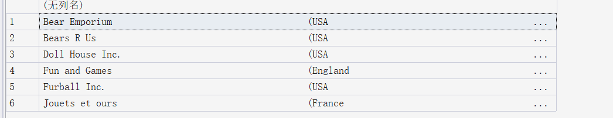
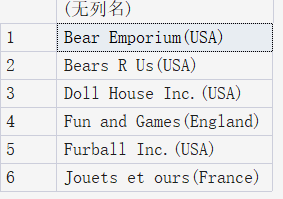

# 20250728

## 01 了解SQL

数据库：保存数据的容器

表：存放**同一类型**的数据。在一个数据库中，每张表都有一个唯一的名字来标识自己。

例如，顾客的清单 和 订单的清单，这便是两张表。


模式：描述一张表如何存储、存储的数据类型等信息。

主键：表中的每一行都有一列来标注自身。例如，每个顾客都有自己的顾客编号。

- 主键列不允许出现空值（NULL）
- 主键列的值不允许修改和更新


SQL Structured Query Language 结构化查询语言，和数据库沟通交流

设计SQL的目的是为了读写数据


## 02 检索数据

```sql
SELECT prod_name FROM Products; -- 从Products表中检索出prod_name这一列的列名
```

SQL语句不区分*大小写*

SQL开发人员喜欢对SQL关键字使用大写，而对列名和表名使用小写

`*`表示通配符号

```sql
SELECT * -- 表示检索所有列
```

`SELECT`返回匹配的所有行，但是可能一些行一样都满足条件，可以使用`DISTINCT`关键字进行过滤，只返回不同值。

```sql
SELECT DISTINCT vend_id FROM Products;
SELECT TOP 5 prod_name FROM Products; -- 可以返回指定数量的行
```


# 20250730

简单了解一下当前流行的数据库

RDBMS(Relational Database Management System)，关系数据库

- **MySQL**
- **PostgreSQL**
- **Oracle Database**
- **Microsoft SQL Server**
- **IBM DB2**

非关系型数据库 NoSQL(Not Only SQL)

- 文档型数据库：**MongoDB**
- 键值型数据库：**Redis**、**Amazon DynamoDB**

......

其实还有很多，但不再一一列举。

可能这些数据库的实现不完全一致，但总体上差不多，例如注释

基于SQL Server

```sql
-- 这是行内注释
/* 
这是多行注释
*/
# 有的支持行间用#表示注释，有的则不支持
```


# 排序检索数据

子句：SQL语句由子句构成，有些子句是可选的，例如 SELECT cust_id FROM Customers中的FROM Customers就是子句。

为了对检索出的数据进行排序

```sql
SELECT prod_name FROM Products ORDER BY prod_name;
-- ORDER BY 子句一定要在最后面
-- 根据非选择列排序也是合法的

SELECT prod_id, prod_price, prod_name 
FROM Products 
ORDER BY prod_price, prod_name; -- 首先按照价格排序，价格相同，才会按照名称排序，注意默认是升序

SELECT prod_id, prod_price, prod_name 
FROM Products 
ORDER BY 2, 3; -- 还可以这样，按照相对位置

SELECT prod_id, prod_price, prod_name 
FROM Products 
ORDER BY prod_price DESC, prod_name; -- 按照价格降序排列 Descending 价格相同 按照名称升序
-- 默认升序 ASC ascending
```

在对文本数据进行排序时，A和a相不相同，谁在前谁在后，取决于数据库的设置方式。


# 20250731

## 过滤数据

SELECT 中的 WHERE 子句

WHERE 子句根据特定条件对检索内容进行过滤，下面来看一个例子：

```sql
SELECT prod_name, prod_price 
FROM Products
WHERE prod_price = 3.49;
-- 在同时使用ORDER BY 和 WHERE 子句时，ORDER BY 要位于 WHERE 之后

SELECT vend_id, prod_name
FROM Products
WHERE vend_id <> 'DLL01'; -- 检索出vend_id中不等于DLL01的值
-- 注意：字符串必须是单引号才符合规范
```

WHERE 子句操作符

一些特别的

| 操作符  | 说明                                                     |
| ------- | -------------------------------------------------------- |
| ！>     | 不大于                                                   |
| BETWEEN | 在指定的两个值之间                                       |
| IS NULL | 为NULL值                                                 |
| <>      | 不等于，可以和`!=`互换，但并非所有DBMS都支持这两种操作符 |
|         |                                                          |

范围值检查

```sql
SELECT prod_name, prod_price
FROM Products
WHERE prod_price BETWEEN 5 AND 10; -- 开始值和结束值要用AND关键字分隔开， 是全闭区间[a, b]
```

空值检查

在创建表时，可以指定其中的列能否不包含值。不包含值时，称其包含空值`NULL`(它与字段包含0、空字符串或仅包含空格不同)。

```sql
SELECT prod_name
FROM Products
WHERE prod_price IS NULL; -- 返回所有没有价格的商品名称
```


## 过滤数据进阶

组合WHERE子句 联合 `AND` 子句或 `OR` 子句

```sql
SELECT prod_id, prod_name, prod_price
FROM Products
WHERE vend_id = 'DLL01' AND prod_price <= 4; -- 类似地，还有OR

-- 如果有多个操作符可以使用圆括号()
SELECT prod_name, prod_price
FROM Products
WHERE (vend_id = 'DLL01' OR vend_id = 'BRS01')
	AND prod_price >= 10;
```

`IN` 操作符可以指定条件范围，范围中的每个条件都可以进行匹配

```sql
SELECT prod_name, prod_price
FROM Products
WHERE vend_id IN ('DLL01', 'BRS01')
ORDER BY prod_name;
```

`NOT` 操作符否定跟在后面的条件

```sql
SELECT prod_name
FROM Products
WHERE NOT vend_id = 'DLL01'
ORDER BY prod_name; -- 检索出只要vend_id不等于‘DLL01'的列
```

## 用通配符进行过滤

通配符：用来匹配值的一部分特殊字符

搜索模式：由字面值、通配符或两者构成的搜索条件

谓词：


注意，通配速搜索只能用于文本字符串。

- %通配符

%表示任何字符出现任意次。

```sql
SELECT prod_id, prod_name
FROM Products
WHERE prod_name LIKE 'fish%'; -- 检索 任意以fish开头的词

-- %bean bag% 检索带有bean bag的字符串
-- F%y 检索以F开头并以y结尾的字符串
-- % 不会匹配NULL行
```

**Microsoft SQL Server**似乎默认检索不区分大小写。

- _通配符

下划线只匹配单个字符，且DB2不支持通配符_

```sql
SELECT prod_id, prod_name
FROM Products
WHERE prod_name LIKE '__ inch teddy bear';
```

- []通配符

不是所有的DBMS都支持这种通配符

```sql
SELECT cust_contact
FROM Customers
WHERE cust_contact LIKE '[JM]%'
ORDER BY cust_contact; -- 找出所有以J或者M起头的联系人
-- []通配符用于匹配方括号中的任意一个字符，注意只能匹配单个字符

SELECT cust_contact
FROM Customers
WHERE cust_contact LIKE '[^JM]%'
ORDER BY cust_contact; -- 找出所有不以J且不以M起头的联系人
```

尽管通配符很有用，但是代价是搜索更耗时。


# 20250801

## 计算字段

所谓计算字段，就是我们需要在检索出相应数据之后，对得到的数据进行二次加工，例如求平均值。


- 拼接字段

SQL Server 用 `+`

DB2、Oracle、PostgreSQL和SQLite用 `||`

```sql
SELECT vend_name + '(' + vend_country + ')'
FROM Vendors
ORDER BY vend_name; 
```

查询结果如下



许多数据库默认保存填充为列宽的文本值，可以使用`RTRIM(字符串)`函数来去除这些空格。

right trim 字符串处理函数，移除字符串右侧空格

类似地，`ltrim`和`trim`

```sql
SELECT RTRIM(vend_name) + '(' + RTRIM(vend_country) + ')'
FROM Vendors
ORDER BY vend_name;
```



 列别名。

通过`AS`给查询的列指定一个别名

```sql
SELECT RTRIM(vend_name) + '(' + RTRIM(vend_country) + ')'
AS vend_title
FROM Vendors
ORDER BY vend_name; -- 因为是查询语句，所以不会该操作不会改变原表结构
-- 别名可以是单词或者字符串，如果是字符串的话，应该括在引号中。
```

- 算术计算

```sql
SELECT prod_id, quantity, item_price, quantity*item_price 
AS expanded_price
FROM OrderItems
WHERE order_num = 20008;
```

SQL通常支持`+`、`-`、`*`、`/`操作符


## 函数

| 函数                                    | 说明                                               |
| --------------------------------------- | -------------------------------------------------- |
| 提取子串`substr()`[^1]、substring()[^2] | DB2、`ORacle`等用第1个，MYSQL、SQL Server用第第2个 |
| 数据类型转换CAST()[^1]、CONVERT()[^2]   |                                                    |
| 获取当前日期                            | MYSQL用`curdate()`、SQL Server用DATE()             |
|                                         |                                                    |

- 文本处理函数
  - 将文本转换成大写upper()
  - lower()
  - length()


SQL不区分大小写。

- 日期和时间处理函数

```sql
SELECT order_num
FROM Orders
WHERE DATEPART(yy, order_date) = 2020; -- 从order_date中返回年份
```

- 数值处理函数
  - abs()
  - cos()
  - exp()
  - pi()
  - sin()
  - sqrt()
  - tan()


挑战题

```sql
SELECT cust_id, cust_name, upper(substring(cust_contact, 1, 2) + substring(cust_city, 1, 3))
AS user_login
FROM Customers; -- sql字符串索引从1开始
```

# 20250803

## 汇总数据

- 聚集函数：用于汇总数据、分析数据和报表生成

| 聚集函数 | 说明         |
| -------- | ------------ |
| AVG()    |              |
| COUNT()  | 返回某列行数 |
| MAX()    |              |
| MIN()    |              |
| SUM()    |              |

example

```sql
SELECT AVG(DISTINCT prod_price) AS avg_price
FROM Products
WHERE vend_id = 'DLL01'; -- 检索出指定列的均值
-- 注：1.AVG只能确定单个列的平均值
-- 2. AVG()忽略列值为NULL的行

SELECT COUNT(*) AS num_cust
FROM Customers; -- 对表中行进行计数，此时并不忽略NULL行
-- 如果指定列名，则忽略NULL行
-- DISTINCT不能用于count(*)
```


## 分组数据

`GROUP BY`子句

```sql
SELECT vend_id, COUNT(*) AS num_prods
FROM Products
GROUP BY vend_id; -- GROUP BY 子句必须在WHERE 子句之后， ORDER BY子句之前
-- 根据vend_id 找出其到底有多少行
```

`HAVING`子句

`WHERE`过滤行，`HAVING`过滤分组

```sql
SELECT cust_id, COUNT(*) AS orders
FROM Orders
GROUP BY cust_id
HAVING COUNT(*) >= 2; -- count（*)相同的cust_id被分到一组，计算一组多少行
-- HAVING只保留行数>= 2的
```

SELECT 子句顺序

| 子句     | 说明       |
| -------- | ---------- |
| select   |            |
| from     | 从哪个表中 |
| where    | 筛选的条件 |
| group    |            |
| having   |            |
| order by |            |
|          |            |

# 20250804

## 子查询

```sql
SELECT order_num -- order_num 订单编号
FROM OrderItems
WHERE prod_id = 'RGAN01'; -- prod_id 商品编号
-- 选择订单编号中包含这个商品编号的

SELECT cust_id
FROM Orders
WHERE order_num IN(20007, 20008);
-- 从上一个查询的输出结果中我们知道订单编号为20007和20008订购了该商品
-- 于是我们可以从另一个表中查出该订单对应的客户编号

-- 子查询：将上述两次查询变为一次
SELECT cust_id 
FROM Orders
WHERE order_num IN (SELECT order_num 
					FROM OrderItems 
					WHERE prod_id = 'RGAN01');


SELECT cust_name, cust_contact
FROM Customers
WHERE cust_id IN (SELECT cust_id 
				  FROM Orders
				  WHERE order_num IN (SELECT order_num 
									  FROM OrderItems 
									  WHERE prod_id = 'RGAN01'));
```


注意，子查询总是从内向外处理

```sql
SELECT cust_name, cust_state, (SELECT COUNT(*)
							   FROM Orders
							   WHERE Orders.cust_id = Customers.cust_id)
							   AS orders
FROM Customers
ORDER BY cust_name;
-- 计算每个顾客下了多少订单
```

# 20250805

## 联结表

### 关系数据库

理念：相同的数据不要多次出现

把信息分成多个表，一类数据一张表，各表通过某些值相关联(可以是等值联结)

example

```sql
select vend_name, prod_name, prod_price
from Vendors, Products -- from联结了两张表
where Vendors.vend_id = Products.vend_id -- 通过where子句建立联结关系

select vend_name, prod_name, prod_price
from Vendors
INNER JOIN Products ON Vendors.vend_id = Products.vend_id; -- 也可以这样写
```

DBMS再运行时关联指定的每个表，以处理联结。联结表越多，性能越不好。

使用联结代替子查询

```sql
SELECT cust_name, cust_contact
FROM Customers
WHERE cust_id IN (SELECT cust_id 
				  FROM Orders 
				  WHERE order_num IN (SELECT order_num
									  FROM OrderItems
									  WHERE prod_id = 'RGAN01'));

-- 使用联结查询代替子查询
SELECT cust_name, cust_contact
FROM Customers, Orders, OrderItems
WHERE Customers.cust_id = Orders.cust_id 
AND Orders.order_num = OrderItems.order_num
AND OrderItems.Prod_id = 'RGAN01';
```

### 高级联结

SQL支持给表名取别名。

例如

`FROM Customers as C`

`oracle`不支持AS关键字

三种联结

1. 自联结：将表与自身进行联结，本质上是把一个表当作两个不同的表来使用
2. 自然联结：自动根据**两个表中名称相同的列**进行联结（无需显式指定`ON`条件）
3. 外联结

```sql
-- 自联结：
SELECT c1.cust_id, c1.cust_name, c1.cust_contact
FROM Customers AS c1, Customers AS c2
WHERE c1.cust_name = c2.cust_name 
AND c2.cust_contact = 'Jim Jones'; -- 用于查找与 "Jim Jones" 所在公司同名的所有客户信息。

-- 自然联结：自动去除联结表中的同名列
SELECT C.*, O.order_num, O.order_date, OI.prod_id, OI.quantity, OI.item_price
FROM Customers AS C, Orders AS O, OrderItems AS OI
WHERE C.cust_id = O.cust_id
AND OI.order_num = O.order_num
AND prod_id = 'RGAN01'; -- 

-- 内联结：筛选并关联两个或多个表中符合条件的记录
SELECT Customers.cust_id, Orders.order_num
FROM Customers
INNER JOIN Orders ON Customers.cust_id = Orders.cust_id; --检索下单的客户和订购的数量

-- 外联结
SELECT Customers.cust_id, Orders.order_num
FROM Customers
LEFT OUTER JOIN Orders ON Customers.cust_id = Orders.cust_id; 
-- 左外联结：保留左表中的所有记录，即便在右表中没有匹配项
-- 检索下单或是未下单的客户
-- 类似地，还有右外联结

-- 全外联结
SELECT Customers.cust_id, Orders.order_num
FROM Customers
FULL OUTER JOIN Orders ON Customers.cust_id = Orders.cust_id;
-- 保留左表和右表的所有记录，无论是否匹配
```

