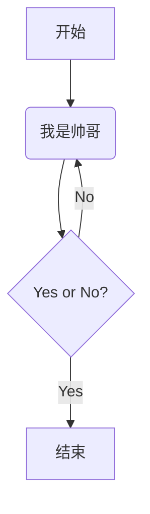

> 引用
> 
> 引用
> > - 这也是引用
> > - 还可以这样

冲天香阵透长安，<br>满城尽带黄金甲。

<u>下划线</u>

我^这是上标^

我~这是下标~

<!--这是注释-->

[TOC]

这是目录

- [ ] 

序列图

```sequence
张三->李四:李四，吃了吗？
Note right of 李四: 我显示在李四的右边
李四-->张三: 我刚刚吃过
```


脚注昨夜

这是干嘛的

流程图

```flow
st=>start: 开始
op=>operation: 我是帅哥
cond=>condition: Yes or No?
e=>end: 结束

st->op->cond
cond(yes)->e
cond(no)->op
```

序列图




<!-- slide -->


```text

```

Here's a simple footnote,[^1] and here's a longer one.[^bignote]

[^1]: This is the first footnote.

[^bignote]: Here's one with multiple paragraphs and code.


<font color="red">这段文字是红色的！</font>

<p style="color:blue">这段文字是蓝色的。</p>
